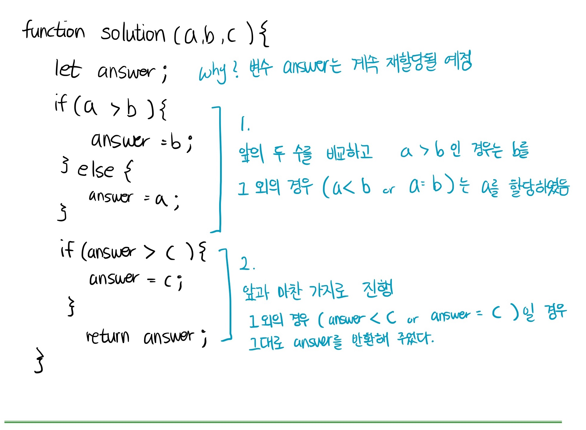

# 기본 문제 풀이

## 확인하는 법

1. 해당 섹션 다운로드 또는 html 코드 복사
2. vs code 확장프로그램 live server 실행
3. 콘솔창을 통해 결과 확인

## 목차

- [세 수 중 최솟값](#세-수-중-최솟값)
- [삼각형 판별하기](#삼각형-판별하기)
- [연필 개수](#연필-개수)
- [1부터 N까지 합 출력하기](#1부터-N까지-합-출력하기)
- [최솟값 구하기](#최솟값-구하기)
- [홀수](#홀수)

## 세 수 중 최솟값

```
100이하의 자연수 A, B, C를 입력받아 세 수 중 가장 작은 값을 출력하는 프로그램을 작성하 세요.(정렬을 사용하면 안됩니다)

▣ 입력설명
첫 번째 줄에 100이하의 세 자연수가 입력된다.

▣ 출력설명
첫 번째 줄에 가장 작은 수를 출력한다.

▣ 입력예제 1 6 5 11

▣ 출력예제 1 5
```

<details>
<summary> 기본 세팅 </summary>

```html
<html>
  <head>
    <meta charset="UTF-8" />
    <title>출력결과</title>
  </head>
  <body>
    <script>
      function solution(a, b, c) {
        let answer;

        // 이 사이에 최솟값을 구하는 함수 solution()에 대한 식을 넣습니다.

        return answer;
      }
      console.log(solution(6, 1, 11));
    </script>
  </body>
</html>
```

</details>

<details>
<summary> 내가 쓴 풀이 </summary>

</details>

<details>
<summary> 정답 코드 보러 가기 </summary>

```html
<html>
  <head>
    <meta charset="UTF-8" />
    <title>출력결과</title>
  </head>
  <body>
    <script>
      function solution(a, b, c) {
        let answer;
        if (a > b) {
          answer = b;
        } else {
          answer = a;
        }

        if (answer > c) {
          answer = c;
        }
        return answer;
      }
      console.log(solution(6, 1, 11));
    </script>
  </body>
</html>
```

</details>

<br/>

## 삼각형 판별하기

```
길이가 서로 다른 A, B, C 세 개의 막대 길이가 주어지면 이 세 막대로 삼각형을 만들 수 있 으면 “YES"를 출력하고, 만들 수 없으면 ”NO"를 출력한다.

▣ 입력설명
첫 번째 줄에 100이하의 서로 다른 A, B, C 막대의 길이가 주어진다.

▣ 출력설명
첫 번째 줄에 “YES", "NO"를 출력한다.

▣ 입력예제 1
6 7 11

▣ 출력예제 1
YES

▣ 입력예제 1
13 33 17

▣ 출력예제 1
NO

```

<details>
<summary> 기본 세팅 </summary>

```html
<html>
  <head>
    <meta charset="UTF-8" />
    <title>출력결과</title>
  </head>
  <body>
    <script>
      function solution(a, b, c) {
        let answer = "YES";
        let max;

        return answer;
      }
      console.log(solution(13, 33, 17));
    </script>
  </body>
</html>
```

</details>

<details>
<summary> 내가 쓴 풀이 </summary>

```html
<html>
  <head>
    <meta charset="UTF-8" />
    <title>출력결과</title>
  </head>
  <body>
    <script>
      function solution(a, b, c) {
        let answer = "YES",
          max;
        // 일단 제일 큰 수를 맥스로 넣어야 함
        // 제일 큰 수(max) 보다 나머지 두 파라미터의 값이 커야 참 (YES)
        // 그 다음 나머지 파라미터 두 개의 합이 맥스보다 작으면 오답이됨 (NO)

        // 1. a가 맥스
        if (a > b) {
          max = a;
          if (max > b + c) {
            answer = "YES";
          } else {
            answer = "NO";
          }

          // 2. b가 맥스
        } else {
          max = b;
          if (max > a + c) {
            answer = "YES";
          } else {
            answer = "NO";
          }
        }
        return answer;
      }
      console.log(solution(13, 33, 19));
    </script>
  </body>
</html>
```

</details>

<details>
<summary> 선생님 풀이 보러 가기 </summary>

```html
<html>
  <head>
    <meta charset="UTF-8" />
    <title>출력결과</title>
  </head>
  <body>
    <script>
      function solution(a, b, c) {
        let answer = "YES",
          max;
        let sum = a + b + c;
        if (a > b) max = a;
        else max = b;
        if (c > max) max = c;
        // 세 막대의 합(sum)에서 가장 큰 막대(max)의 길이를 뺐을 때
        // 두 막대기 길이의 합(sum -max)이 가장 큰 막대의 길이(max)보다 작을 경우 거짓
        if (sum - max <= max) answer = "NO";

        return answer;
      }
      console.log(solution(6, 7, 11));
    </script>
  </body>
</html>
```

</details>

<details>
<summary>차이점은?</summary>

```
변수가 주어지지 않더라도 새롭게 만들어 쓸 수 있는 생각을 할 필요가 있다 (변수 max를 새로 선언하는 경우)
결과값은 같더라도 코드의 길이를 줄일 수 있는 방법을 더 생각하면 좋을 것 같다.
```

</details>

## 연필 개수

```
연필 1 다스는 12자루입니다. 학생 1인당 연필을 1자루씩 나누어 준다고 할 때 N명이 학생수 를 입력하면 필요한 연필의 다스 수를 계산하는 프로그램을 작성하세요.

▣ 입력설명
첫 번째 줄에 1000 이하의 자연수 N이 입력된다.

▣ 출력설명
첫 번째 줄에 필요한 다스 수를 출력합니다.

▣ 입력예제 1
25

▣ 출력예제 1
3

▣ 입력예제 2
178

▣ 출력예제 2
15
```

<details>
<summary> 기본 세팅 </summary>

```html
<html>
  <head>
    <meta charset="UTF-8" />
    <title>출력결과</title>
  </head>
  <body>
    <script>
      function solution(n) {
        let answer;

        return answer;
      }
      console.log(solution(178));
    </script>
  </body>
</html>
```

</details>

<details>
<summary> 내가 쓴 풀이 </summary>

```html
<html>
  <head>
    <meta charset="UTF-8" />
    <title>출력결과</title>
  </head>
  <body>
    <script>
      function solution(n) {
        // 한 다스는 열두자루
        // 연필의 다스 수이므로, floor 메서드를 통해 처리
        let answer;
        answer = Math.floor(n / 12) + 1;
        return answer;
      }
      console.log(solution(13));
    </script>
  </body>
</html>
```

</details>

<details>
<summary> 선생님 풀이 보러 가기 </summary>

```html
<html>
  <head>
    <meta charset="UTF-8" />
    <title>출력결과</title>
  </head>
  <body>
    <script>
      function solution(n) {
        let answer;
        answer = Math.ceil(n / 12);
        return answer;
      }
      console.log(solution(178));
    </script>
  </body>
</html>
```

</details>

<details>
<summary> 차이점은? </summary>

```
Math 객체를 두 가지 방법이 있음

floor()를 통해서 나머지를 버리고 + 1 을 하거나,
ceil()을 통해 나머지가 있을 경우 올림 하는 경우

Math.random()을 사용하여 floor로 버리는 난 수 만드는 방법을 사용해서 ceil() 메서드의 존재 유무조차 몰랐음
MDN에서 math 객체 내장 메서드 공부를 좀 더 해야 겠다
```

</details>

## 1부터 N까지 합 출력하기

```
자연수 N이 입력되면 1부터 N까지의 합을 출력하는 프로그램을 작성하세요.

▣ 입력설명
첫 번째 줄에 20이하의 자연수 N이 입력된다..

▣ 출력설명
첫 번째 줄에 1부터 N까지의 합을 출력한다.

▣ 입력예제 1
6

▣ 출력예제 1
21

▣ 입력예제 2
10

▣ 출력예제 2
55
```

<details>
<summary> 기본 세팅 </summary>

```html
<html>
  <head>
    <meta charset="UTF-8" />
    <title>출력결과</title>
  </head>
  <body>
    <script>
      function solution(n) {
        let answer = 0;
        return answer;
      }
      console.log(solution(6));
    </script>
  </body>
</html>
```

</details>

<details>
<summary> 내가 쓴 풀이 </summary>

```html
<html>
  <head>
    <meta charset="UTF-8" />
    <title>출력결과</title>
  </head>
  <body>
    <script>
      function solution(n) {
        let answer = 0;
        answer = (n * (n + 1)) / 2;
        return answer;
      }

      console.log(solution(6));
    </script>
  </body>
</html>
```

</details>

<details>
<summary> 선생님 풀이 보러 가기 </summary>

```html
<html>
  <head>
    <meta charset="UTF-8" />
    <title>출력결과</title>
  </head>
  <body>
    <script>
      function solution(n) {
        let answer = 0;
        for (let i = 1; i <= n; i++) {
          answer = answer + i;
        }
        return answer;
      }

      console.log(solution(10));
    </script>
  </body>
</html>
```

</details>

<details>
<summary> 차이점은? </summary>

```
xx
```

</details>

## 최솟값 구하기

```
7개의 수가 주어지면 그 숫자 중 가장 작은 수를 출력하는 프로그램을 작성하세요.

▣ 입력설명
첫 번째 줄에 7개의 수가 주어진다.

▣ 출력설명
첫 번째 줄에 가장 작은 값을 출력한다.

▣ 입력예제 1
5 3 7 11 2 15 17

▣ 출력예제 1
2
```

<details>
<summary> 기본 세팅 </summary>

```html
<html>
  <head>
    <meta charset="UTF-8" />
    <title>출력결과</title>
  </head>
  <body>
    <script>
      function solution(arr) {
        let answer,
          min = Number.MAX_SAFE_INTEGER;

        return answer;
      }
      let arr = [5, 7, 1, 3, 2, 9, 20];
      console.log(solution(arr));
    </script>
  </body>
</html>
```

</details>

<details>
<summary> 내가 쓴 풀이 </summary>

```html
<!-- 실패 🥲 -->

<html>
  <head>
    <meta charset="UTF-8" />
    <title>출력결과</title>
  </head>
  <body>
    <script>
      function solution(arr) {
        let answer,
          min = Number.MAX_SAFE_INTEGER;
        console.log("배열의 길이:", arr.length);
        for (let i = 1; i <= arr.length; i++) {
          if (arr[i - 1] > arr[i]) min = arr[i];
          else min = arr[i - 1];
        }
        // 그다음 여기서 처음 가져온 값과 비교해서 해당 값이 비교값 보다 작으면 answer 에 저장

        if (min < answer) answer = min;
        console.log("answer: ", answer);

        return answer;
      }
      let arr = [5, 7, 1, 3, 2, 9, 20];
      console.log(solution(arr));
    </script>
  </body>
</html>
```

</details>

<details>
<summary> 선생님 풀이 보러 가기 </summary>

```html
<html>
  <head>
    <meta charset="UTF-8" />
    <title>출력결과</title>
  </head>
  <body>
    <script>
      function solution(arr) {
        let answer,
          min = Number.MAX_SAFE_INTEGER; // Number 객체의 .MAX_SAFE_INTEGER를 통해 integer 의 가장 큰 수가 저장된다.
        console.log("초기 min 객체:", min);
        for (let i = 0; i < arr.length; i++) {
          if (arr[i] < min) min = arr[i];
        }
        answer = min;
        return answer;
      }
      let arr = [5, 7, 1, 3, 2, 9, 20];
      console.log(solution(arr));
    </script>
  </body>
</html>
```

> 내장객체 사용하기

```html
<html>
  <head>
    <meta charset="UTF-8" />
    <title>출력결과</title>
  </head>
  <body>
    <script>
      function solution(arr) {
        // let answer= Math.min(arr);   // NaN : 인자로만(숫자) 넘겨줘야 한다.
        let answer = Math.min(...arr); // spread 연산자를 통해 인자들을 펼쳐준다. (arr[0], arr[1], ... arr[6])
        // let answer = Math.min.apply(null, arr);
        return answer;
      }
      let arr = [5, 7, 1, 3, 2, 9, 20];
      console.log(solution(arr));
    </script>
  </body>
</html>
```

</details>

<details>
<summary> 차이점은? </summary>

```
1. 배열의 길이만큼 for 문을 돌린다는 생각까지는 성공했으나, for 문 내부에서 값 비교하는 부분이 잘못됨
2. min = Number.MAX_SAFE_INTEGER 의 Number 내장 객체의 MAX_SAFE_INTEGER에 대한 개념이 없어서, 처음 초기화를 어떻게 해야 할 지 생각하지 못했던 것 같다.
```

</details>

## 홀수

```
7개의 자연수가 주어질 때, 이들 중 홀수인 자연수들을 모두 골라 그 합을 구하고, 고른 홀수들 중 최소값을 찾는 프로그램을 작성하세요.

예를 들어, 7개의 자연수 12, 77, 38, 41, 53, 92, 85가 주어지면 이들 중 홀수는 77, 41, 53, 85이므로 그 합은

77 + 41 + 53 + 85 = 256

이 되고,

41 < 53 < 77 < 85 이므로 홀수들 중 최소값은 41이 된다.

▣ 입력설명
첫 번째 줄에 자연수 7개가 주어진다. 주어지는 자연수는 100보다 작다. 홀수가 한 개 이상 반드시 존재한다.

▣ 출력설명
첫째 줄에 홀수들의 합을 출력하고, 둘째 줄에 홀수들 중 최소값을 출력한다.

▣ 입력예제 1
12 77 38 41 53 92 85

▣ 출력예제 1
256
41
```

<details>
<summary> 기본 세팅 </summary>

```html
<html>
  <head>
    <meta charset="UTF-8" />
    <title>출력결과</title>
  </head>
  <body>
    <script>
      function solution(arr) {
        let answer = [];

        return answer;
      }

      arr = [12, 77, 38, 41, 53, 92, 85];
      console.log(solution(arr));
    </script>
  </body>
</html>
```

</details>

<details>
<summary> 내가 쓴 풀이 </summary>

```html
<html>
  <head>
    <meta charset="UTF-8" />
    <title>출력결과</title>
  </head>
  <body>
    <script>
      function solution(arr) {
        let answer = [];
        let odd = [];
        let min = Number.MAX_SAFE_INTEGER;
        let sum = 0;
        for (let i = 0; i < arr.length; i++) {
          if (arr[i] % 2 === 1) {
            odd.push(arr[i]);
          }
        }
        for (let k = 0; k < odd.length; k++) {
          if (odd[k] < min) min = odd[k];
        }
        for (let l = 0; l < odd.length; l++) {
          sum = sum + odd[l];
        }
        answer.push(sum);
        answer.push(min);
        return answer;
      }

      arr = [12, 77, 38, 41, 53, 92, 85];
      console.log(solution(arr));
    </script>
  </body>
</html>
```

</details>

<details>
<summary> 선생님 풀이 보러 가기 </summary>

```html
<html>
  <head>
    <meta charset="UTF-8" />
    <title>출력결과</title>
  </head>
  <body>
    <script>
      function solution(arr) {
        let answer = [];
        let sum = 0;
        let min = Number.MAX_SAFE_INTEGER;
        for (let x of arr) {
          if (x % 2 === 1) {
            sum += x; //sum=sum+1;
            if (x < min) min = x;
          }
        }
        answer.push(sum);
        answer.push(min);
        return answer;
      }

      arr = [12, 77, 38, 41, 53, 92, 85];
      console.log(solution(arr));
    </script>
  </body>
</html>

<!-- 
    '==' 과 '==='의 차이

    == > 값 비교
    === > 값 + 타입 비교

    하나로 통일하기만 하면 문제가 없음
    === 추천

 -->
```

</details>

<details>
<summary> 차이점은? </summary>

```
코드의 간소화를 위해서 if (홀수값 sum 구하기) 문 내부에서 if(홀수의 최소값 구하기)문을 다시 돌렸다.
```

</details>
