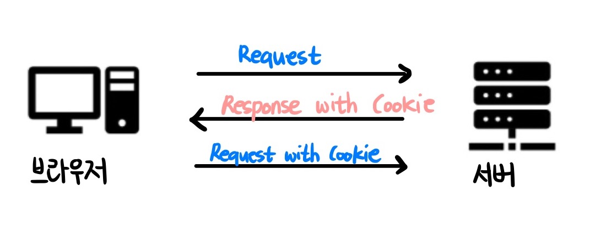
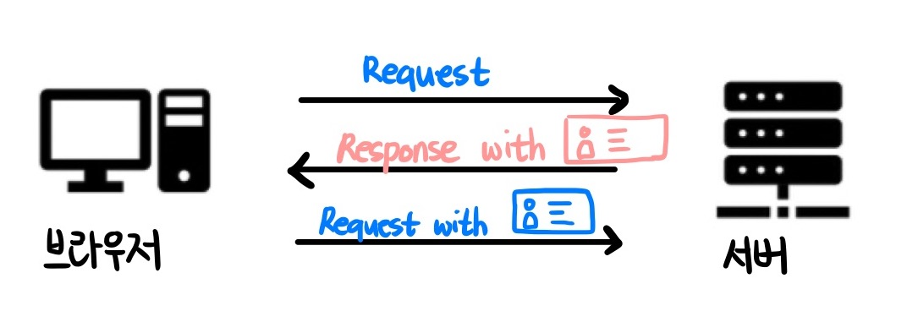
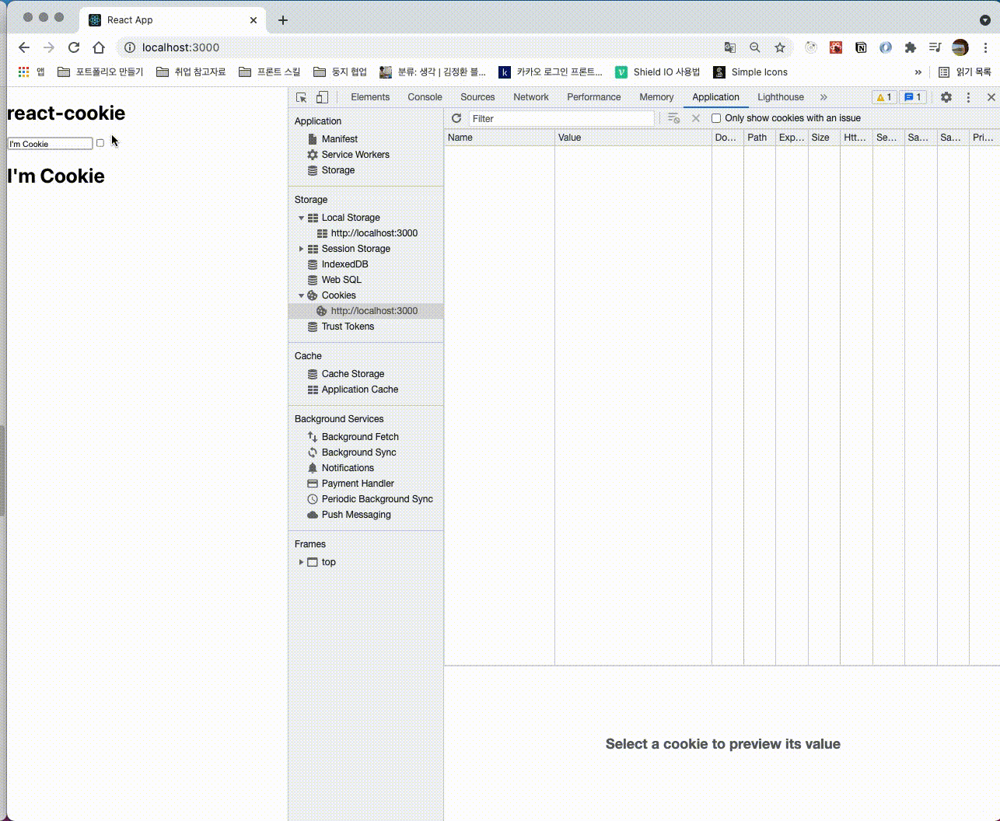

# 잔기술 모음집

## 들어가며

<p>이 readme에는 프로젝트 진행 중에 React 개념에 넣기에는 애매한 tips(이런 상황에서는 이렇게 해보면 어떨까?)를 적어보았습니다.</p>

## 목차

- [useState로 막대 그래프 비율 관리하기](#useState로-막대-그래프-비율-관리하기)
- [잊지 말자 useCallback 상황 소개](#잊지-말자-useCallback-상황-소개)
- [ES6 property-shorthand를 사용하기](#ES6-property-shorthand를-사용하기)
- [쿠키와 세션](#쿠키와-세션)
- [react-cookie](#react-cookie)

## useState로 막대 그래프 비율 관리하기

<p>지난 주말 (6월 27일) 회의를 통해서 현재 만들고 있는 프로젝트의 변경 사항에 대해 논의 했습니다. 따로 세부적으로 기획을 하거나 디자인을 한 것이 아닌, 타깃 사이트를 잡고 진행한 프로젝트였기 때문에 큰 문제가 없이 빨리 끝낼 수 있을 것이라 생각했지만 마음처럼 쉽지 않았다. 우리만의 무언가를 보여주기 위해서 백엔드 개발자인 진수님이 순수 figma를 작성하여 '이런 식으로 해보면 어떨까요..?' 라는 주제를 던져 주셨다. </p>


<p>너무 타깃 사이트를 따라 가기만 바빠서 생각하지 못했던 부분인데, 이를 우리 프로젝트에 추가하기로 결정하였지만, 생각보다 꽤 까다로운 부분이 모여있었다. 그래서 바로 개발부터 들어가는 것이 아닌 생각을 한 번 정리하고 들어가는 방법을 선택하였다. 예전에는 잘 못느꼈는데 계속 복잡한 작업을 하다보니 이러한 방식이 더 개발에 효율적이라고 느껴진다.</p>


> 로직은 다음과 같다

1. 음료에 해당하는 버튼 클릭, 리뷰 작성
2. 가게 정보를 비롯한 사용자 input (선택한 음료, 리뷰)를 서버에 저장 (post 요청)
3. 이를 바탕으로 변경 시, reducer에서 감지하고 review list를 업데이트 (get 요청)
4. 막대 그래프를 통해 비율과 해당하는 비율 표시하기
5. 기타 반응형 작업

<p>우선 form 태그와 관련된 DOM 이벤트도 안 써본지 엄청 오래 되었고, 리액트와 타입스크립트 문법을 배우면서 등한시 했던 부분이라 까다롭더라도 한 번 해보고 싶었다</p>

> 1,2 카테고리를 선택하고 코멘트와 함께 데이터를 보내는 로직

```js
const Store = () => {
  // 카테고리 관리
  const [inputStatus, setInputStatus] = useState("");
  // 라우팅을 통해 파라미터로 전달받는 가게 이름(title과 가게 고유id)
  const { title, id } = useParams();
  // 사용자 입력 input을 관리한 레퍼런스
  const commentRef = useRef();

  // 카테고리 선택을 위한 함수
  const handleClickRadioButton = useCallback((radioBtnName) => {
    setInputStatus(radioBtnName);
  }, []);

  // onSubmit 관련 함수
  const onSubmitForm = useCallback(
    (e) => {
      e.preventDefault();
      const comment = commentRef.current;
      if (comment.value.trim() === "" || inputStatus === "") {
        alert("게시글을 입력 또는 카테고리 선택을 완료해야 합니다");
        comment.focus();
        return;
      }
      alert(
        `가게id: ${id} \n가게이름: ${title}\n커멘트: ${
          comment.value
        }\n카테고리: ${inputStatus ? inputStatus : "없음"}`
      );
      comment.value = "";
    },
    [inputStatus]
  );

  return (
    {/* 리뷰 작성하기 관련 */}
      <StoreContent>
        <form onSubmit={onSubmitForm}>
          <MyGraph>
            <InnerGraph width={categoryRate} />
          </MyGraph>
          <FormCategoryWrap>
            <FormCategoryMain>
              <input type="radio" name="category" value="pepsi" defaultChecked={inputStatus === 'pepsi'} onClick={() => handleClickRadioButton('pepsi')}/>
              
            </FormCategoryMain>
            <FormCategoryMain>
              
              <input type="radio" name="category" value="coca" defaultChecked={inputStatus === 'coca'} onClick={() => handleClickRadioButton('coca')}/>
            </FormCategoryMain>
          </FormCategoryWrap>
          <div>
            <MyCard title="홍길동" style={{ margin: '6% 0' }}>
              <input ref={commentRef} />
            </MyCard>
            <CustomBtn>리뷰쓰기</CustomBtn>
          </div>
        </form>
      </StoreContent>

  )
};
```

1. 두 개의 선택지에서 하나만 선택을 하기 위해서는 같은 name 프로퍼티를 가지고 있어야 한다
2. 리액트에서 input 태그 내부에서 state를 통해 관리하기 위해서는 checked 대신 defaultChecked를 사용한다.
3. inputStatus를 비워두고 해당 라디오 버튼이 클릭되면 handleClickRadioButton함수를 통해 inputStatus에 해당 값(value)을 저장한다
4. inputStatus === 'coca' , 즉 체크가 되어 있는 상태에서만 defaultChecked를 통해 표시된다.
5. 따라서 useState를 통해 value 값을 관리하고 있기 때문에ㅔ, inputStatus를 onSubmit 시에 해당 데이터와 함께 dispatch 시킬 수 있다.
6. 현재 alert()로 보여지고 있는 데이터는 dispatch를 통해 액션을 서버로 보내준다.

> 3,4 review list를 업데이트 및 막대 그래프를 통해 비율과 해당하는 비율 표시하기

<p>위의 과정을 통해 mongoDB에 저장이 된다면, 우리는 서버로 부터 새로운 리뷰 리스트를 전달 받는다. 리뷰 리스트는 reducer에서 initialState를 통해 관리되고, 우리는 이를 useSelector()를 통해 불러온 뒤 매핑해준다. 이때 다시 넘겨받는 reviewList의 객체 안의 category 프로퍼티를 통해 비율을 표시해줘야 한다.</p>

```js
const Store = () => {
  // 카테고리 비율
  const [categoryRate, setCategoryRate] = useState(100);

  // 해당 가게에 대한 리뷰 리스트
  const reviewList = [
    {
      id: 1,
      storeName: "헤반트 범계점",
      userName: "윤성님",
      comment: "존맛탱 가게입니다 추천해요",
      category: "펩시",
    },
    {
      id: 2,
      storeName: "헤반트 범계점",
      userName: "도해님",
      comment: "튀김이 바삭바삭해용.튀김이 바삭바삭해용",
      category: "코카콜라",
    },
    {
      id: 3,
      storeName: "헤반트 범계점",
      userName: "진수님",
      comment: "여긴 왜 제로콜라 없나요?",
      category: "펩시",
    },
    {
      id: 4,
      storeName: "헤반트 범계점",
      userName: "준희님",
      comment: "펩시 제로 라임맛 최고",
      category: "펩시",
    },
  ];

  // 카테고리 비율을 계산할 함수 calCategory() 실행 후 결과 값을 CategoryRate state에 담고 props로 전달
  useEffect(() => {
    const categoryResult = calCategory(reviewList);
    setCategoryRate(categoryResult);
  }, [reviewList]);

   const calCategory = useCallback((reviewList) => {
    // 펩시 개수, 콜라 개수
    let pepsiArr = [];
    let cocaArr = [];

    reviewList.map((r) => {
      if (r.category === '펩시') {
        pepsiArr.push(r.category);
      } else if (r.category === '코카콜라') {
        cocaArr.push(r.category);
      }
    });

    return Math.floor((pepsiArr.length / reviewList.length) * 100);
  }, []);

  return (
        // 막대그래프의 비율을 관리할 categoryRate
        <MyGraph>
          <InnerGraph width={categoryRate} />
        </MyGraph>

        // 리뷰 리스트 관련
        <StoreContent>
          <StoreContentHeader>
            <StoreContentHeaderMain>리뷰 </StoreContentHeaderMain>
            <StoreContentHeaderSub>
              {reviewList.length ? <span>{reviewList.length}개</span> : <span>0개</span>}
            </StoreContentHeaderSub>
          </StoreContentHeader>
          {storeReview.length ? (
            <StoreContentReview>
              {reviewList.map((review) => (
                <StoreContentReviewWrap key={review.id}>
                  <MyCard title={review.userName} bordered={false} category={review.category.toString()}>
                    <p>{review.comment}</p>
                    <p>{review.category === '펩시' ?  : }</p>
                  </MyCard>
                </StoreContentReviewWrap>
              ))}
            </StoreContentReview>
          ) : (
            <Skeleton></Skeleton>
          )}
        </StoreContent>
  )
};
...
📁 style.js
// width를 props로 전달받음
export const InnerGraph = styled.div`
  background: #bbdefb;
  width: ${(props) => props.width}%;
  padding: 8px;
  border-radius: 20px;
`;
```

1. 서버로 부터 넘겨받을 데이터를 더미데이터로 구현해 두었다 (reviewList)
2. useEffect()를 통해 reviewList를 감지한다 변화가 있을 시, 해당 변화를 감지할 calCategory 함수를 사용한다.
3. calCategory 함수를 통해 reviewList의 각 객체 안에 들어있는 category 프로퍼티에 접근한다.
4. 후에 각각의 배열 (pepsiArr, cocaArr)에 해당하는 값이 있다면 넣어주고, 비율을 계산하여 리턴한다.

```js
return Math.floor((pepsiArr.length / reviewList.length) * 100); // 펩시의 백분율(%)을 계산하는 식 (나머지는 floor 함수를 통해 버림하였다)
```

5. 마지막으로 calCategory 함수의 리턴 값을 setCategoryRate(categoryResult)를 통해 categoryRate state를 새로 업데이트 해준다.
6. 해당 state를 props로 전달하여, emotion을 통해 해당 width를 통해 막대 그래프의 비율을 조정할 수 있다.

### 결과


> 데이터를 추가하면 정상적으로 비율과 배경이 변화한다


### 레퍼런스

- <a href="https://taehoblog.netlify.app/react/radiobutton/">리액트 라디오 버튼</a>
- <a href="https://developer.mozilla.org/ko/docs/Web/JavaScript/Reference/Global_Objects/Math/floor">MDN: Math.floor</a>
- <a href="https://www.google.com/search?q=%EB%B0%B0%EC%97%B4+%ED%94%84%EB%A1%9C%ED%8D%BC%ED%8B%B0+%EC%B6%94%EC%B6%9C%ED%95%98%EA%B8%B0&rlz=1C5CHFA_enKR920KR920&sxsrf=ALeKk03bnq9RNoznCQVXOJzP2L2OczMNTg%3A1625054492051&ei=HF3cYLPPAse2mAWmrJrICw&oq=%EB%B0%B0%EC%97%B4+%ED%94%84%EB%A1%9C%ED%8D%BC%ED%8B%B0+%EC%B6%94%EC%B6%9C%ED%95%98%EA%B8%B0&gs_lcp=Cgdnd3Mtd2l6EANKBAhBGAFQ2wpYghBgwhFoAXAAeACAAaYCiAHLC5IBBTEuMS41mAEAoAEBqgEHZ3dzLXdpesABAQ&sclient=gws-wiz&ved=0ahUKEwizzfTdp7_xAhVHG6YKHSaWBrkQ4dUDCA4&uact=5">키워드로 검색: 배열 프로퍼티 추출하기</a>

## 잊지 말자 useCallback 상황 소개

<p>콜라맵 프로젝트를 진행하는 중에, input 값을 추출하여 서버에 데이터를 전송하는 부분이 있었다. 카카오 API에서 제공하는 가게의 고유 id와, 가게의 이름, 글쓴이, 카테고리, 댓글(코멘트)를 서버에 넘겨줘야하는 상황이다. form 태그를 통해서 실제로 컨트롤하는 것은 카테고리 분류에 대한 값과 댓글을 처리하는 방법이다. 이를 각각 useState와 useRef를 사용하여 처리하였다.</p>

```js
const Store = () => {
  // 카테고리 관리
  const [inputStatus, setInputStatus] = useState("");
  // 파라미터를 통해 가게 고유 아이디와 가게 이름을 넘겨받음
  const { title, id } = useParams();
  // 댓글 (코멘트)관리
  const commentRef = useRef();
  ...

  // input button type radio에게 useState를 부여할 함수(handleClickRadioButton)
  const handleClickRadioButton = useCallback((radioBtnName) => {
    setInputStatus(radioBtnName);
  }, []);

  // form 태그의 메서드 onSubmit={onSubmitForm}에 들어가는 함수
  ...
  const onSubmitForm = useCallback(
    (e) => {
      e.preventDefault();
      const comment = commentRef.current;
      if (comment.value.trim() === '' || inputStatus === '') {
        alert('게시글을 입력 또는 카테고리 선택을 완료해야 합니다');
        comment.focus();
        return;
      }
      alert(
        `가게id: ${id} \n가게이름: ${title}\n커멘트: ${comment.value}\n카테고리: ${inputStatus ? inputStatus : '없음'}`,
      );
      comment.value = '';
    },
    [],
  );
};
```


<p>분명히 useEffect와 useState를 통해서 카테고리의 값이 변경될 때마다 감지가 되는데, form 태그로 해당 state를 전달하지 못하는 것이였다. 전에도 이런적이 있었는데, 리뷰를 받고 어영부영 넘겨서 해결했던 부분이여서 또 까먹었던 것 같다. 구글링을 계속 해보았는데, 내가 원하는 정보는 찾을 수 없었다. 하지만, 슬랙에서 다른 프론트 엔드 파트 인원분들께 여쭤보니, useCallback()을 사용할 때 두 번째 파라미터에 우리가 감지하고 싶어하는 state를 넣어 주지 않았다는 것을 알 수 있다.</p>

> useCallback 의 첫번째 파라미터에는 우리가 생성해주고 싶은 함수를 넣어주고, 두번째 파라미터에는 배열을 넣어주면 되는데 이 배열에는 어떤 값이 바뀌었을 때 함수를 새로 생성해주어야 하는지 명시해주어야 합니다.

<p>지금 찾아보니 지금 이 정리본에도 적혀 있는 내용인데, 이미 안다고 생각하고 대충 보고 넘긴 경향이 있는 것 같다.</p>

> 바꾼 로직

```js
const Store = () => {
  // 카테고리 관리
  const [inputStatus, setInputStatus] = useState("");
  // 파라미터를 통해 가게 고유 아이디와 가게 이름을 넘겨받음
  const { title, id } = useParams();
  // 댓글 (코멘트)관리
  const commentRef = useRef();
  ...

  // input button type radio에게 useState를 부여할 함수(handleClickRadioButton)
  const handleClickRadioButton = useCallback((radioBtnName) => {
    setInputStatus(radioBtnName);
  }, []);

  // form 태그의 메서드 onSubmit={onSubmitForm}에 들어가는 함수
  ...
  const onSubmitForm = useCallback(
    (e) => {
      e.preventDefault();
      const comment = commentRef.current;
      if (comment.value.trim() === '' || inputStatus === '') {
        alert('게시글을 입력 또는 카테고리 선택을 완료해야 합니다');
        comment.focus();
        return;
      }
      alert(
        `가게id: ${id} \n가게이름: ${title}\n커멘트: ${comment.value}\n카테고리: ${inputStatus ? inputStatus : '없음'}`,
      );
      comment.value = '';
    },
    [inputStatus],
    // inputStatus를 추가 > onSubmitForm 함수가 useState를 통해 관리되는 state의 업데이트 값을 인식하지 못한다.
    // 추가적으로 의존성을 띄게 되는 state가 있다면 [] 파라미터에 의존성을 추가해줄 것
  );
};
```

## ES6 property-shorthand를 사용하기

<p>새롭게 현업을 시작하는 과정에서, 전에도 해결하지 못한(?) 방식으로 코드를 짜시는 팀원분을 만났습니다.</p>

### return문에 { } 객체형식으로 변수 반환하기

```js
function useHeader() {
  const teamName = "MIC-TEAM";

  return { teamName };
}

export default useHeader;
```

### 해당 teamName 객체의 사용

```js
import React from "react";
import useHeader from "../../hooks/useHeader";
import { container } from "./styles";

function Header() {
  const { teamName } = useHeader();

  return <h1 css={container}>{teamName}</h1>;
}

export default Header;
```

<p>끈질긴 질문 끝에 property-shorthand라 불리우는 ES6의 문법이라는 단서를 얻을 수 있었습니다.</p>

<p>property-shorthand에 대한 기본적인 내용은 다음과 같습니다.</p>

```js
/* property shorthand (단축 속성명) */
var a = "foo";
var b = 42;
var c = {};

console.log("a:", a, "b:", b, "c:", c);
// a: foo b: 42 c: {}

var o = {
  a: a,
  b: b,
  c: c,
};

console.log("o:", o);
// o: { a: 'foo', b: 42, c: {} }

// 프로퍼티 {key: value}에서 해당 key , value의 값이 일치한다면 단축 속성명을 사용할 수 있습니다.
// 다음과 같이 key값을 변수명으로 생성할 수 있습니다.

var o2 = { a, b, c };

console.log("o2:", o2);
// o2: { a: 'foo', b: 42, c: {} }
```

<p>프로퍼티를 구성하는 {key : value}의 형태에서, key와 value의 값이 일치하게 구성한다면, 단축 속성명 (property-shorthand)을 사용할 수 있습니다. 따라서 처음 제시한 코드를 풀어보면 다음과 같습니다.</p>

```js
case 1: 단축 속성명 사용 전,

function useHeader() {
  const teamName = "MIC-TEAM";

  return { teamName: teamName };
}

export default useHeader;

console.log(useHeader());
// { teamName: 'MIC-TEAM' }

case 2: 단축 속성명 사용 후,

function useHeader() {
  const teamName = "MIC-TEAM";

  return { teamName };
}

export default useHeader;

console.log(useHeader());
// { teamName: 'MIC-TEAM' }
```

<p>호출된 함수가 객체 형식으로 반환할 때, 프로퍼티의 value를 적어주지 않더라도 같은 값을 반환하는 것을 알 수 있었습니다.</p>
<p>따라서, useHeader 함수를 호춣하며 { } 중괄호 내부에 담는 { teamName } 은 실질적으로 teamName이라는 식별자에 의해 참조가 가능한 메모리에 저장된 원시값인 'MIC-TEAM' 문자열을 의미합니다.</p>

```js
import React from "react";
import useHeader from "../../hooks/useHeader";
import { container } from "./styles";

function Header() {
  const { teamName } = useHeader();

  return <h1 css={container}>{teamName}</h1>;
}

export default Header;
```

<p>사실 아직까지는 그냥 이렇게 분리해서 사용해야 하는 이유를 발견하지 못했습니다. 조금 더 공부하면서, 해당 부분을 단축 속성명을 사용하며 생기는 이점에 대해 알아보겠습니다.</p>

```
아하~ 저 useHeader에 리턴하는 값이 teamName 하나라면 준희님 말씀처럼 값만 던져주는 게 더 좋은 코드인 것 같습니다~!
그런데 보통 useHeader 같은 커스텀 훅은 비즈니스 로직 처리 후 리턴 값이 여러 키, 밸류를 담고 있는 객체가 전달되는 게 보통인 것 같아서 미리 객체로 만들어서 리턴 시켜줬습니다
```

<p>와 같은 답변을 받았습니다...! 후에 비즈니스 로직이 추가되면, 반드시 객체로 반환하는 이유를 찾아 추가적으로 작성해보도록 하겠습니다!</p>

## 쿠키와 세션

프로젝트에서 처음 맡은 부분은 네이버와 카카오의 소셜 로그인을 통해 간편 로그인을 구현하고, 해당 정보를 바탕으로 로그인 환경을 유지하는 것이다.
스토리지(Local Storage)에 토큰을 저장하는 방법을 사용하였다. 이번에는 저번과 달리 헤더를 통해 넘어오는 정보(토큰)를 쿠키에 저장하기 위해 공부하였다.</p>

<p>우선 쿠키와 세션에 대한 정확한 개념이 없을 수 있으니, 구글링을 통해 얻은 정보를 바탕으로 정리해보겠다.</p>

### 참고자료

[쿠키와 세션](https://sirong.tistory.com/100)<br/>
[쿠키란?](https://hahahoho5915.tistory.com/32)<br/>
[react-cookie](https://sirong.tistory.com/101)<br/>
[MDN HTTP 쿠키](https://developer.mozilla.org/ko/docs/Web/HTTP/Cookies)<br/>
[MDN Set-Cookie](https://developer.mozilla.org/ko/docs/Web/HTTP/Headers/Set-Cookie)<br/>

### 쿠키와 세션

<p>HTTP는 항상 연결되어있는 것이 아닌 필요할 때마다 요청을 보내고 응답을 반는 <b>비연결성</b>이라는 특징을 가지고 있다.</p>

<p>이는 클라이언트가 응답을 받으면 서버는 접속을 끊는다는 것인데, 연결이 끝나면 상태 정보가 유지되지 않는 특성이 있다.</p>

```
로그인을 한 뒤, 다른 도메인으로 이동했다 기존 사이트로 돌아오면 로그인 정보가 유지되지 않는다는 것
```

<p>이렇게 유지되지 않는 로그인 정보를 유지하기 위한 방법이 <b>쿠키와 세션</b>이다.</p>

### 쿠키

<p>HTTP의 일종으로 사용자가 어떠한 웹 사이트를 방문할 경우, 그 사이트가 사용하고 있는 서버에서 사용자의 컴퓨터에 저장하는 작은 기록 정보 파일이다.  HTTP에서 클라이언트의 상태 정보를 클라이언트의 PC에 저장하였다가 필요시 정보를 참조하거나 재사용할 수 있다.</p>

### 쿠키의 특징

- 이름, 값, 만료일(저장 기간 설정), 경로 정보로 구성되어 있다.
- 클라이언트에 총 300개의 쿠키를 저장할 수 있다.
- 하나의 도메인 당 20개의 쿠키를 가질 수 있다
- 하나의 쿠키는 4KB(=4096byte)까지 저장 가능하다.

### 쿠키의 동작 순서



- 클라이언트가 페이지를 요청한다 (사용자가 웹사이트 접근) 웹 서버는 쿠키를 생성한다
- 생성한 쿠키에 정보를 담아 HTTP 화면을 돌려줄 때, 같이 클라이언트에게 돌려준다
- 넘겨 받은 쿠키는 클라이언트가 가지고 있다가(로컬 PC에 저장) 다시 서버에 요청할 때 요청과 함께 쿠키를 전송한다
- 동일 사이트 재방문시 클라이언트의 PC에 해당 쿠키가 있는 경우, 요청 페이지와 함께 쿠키를 전송한다

### 사용 예시

1. 방문했던 사이트에 다시 방문 하였을 때 아이디와 비밀번호 자동 입력
2. 팝업창을 통해 "오늘 이 창을 다시 보지 않기" 체크

### 쿠키의 약점

- 쿠키의 특징으로는 클라이언트(브라우저)단에 저장된다는 것이다
- 즉 보안에 약할 수 있다
- 쿠키를 훔쳐서 계정 접근 권한 등을 탈취하여 유저의 정보를 악용할 수 있다

### 세션

<p>
HTTP 세션이란 클라이이언트가 웹서버에 연결된 순간부터 웹 브라우저를 닫아 서버와의 HTTP 통신을 끝낼 때 까지의 기간이다.

하지만 보통 세션이라고 말할 때에는 <b>서버에 세션에 대한 정보(세션 상태, 클라이언트 상태, 세션 데이터 등)를 저장해 놓고 세션 쿠키( 고유한 세션 ID 값 )를 클라이언트에게 주어 서버가 클라이언트를 식별할 수 있도록 하는 방식자체를 의미하는 경우</b>가 많다.

</p>

### 세션의 특징

- 따로 용량의 제한이 없다 (서버의 능력에 따라 다를 수 있다)
- 서버에 세션 객체를 생성하며 각 클라이언트 마다 고유한 세션 ID 값을 부여한다
- 쿠키를 사용하여 세션 ID 값을 클라이언트에 보낸다
- 웹 브라우저가 종료되면 세션 쿠키는 삭제된다

### 세션의 동작 방식



- 클라이언트 페이지가 요청한다
- 서버가 클라이언트마다 개별의 세션 ID를 부여한다
- 클라이언트는 요청할 때마다 세션 ID를 서버에 전달한다
- 서버는 받은 세션 ID로 클라이언트 정보를 가져와 활용한다

## react-cookie

<p>이번에는 리액트 환경에서 쿠키를 사용하여 브라우저에 쿠키값을 저장하는 방법을 알아보도록 하겠다</p>

[예제보기](https://github.com/junh0328/TIL/commits/master/React/react-cookie)

### 라이브러리 다운로드

<p>리액트 환경에서 쿠키를 사용하기 위해 npm에서 제공하는 패키지를 다운 받는다.</p>

```
npm install react-cookie
```

<p>📁/src/index.js에서 쿠키를 사용하기 위해 Provider로 해당 &lt;App&gt;을 감싸준다</p>

```js
import React from "react";
import ReactDOM from "react-dom";
import { CookiesProvider } from "react-cookie";
import App from "./App";

ReactDOM.render(
  <CookiesProvider>
    <App />
  </CookiesProvider>,
  document.getElementById("root")
);
```

### 코드

```js
import "./App.css";
import { useCallback, useEffect, useState } from "react";
import { useCookies } from "react-cookie";

function App() {
  const [text, setText] = useState("");
  const [isRemember, setIsRemember] = useState(false);
  const [cookies, setCookie, removeCookie] = useCookies(["rememberText"]);

  let now = new Date();
  let afterOneMinute = new Date();

  useEffect(() => {
    if (cookies.rememberText !== undefined) {
      setText(cookies.rememberText);
      setIsRemember(true);
    }
  }, []);

  const onChange = useCallback((e) => {
    setText(e.target.value);
  }, []);

  const handleOnChage = (e) => {
    setIsRemember(e.target.checked);
    if (e.target.checked) {
      afterOneMinute.setMinutes(now.getMinutes() + 1);
      setCookie("rememberText", text, { path: "/", expires: afterOneMinute });
    } else {
      removeCookie("rememberText");
    }
  };

  return (
    <div>
      <h1>react-cookie</h1>
      <input value={text} onChange={onChange} />
      <input type="checkBox" onChange={handleOnChage} checked={isRemember} />
      <h1>{text}</h1>
    </div>
  );
}

export default App;
```

### 해석

### ① 렌더링 부분

```js
  const [text, setText] = useState("");
  const [isRemember, setIsRemember] = useState(false);

  const onChange = useCallback((e) => {
    setText(e.target.value);
  }, []);

  const handleOnChage = (e) => {
    setIsRemember(e.target.checked)
  }

...
  return (
    <div>
      <h1>react-cookie</h1>
      <input value={text} onChange={onChange} />
      <input type="checkBox" onChange={handleOnChage} checked={isRemember} />
      <h1>{text}</h1>
    </div>
  );
```

<p>input 태그에 useState로 관리하는 text state를 지정해주었다. 이 text를 바탕으로 check-box가 체크되었을 때 쿠키 로직을 작성하여 쿠키에 text 정보를 저장할 것이다</p>

### ② 쿠키 로직 부분

```js
import "./App.css";
import { useCallback, useEffect, useState } from "react";
import { useCookies } from "react-cookie";

function App() {
  const [text, setText] = useState("");
  const [isRemember, setIsRemember] = useState(false);
  /* 
  react-cookie 에서 제공하는 훅함수인 useCookies를 사용하였다 
  cookies는 쿠기의 정의
  setCookie는 쿠키를 재정의
  removeCookie는 쿠키를 제거
  useCookies 안에는 초기값을 넣는다
  */
  const [cookies, setCookie, removeCookie] = useCookies(["rememberText"]);

  let now = new Date(); // Date 객체를 통해 생성한 인스턴스 now를 통해 현재 시간을 불러온다
  let afterOneMinute = new Date(); // 1분 후에 쿠키를 재거하기 위한 변수 afterOneMinute를 인스턴스로 생성한다

  useEffect(() => {
    if (cookies.rememberText !== undefined) {
      setText(cookies.rememberText);
      setIsRemember(true);
    }
  }, []);

  /* text input 값이 변하면 활성되는 함수*/
  const onChange = useCallback((e) => {
    setText(e.target.value);
  }, []);

  const handleOnChage = (e) => {
    setIsRemember(e.target.checked);
    if (e.target.checked) {
      afterOneMinute.setMinutes(now.getMinutes() + 1);
      /* setCookie를 통해 초기값(rememberText)에 text state를 저장한다 */
      setCookie("rememberText", text, { path: "/", expires: afterOneMinute });
    } else {
      /* check가 되지 않는다면 쿠키를 제거한다 */
      removeCookie("rememberText");
    }
  };

  return (
    <div>
      <h1>react-cookie</h1>
      <input value={text} onChange={onChange} />
      <input type="checkBox" onChange={handleOnChage} checked={isRemember} />
      <h1>{text}</h1>
    </div>
  );
}

export default App;
```

### 결과



<br/>

문제없이 동작한다

### 추가 정리 내용

현재까지는 react-cookie 라이브러리를 통해 브라우저 상에서 임의의 쿠키를 생성하였다. 하지만, 실제로 쿠키를 사용하는 이유는 서버에서 헤더를 통해 넘겨받는 정보를 저장하기 위함이므로, 이에 대한 내용을 추가적으로 정리할 필요가 있을 것이다.

### 쿠키 만들기

HTTP 요청을 수신할 때, 서버는 응답과 함께 <b>Set-Cookie</b> 헤더를 전송할 수 있습니다. <br/>
쿠키는 보통 브라우저에 의해 저장되며, 그 후 쿠키는 같은 서버에 의해 만들어진 요청(Request)들의 <b>Cookie HTTP 헤더</b>안에 포함되어 전송됩니다. <br/>
만료일 혹은 지속시간(duration)도 명시될 수 있고, 만료된 쿠키는 더이상 보내지지 않습니다. <br/>
추가적으로, 특정 도메인 혹은 경로 제한을 설정할 수 있으며 이는 쿠키가 보내지는 것을 제한할 수 있습니다.<br/>

### 쿠키 문법

```
Set-Cookie: <cookie-name>=<cookie-value>
Set-Cookie: <cookie-name>=<cookie-value>; Expires=<date>
Set-Cookie: <cookie-name>=<cookie-value>; Max-Age=<non-zero-digit>
Set-Cookie: <cookie-name>=<cookie-value>; Domain=<domain-value>
Set-Cookie: <cookie-name>=<cookie-value>; Path=<path-value>
Set-Cookie: <cookie-name>=<cookie-value>; Secure
Set-Cookie: <cookie-name>=<cookie-value>; HttpOnly

Set-Cookie: <cookie-name>=<cookie-value>; SameSite=Strict
Set-Cookie: <cookie-name>=<cookie-value>; SameSite=Lax

// Multiple directives are also possible, for example:
Set-Cookie: <cookie-name>=<cookie-value>; Domain=<domain-value>; Secure; HttpOnly
```

### Set-Cookie 그리고 Cookie 헤더

간단한 쿠키는 다음과 같이 설정될 수 있습니다.

```
Set-Cookie: <cookie-name>=<cookie-value>
```

이 서버 헤더는 클라이언트에게 쿠키를 저장하라고 전달합니다.

```
HTTP/1.0 200 OK
Content-type: text/html
Set-Cookie: yummy_cookie=choco
Set-Cookie: tasty_cookie=strawberry

[page content]
```

이제, 서버로 전송되는 모든 요청과 함께, 브라우저는 <b>Cookie 헤더</b>를 사용하여 서버로 이전에 저장했던 모든 쿠키를 회신할 것입니다.

```
GET /sample_page.html HTTP/1.1
Host: www.example.org
Cookie: yummy_cookie=choco; tasty_cookie=strawberry
```

### 쿠키에 대한 도메인 설정

쿠키가 유효한 사이트를 명시하기 위해 쿠키에 도메인을 설정할 수 있습니다

```
Set-Cookie: yummy_cookie=choco; Domain=localhost
```

이렇게 도메인이 설정된 쿠키는 해당 도메인에서만 유요한 쿠키가 됩니다.<br/>
위에서 yummy_cookies 쿠키는 localhost를 대상으로 쿠키가 설정되었기 때문에, localhost를 대상으로 한 요청에만 normal 쿠키가 전송됩니다.<br/>

쿠키에 별도로 명시된 도메인이 없다면 기본값으로 쿠키를 보낸 서버의 도메인으로 설정됩니다.

### 쿠키의 라이프 타임

쿠키의 라이프타임은 두 가지 방법으로 정의할 수 있습니다

```
① 세션쿠키는 현재 세션이 끝날 때 삭제됩니다. 브라우저는 '현재 세션'이 끝나는 시점을 정의하며,
어떤 브라우저들은 재시작할 때 세션을 복원해 세션 쿠키가 무기한 존재할 수 있도록 합니다.

② 영속적인 쿠키는 Expires 속성에 명시된 날짜에 삭제되거나, Max-Age 속성에 명시된 기간 이후에 삭제됩니다.
```

예를 들면 아래와 같습니다.

```
Set-Cookie: id=a3fWa; Expires=Wed, 21 Oct 2015 07:28:00 GMT;
```

### 쿠키의 스코프

```
Set-Cookie: <cookie-name>=<cookie-value>; Domain=<domain-value>
Set-Cookie: <cookie-name>=<cookie-value>; Path=<path-value>
```

Domain 그리고 Path 디렉티브는 쿠키의 스코프를 정의합니다: 어떤 URL을 쿠키가 보내야 하는지. <br/>

Domain은 쿠키가 전송되게 될 호스트들을 명시합니다. 만약 명시되지 않는다면, 현재 문서 위치의 호스트 일부를 기본값으로 합니다.<br/>
도메인이 명시되며, 서브도메인들은 항상 포함입니다.

Path는 Cookie 헤더를 전송하기 위하여 요청되는 URL 내에 반드시 존재해야 하는 URL 경로입니다.

```
만약 Path=/docs 이 설정되면, 다음 경로들은 모두 매치될 것입니다

/docs
/docs/Web/
/docs/Web/HTTP
```

### SameSite (?)

[SameSite 속성](https://seob.dev/posts/%EB%B8%8C%EB%9D%BC%EC%9A%B0%EC%A0%80-%EC%BF%A0%ED%82%A4%EC%99%80-SameSite-%EC%86%8D%EC%84%B1)<br/>

SameSite 쿠키는 쿠키가 cross-site 요청과 함께 전송되지 않았음을 요구하게 만들어, cross-site 요청 위조 공격(CSRF (en-US))에 대해 어떤 보호 방법을 제공합니다. <br/>
SameSite 쿠키는 여전히 실험 중이며 모든 브라우저에 의해 아직 제공되지 않고 있습니다.

[CSRF(Cross Site Request Forgery)](https://ko.wikipedia.org/wiki/%EC%82%AC%EC%9D%B4%ED%8A%B8_%EA%B0%84_%EC%9A%94%EC%B2%AD_%EC%9C%84%EC%A1%B0)는 이 문제를 노린 공격입니다. 간단히 소개해보자면 아래와 같은 방식입니다.

1. 공격대상 사이트는 쿠키로 사용자 인증을 수행함
2. 피해자는 공격 대상 사이트에 이미 로그인 되어있어서 브라우저에 쿠키가 있는 상태
3. 공격자는 피해자에게 그럴듯한 사이트 링크를 전송하고 누르게 함 (공격대상 사이트와 다른 도메인)
4. 링크를 누르면 HTML 문서가 열리는데, 이 문서는 공격 대상 사이트에 HTTP 요청을 보냄
5. 이 요청에는 쿠키가 포함(서드 파티 쿠키)되어 있으므로 공격자가 유도한 동작을 실행할 수 있음

SameSite 쿠키는 앞서 언급한 서드 파티 쿠키의 보안적 문제를 해결하기 위해 만들어진 기술입니다. 크로스 사이트(Cross-site)로 전송하는 요청의 경우 쿠키의 전송에 제한을 두도록 합니다.<br/>

SameSite 쿠키의 정책으로 None, Lax, Strict 세 가지 종류를 선택할 수 있고, 각각 동작하는 방식이 다릅니다.

1. <b>None</b>: SameSite 가 탄생하기 전 쿠키와 동작하는 방식이 같습니다. None으로 설정된 쿠키의 경우 크로스 사이트 요청의 경우에도 항상 전송됩니다. 즉, 서드 파티 쿠키도 전송됩니다. 따라서, 보안적으로도 SameSite 적용을 하지 않은 쿠키와 마찬가지로 문제가 있는 방식입니다.
2. <b>Strict</b>: 가장 보수적인 정책입니다. Strict로 설정된 쿠키는 크로스 사이트 요청에는 항상 전송되지 않습니다. 즉, 서드 파티 쿠키는 전송되지 않고, 퍼스트 파티 쿠키만 전송됩니다.
3. <b>Lax</b>: Strict에 비해 상대적으로 느슨한 정책입니다. Lax로 설정된 경우, 대체로 서드 파티 쿠키는 전송되지 않지만, 몇 가지 예외적인 요청에는 전송됩니다.

### 퍼스트 쿠키 서드파티 쿠키

<p>
쿠키는 그와 관련된 도메인을 가집니다. 이 도메인이 당신이 현재 보고 있는 페이지의 도메인과 동일하다면, 그 쿠키는 퍼스트파티 쿠키라고 불립니다. 만약 도메인이 다르다면, 서드파티 쿠키라고 부릅니다. 퍼스트파티 쿠키가 그것을 설정한 서버에만 전송되는데 반해, 웹 페이지는 다른 도메인의 서버 상에 저장된 (광고 배너와 같은) 이미지 혹은 컴포넌트를 포함할 수도 있습니다. 이러한 서드파티 컴포넌트를 통해 전송되는 쿠키들을 서드파티 쿠키라고 부르며 웹을 통한 광고와 트래킹에 주로 사용됩니다.
</p>
