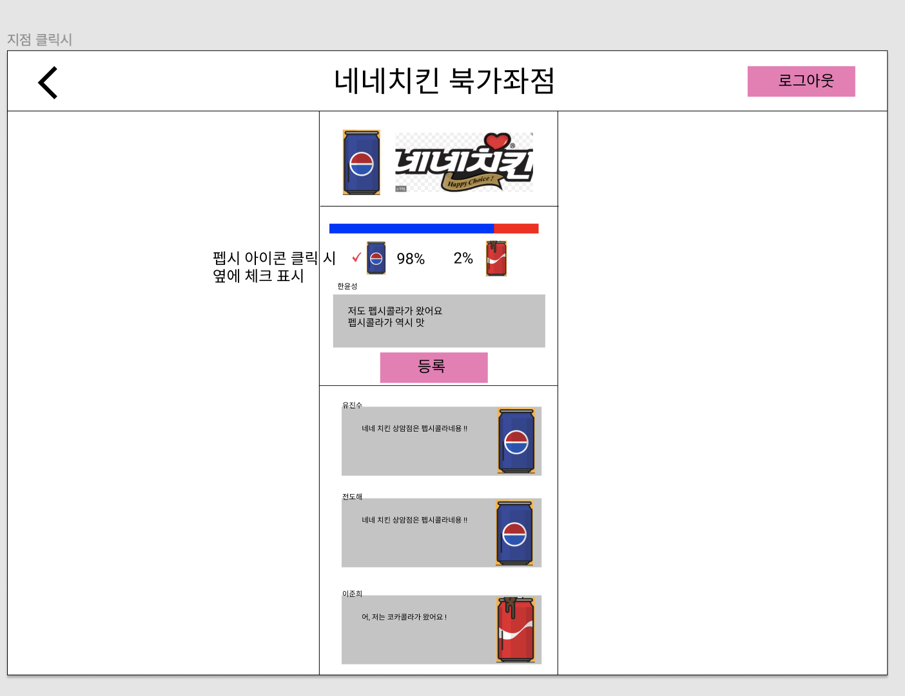
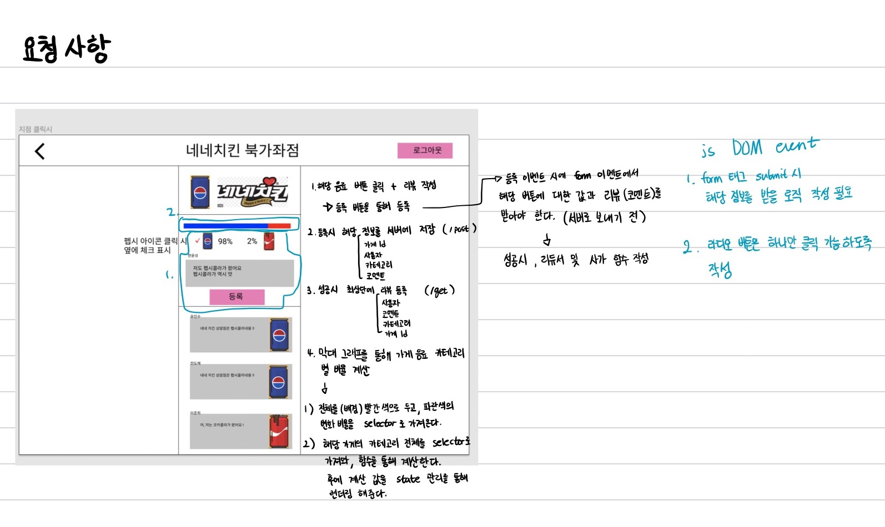
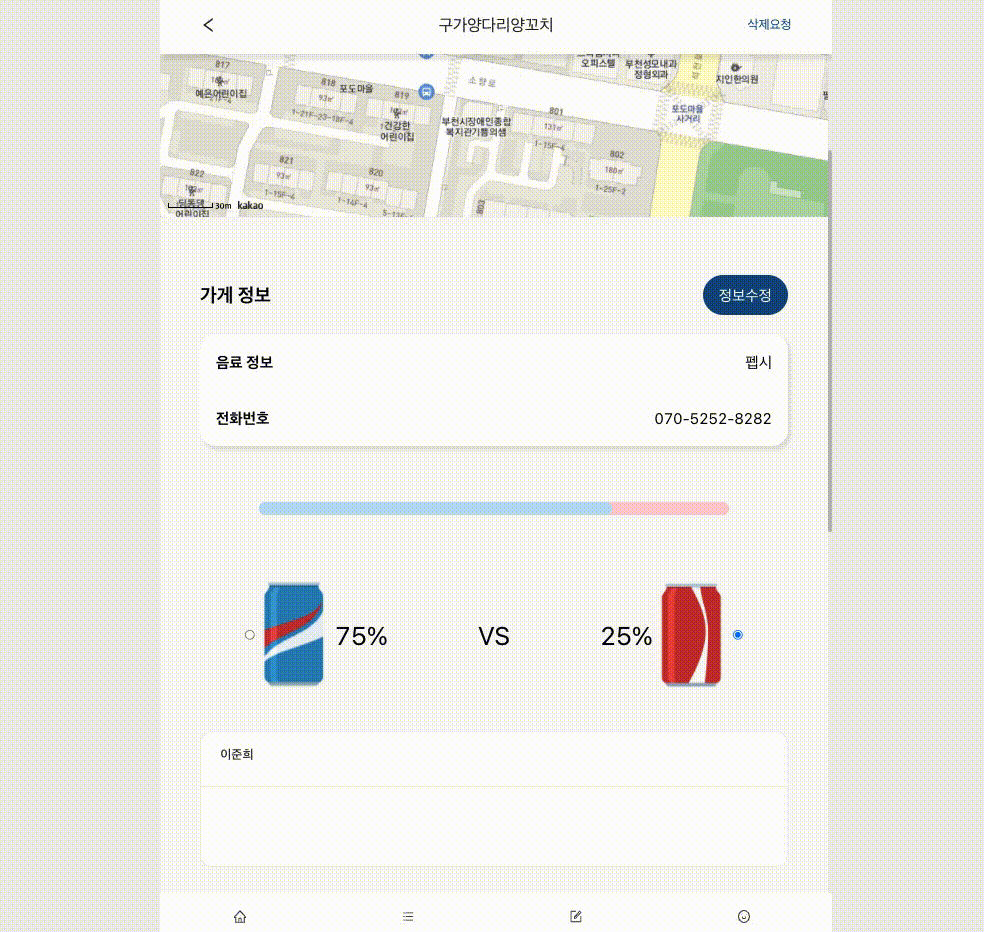
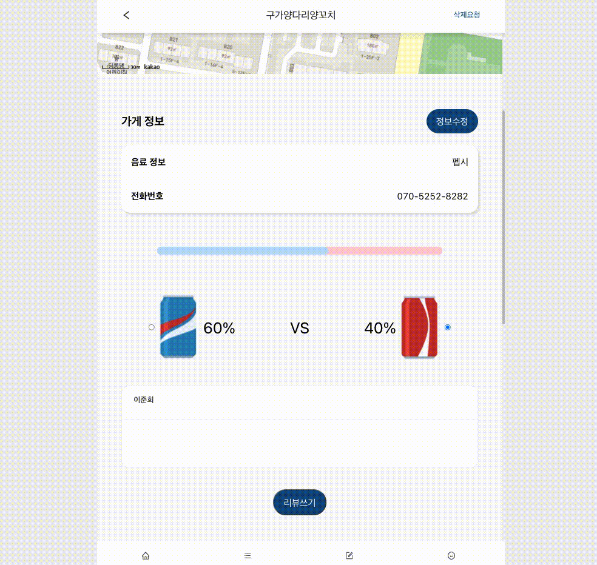

# 잔기술 모음집

## 들어가며

<p>이 readme에는 프로젝트 진행 중에 React 개념에 넣기에는 애매한 tips(이런 상황에서는 이렇게 해보면 어떨까?)를 적어보았습니다.</p>

## 첫 번째 useState로 막대 그래프 비율 관리하기

<p>지난 주말 (6월 27일) 회의를 통해서 현재 만들고 있는 프로젝트의 변경 사항에 대해 논의 했습니다. 따로 세부적으로 기획을 하거나 디자인을 한 것이 아닌, 타깃 사이트를 잡고 진행한 프로젝트였기 때문에 큰 문제가 없이 빨리 끝낼 수 있을 것이라 생각했지만 마음처럼 쉽지 않았다. 우리만의 무언가를 보여주기 위해서 백엔드 개발자인 진수님이 순수 figma를 작성하여 '이런 식으로 해보면 어떨까요..?' 라는 주제를 던져 주셨다. </p>



<p>너무 타깃 사이트를 따라 가기만 바빠서 생각하지 못했던 부분인데, 이를 우리 프로젝트에 추가하기로 결정하였지만, 생각보다 꽤 까다로운 부분이 모여있었다. 그래서 바로 개발부터 들어가는 것이 아닌 생각을 한 번 정리하고 들어가는 방법을 선택하였다. 예전에는 잘 못느꼈는데 계속 복잡한 작업을 하다보니 이러한 방식이 더 개발에 효율적이라고 느껴진다.</p>



> 로직은 다음과 같다

1. 음료에 해당하는 버튼 클릭, 리뷰 작성
2. 가게 정보를 비롯한 사용자 input (선택한 음료, 리뷰)를 서버에 저장 (post 요청)
3. 이를 바탕으로 변경 시, reducer에서 감지하고 review list를 업데이트 (get 요청)
4. 막대 그래프를 통해 비율과 해당하는 비율 표시하기
5. 기타 반응형 작업

<p>우선 form 태그와 관련된 DOM 이벤트도 안 써본지 엄청 오래 되었고, 리액트와 타입스크립트 문법을 배우면서 등한시 했던 부분이라 까다롭더라도 한 번 해보고 싶었다</p>

> 1,2 카테고리를 선택하고 코멘트와 함께 데이터를 보내는 로직

```js
const Store = () => {
  // 카테고리 관리
  const [inputStatus, setInputStatus] = useState("");
  // 라우팅을 통해 파라미터로 전달받는 가게 이름(title과 가게 고유id)
  const { title, id } = useParams();
  // 사용자 입력 input을 관리한 레퍼런스
  const commentRef = useRef();

  // 카테고리 선택을 위한 함수
  const handleClickRadioButton = useCallback((radioBtnName) => {
    setInputStatus(radioBtnName);
  }, []);

  // onSubmit 관련 함수
  const onSubmitForm = useCallback(
    (e) => {
      e.preventDefault();
      const comment = commentRef.current;
      if (comment.value.trim() === "" || inputStatus === "") {
        alert("게시글을 입력 또는 카테고리 선택을 완료해야 합니다");
        comment.focus();
        return;
      }
      alert(
        `가게id: ${id} \n가게이름: ${title}\n커멘트: ${
          comment.value
        }\n카테고리: ${inputStatus ? inputStatus : "없음"}`
      );
      comment.value = "";
    },
    [inputStatus]
  );

  return (
    {/* 리뷰 작성하기 관련 */}
      <StoreContent>
        <form onSubmit={onSubmitForm}>
          <MyGraph>
            <InnerGraph width={categoryRate} />
          </MyGraph>
          <FormCategoryWrap>
            <FormCategoryMain>
              <input type="radio" name="category" value="pepsi" defaultChecked={inputStatus === 'pepsi'} onClick={() => handleClickRadioButton('pepsi')}/>
              
            </FormCategoryMain>
            <FormCategoryMain>
              
              <input type="radio" name="category" value="coca" defaultChecked={inputStatus === 'coca'} onClick={() => handleClickRadioButton('coca')}/>
            </FormCategoryMain>
          </FormCategoryWrap>
          <div>
            <MyCard title="홍길동" style={{ margin: '6% 0' }}>
              <input ref={commentRef} />
            </MyCard>
            <CustomBtn>리뷰쓰기</CustomBtn>
          </div>
        </form>
      </StoreContent>

  )
};
```

1. 두 개의 선택지에서 하나만 선택을 하기 위해서는 같은 name 프로퍼티를 가지고 있어야 한다
2. 리액트에서 input 태그 내부에서 state를 통해 관리하기 위해서는 checked 대신 defaultChecked를 사용한다.
3. inputStatus를 비워두고 해당 라디오 버튼이 클릭되면 handleClickRadioButton함수를 통해 inputStatus에 해당 값(value)을 저장한다
4. inputStatus === 'coca' , 즉 체크가 되어 있는 상태에서만 defaultChecked를 통해 표시된다.
5. 따라서 useState를 통해 value 값을 관리하고 있기 때문에ㅔ, inputStatus를 onSubmit 시에 해당 데이터와 함께 dispatch 시킬 수 있다.
6. 현재 alert()로 보여지고 있는 데이터는 dispatch를 통해 액션을 서버로 보내준다.

> 3,4 review list를 업데이트 및 막대 그래프를 통해 비율과 해당하는 비율 표시하기

<p>위의 과정을 통해 mongoDB에 저장이 된다면, 우리는 서버로 부터 새로운 리뷰 리스트를 전달 받는다. 리뷰 리스트는 reducer에서 initialState를 통해 관리되고, 우리는 이를 useSelector()를 통해 불러온 뒤 매핑해준다. 이때 다시 넘겨받는 reviewList의 객체 안의 category 프로퍼티를 통해 비율을 표시해줘야 한다.</p>

```js
const Store = () => {
  // 카테고리 비율
  const [categoryRate, setCategoryRate] = useState(100);

  // 해당 가게에 대한 리뷰 리스트
  const reviewList = [
    {
      id: 1,
      storeName: "헤반트 범계점",
      userName: "윤성님",
      comment: "존맛탱 가게입니다 추천해요",
      category: "펩시",
    },
    {
      id: 2,
      storeName: "헤반트 범계점",
      userName: "도해님",
      comment: "튀김이 바삭바삭해용.튀김이 바삭바삭해용",
      category: "코카콜라",
    },
    {
      id: 3,
      storeName: "헤반트 범계점",
      userName: "진수님",
      comment: "여긴 왜 제로콜라 없나요?",
      category: "펩시",
    },
    {
      id: 4,
      storeName: "헤반트 범계점",
      userName: "준희님",
      comment: "펩시 제로 라임맛 최고",
      category: "펩시",
    },
  ];

  // 카테고리 비율을 계산할 함수 calCategory() 실행 후 결과 값을 CategoryRate state에 담고 props로 전달
  useEffect(() => {
    const categoryResult = calCategory(reviewList);
    setCategoryRate(categoryResult);
  }, [reviewList]);

   const calCategory = useCallback((reviewList) => {
    // 펩시 개수, 콜라 개수
    let pepsiArr = [];
    let cocaArr = [];

    reviewList.map((r) => {
      if (r.category === '펩시') {
        pepsiArr.push(r.category);
      } else if (r.category === '코카콜라') {
        cocaArr.push(r.category);
      }
    });

    return Math.floor((pepsiArr.length / reviewList.length) * 100);
  }, []);

  return (
        // 막대그래프의 비율을 관리할 categoryRate
        <MyGraph>
          <InnerGraph width={categoryRate} />
        </MyGraph>

        // 리뷰 리스트 관련
        <StoreContent>
          <StoreContentHeader>
            <StoreContentHeaderMain>리뷰 </StoreContentHeaderMain>
            <StoreContentHeaderSub>
              {reviewList.length ? <span>{reviewList.length}개</span> : <span>0개</span>}
            </StoreContentHeaderSub>
          </StoreContentHeader>
          {storeReview.length ? (
            <StoreContentReview>
              {reviewList.map((review) => (
                <StoreContentReviewWrap key={review.id}>
                  <MyCard title={review.userName} bordered={false} category={review.category.toString()}>
                    <p>{review.comment}</p>
                    <p>{review.category === '펩시' ?  : }</p>
                  </MyCard>
                </StoreContentReviewWrap>
              ))}
            </StoreContentReview>
          ) : (
            <Skeleton></Skeleton>
          )}
        </StoreContent>
  )
};
...
📁 style.js
// width를 props로 전달받음
export const InnerGraph = styled.div`
  background: #bbdefb;
  width: ${(props) => props.width}%;
  padding: 8px;
  border-radius: 20px;
`;
```

1. 서버로 부터 넘겨받을 데이터를 더미데이터로 구현해 두었다 (reviewList)
2. useEffect()를 통해 reviewList를 감지한다 변화가 있을 시, 해당 변화를 감지할 calCategory 함수를 사용한다.
3. calCategory 함수를 통해 reviewList의 각 객체 안에 들어있는 category 프로퍼티에 접근한다.
4. 후에 각각의 배열 (pepsiArr, cocaArr)에 해당하는 값이 있다면 넣어주고, 비율을 계산하여 리턴한다.

```js
return Math.floor((pepsiArr.length / reviewList.length) * 100); // 펩시의 백분율(%)을 계산하는 식 (나머지는 floor 함수를 통해 버림하였다)
```

5. 마지막으로 calCategory 함수의 리턴 값을 setCategoryRate(categoryResult)를 통해 categoryRate state를 새로 업데이트 해준다.
6. 해당 state를 props로 전달하여, emotion을 통해 해당 width를 통해 막대 그래프의 비율을 조정할 수 있다.

### 결과



> 데이터를 추가하면 정상적으로 비율과 배경이 변화한다


