# 리액트 개념 정리

## 들어가며

이 readme 는 'velopert' 님이 쓰신 책인 '리액트를 다루는 기술'의 내용을 공부하고 정리하여 만든 정리본입니다. 이미지의 출처는 모두 '리액트를 다루는 기술' 내의 이미지를 사용하였습니다. <a href="https://thebook.io/080203/">the book.io</a> 를 통해서 해당 책의 내용을 볼 수 있습니다.

## 목차

- [Chapter 1, 리액트 시작](#Chapter-1-리액트-시작)
- [Chapter 2, JSX](#Chapter-2-JSX)
- [Chapter 3, 컴포넌트](#Chapter-3-컴포넌트)
- [Chapter 4, Event Handling](#Chapter4-Event-Handling)
- [Chapter 5, ref DOM에 이름 달기](#Chapter-5-ref-DOM에-이름-달기)
- [Chapter 6, 컴포넌트 반복](#Chapter-6-컴포넌트-반복)
- [Chapter 7, 컴포넌트의 라이프사이클 메서드](#Chapter-7-컴포넌트의-라이프사이클-메서드)
- [Chapter 8, Hooks](#Chapter-8-Hooks)
- [Chapter 9, 컴포넌트 스타일링](#Chapter-9-컴포넌트-스타일링)
- [Chapter 13, 리액트 라우터로 SPA 개발하기](#Chapter-13-리액트-라우터로-SPA-개발하기)
- [Chapter 14, 외부 API를 연동하여 뉴스 뷰어 만들기](#Chapter-14-외부-API를-연동하여-뉴스-뷰어-만들기)
- [Chapter 16, 리덕스 라이브러리 이해하기](#Chapter-16-리덕스-라이브러리-이해하기)
- [Chapter 17, 리덕스를 사용한 리액트 상태 관리 애플리케이션](#Chapter-17-리덕스를-사용한-리액트-상태-관리-애플리케이션)
- [Chapter 18, 리덕스 미들웨어를 통한 비동기 작업 관리](#Chapter-18-리덕스-미들웨어를-통한-비동기-작업-관리)
- [Chapter 19, 코드 스플리팅](#Chapter-19-코드-스플리팅)
- [Chapter 20, 서버 사이드 렌더링](#Chapter-20-서버-사이드-렌더링)

## Chapter 1 리액트 시작

### 왜 리액트인가?

<p>최근 몇 년간 전 세계 개발자는 자바스크립트에 뜨겁게 열광하고 있습니다. 한때 자바스크립트는 웹 브라우저에서 간단한 연산을 하거나 시각적인 효과를 주는 단순한 스크립트 언어에 불과했지만, 현재는 웹 어플리케이션에서 가장 핵심적인 역할을 합니다. 더 나아가 영역을 확장하여 서버 사이드는 물론 모바일, 데스크톱 애플리케이션에서도 엄처나게 활약합니다.</p>

<p>이제는 자바스크립트만으로도 규모가 큰 애플리케이션을 만들 수 있는 시대가 왔습니다. 대규모 애플리케이션 중 프런트엔드 사이드에서 돌아가는 애플리케이션 구조를 관리하려면 어떻게 해야 할까요? 솔직히 이런 애플리케이션을 특별한 도구 없이 순수하게 자바스크립트로만 관리하려면 골치 아프겠죠? 지금까지 수많은 프레임워크가 조금씩 다른 관점에서 이를 해결하려고 노력해 왔습니다.</p>

<p>이 프레임워크들은 주로 MVC(model-view-controller) 아키텍처, MVVM(model-view-view model)아키텍처를 사용합니다. MVC, MVVM, MVW 등과 같은 여러 구조가 지닌 공통점은 모델과 뷰가 있다는 것인데요, 모델은 애플리케이션에서 사용하는 데이터를 관리하는 영역이고, 뷰는 사용자에게 보이는 부분입니다. 프록램이 사용자에게서 어떤 작업(예: 버튼 클릭, 텍스트 입력 등)을 받으면 컨트롤러는 모델 데이터를 조회하거나 수정하고, 변경된 사항을 뷰에 반영합니다.</p>

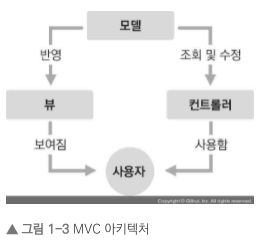

- 프로그램이 사용자에게 작업을 받는다
- 컨트롤러는 모델 데이터를 조회 수정하고 뷰에 반영
- 뷰를 변경 (JSON 객체 값을 변경)
- 사용자에게 보여짐

<p>예를 들어 JSON 파일의 객체중 likes 라는 객체의 값이 1 증가 시키고 싶을 때, likes 요소를 찾아 내부를 수정해야겠지요? 업데이트하는 항목에 따라 어떤 부분을 찾아서 변경할지 규칙을 정하는 작업은 간단하지만, 애플리케이션 규모가 크면 상당히 복잡해지고 제대로 관리하지 않으면 성능도 떨어질 수 있습니다. 페이스북 개발 팀은 이를 해결하려고 하나의 아이디어를 고안해 냈는데, 어떤 데이터가 변할 때마다 어떤 변화를 줄지 고민하는 것이 아니라 그냥 기존 뷰를 날려 버리고 처음부터 새로 렌더링하는 방식입니다.</p>

<p>하지만, 이것이 과연 가능할까요? 웹 브라우저에서 이 방식대로 하면 CPU 점유율도 크게 증가할텐데요. DOM은 느리니까요. 페이스북 개발팀이 앞서 설명한 방식으로 최대한 성능을 아끼고 편안한 사용자 경험을 제공하면서 구현하고자 개발한 것이 바로 리액트(react)입니다.</p>

> 리액트의 이해

<p>리액트는 자바스크립트 라이브러리로 사용자 인터페이스를 만드는데 사용합니다. 구조가 MVC, MVW 등인 프레임워크와 달리, 오직 V(View)에만 신경 쓰는 라이브러리입니다. 리액트 프로젝트에서 특정 부분이 어떻게 생길지 정하는 선언체가 있는데, 이를 컴포넌트라고 합니다. 컴포넌트는 다른 프레임워크에서 사용자 인터페이스를 다룰 때 사용하는 템플릿과는 다른 개념입니다. 템플릿은 보통 데이터셋이 주어지면 HTML 태그 형식을 문자열로 반환하는데, 이와 달리 컴포넌트는 재사용이 가능한 API로 수많은 기능들을 내장하고 있으며, 컴포넌트 하나에서 해당 컴포넌트의 생김새와 작동 방식을 정의합니다.</p>

<p>사용자 화면에 뷰를 보여 주는 것을 렌더링이라고 합니다. 리액트 라이브러리는 뷰를 어떻게 렌더링하길래 데이터가 변할 때마다 새롭게 리렌더링하면서 성능을 아끼고, 최적의 사용자 경험을 제공할 수 있을까요? 이 비밀을 파악하려면 리액트 컴포넌트가 최초로 실행한 '초기 렌더링'과 컴포넌트의 데이터 변경으로 다시 실행되는 '리렌더링' 개념을 이해해야 합니다.</p>

> 초기 렌더링

<p>어떤 UI 관련 프레임워크, 라이브러리를 사용하는지 간에 맨 처음 어떻게 보일지를 정하는 초기 렌더링이 필요합니다. 리액트 에서는 이를 다루는 render() 함수가 있습니다.</p>

```js
render(){ ...}
```

<p>이 함수는 컴포넌트가 어떻게 생겼는지 정의하는 역할을 합니다. 이 함수는 html 형식의 문자열을 반환하지 않고, 뷰가 어떻게 생겼고 어떻게 작동하는지에 대한 정보를 지닌 객체를 반환합니다. 이렇게 컴포넌트의 렌더링 작업이 끝나면 지니고 있는 정보들을 사용하여 HTML, 마크업을 만들고, 이를 우리가 정하는 실제 페이지의 DOM 요소 안에 주입합니다.</p>

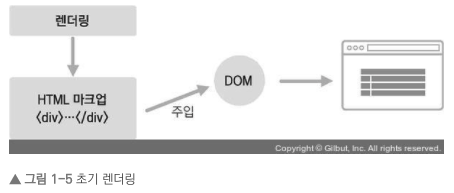

<p>컴포넌트를 실제 페이지에 렌더링할 때는 분리된 두 가지 절차를 따릅니다.</p>

1. 문자열 형태의 HTML 코드를 생성합니다.
2. 특정 DOM에 해당 내용을 주입하면 이벤트가 적용됩니다.

> 조화 과정 (reconciliation)

<p>리액트에서 뷰를 업데이트할 때는 "업데이트 과정을 거친다"라고 하기 보다는 "조화(reconciliation)" 과정을 거친다라고 하는 것이 더 정확한 표현입니다. 컴포넌트에서 데이터에 변화가 있을 때 우리가 보기에는 변화에 따라 뷰가 변형되는 것처럼 보이지만, 사실은 새로운 요소를 갈아끼우기 때문입니다. 이 작업 또한 render 함수가 맡아서 합니다. 컴포넌트는 데이터를 업데이트했을 때 단순히 값을 수정하는 것이 아니라, 새로운 데이터를 가지고 render 함수를 또 다시 호출합니다. 하지만, 이때 render 함수가 반환하는 결과를 곧바로 DOM에 반영하지 않고, 이전에 render 함수가 만들었던 컴포넌트 정보와 현재 render 함수가 만든 컴포넌트 정보를 비교합니다. </p>

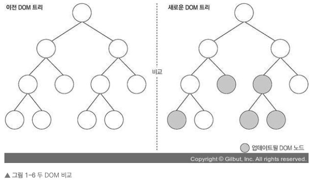

<p>두 가지 뷰를 최소한의 연산으로 비교한 후, 둘의 차이를 알아내 최소한의 연산으로 DOM 트리를 업데이트하는 것이죠. 결국 방식 자체는 루트 노드부터 시작하여 전체 컴포넌트를 처음부터 다시 렌더링하는 것처럼 보이지만, 사실 최적의 자원을 사용하여 이를 수행하는 것입니다.</p>

### 리액트의 특징

> Virttual DOM (가상의 DOM:document object model)

<p>DOM은 Document Object Model의 약어입니다. 즉, 객체로 문서 구조를 표현하는 방법으로 XML이나 HTML로 작성합니다. 웹 브라우저는 DOM을 활용하여 객체에 자바스크립트와 CSS를 적용합니다. DOM은 트리 형태라서 특정 노드를 찾거나 수정하거나 제거하거나 원하는 곳에 삽입할 수 있습니다. 요즘 DOM API를 수많은 플랫폼과 웹 브라우저에 사용하는데, 이 DOM에는 치명적인 한 가지 문제점이 있습니다. 바로 동적 UI에 최적화되어 있지 않다는 것입니다. HTML은 자체적으로는 정적입니다. 자바스크립트를 사용하여 이를 동적으로 만들어줄 수 있습니다</p>

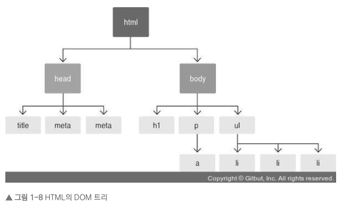

> DOM은 과연 느릴까요?

<p>DOM 자체는 빠릅니다. 하지만, DOM 자체를 읽고 쓸 때의 성능은 자바스크립트 객체를 처리할 때의 성능과 비교하여 다르지 않습니다. 단, 웹 브라우저 단에서 DOM에 변화가 일어나면 웹 브라우저가 CSS를 다시 연산하고, 레이아웃을 구성하고, 페이지를 리페인트합니다. 이 과정에서 시간이 허비되는 것입니다.</p>

> 해결방법은 있나요?

<p>HTML 마크업을 시각적인 형태로 변환하는 것은 웹 브라우저가 하는 주 역할이기 때문에, 이를 처리할 때 컴퓨터 자원을 사용하는 것은 어쩔 수 없습니다. DOM을 조작할 때마다 엔진이 웹 페이지를 새로 그리기 때문에 업데이트가 너무 잦으면 성능이 저하될 수 있습니다. 따라서 우리는 DOM을 최소한으로 조작하여 작업을 처리하는 방식으로 개선할 수 있습니다</p>

<p>Virtual DOM을 사용하면 실제 DOM에 접근하여 조작하는 대신 이를 추상화한 자바스크립트 객체를 구성하여 사용합니다. 마치 실제 DOM의 가벼운 사본과 비슷합니다. 리액트에서 데이터가 변하여 웹 브라우저에 실제 DOM을 업데이트할 때는 다음 세 가지 절차를 밟습니다.</p>

1. 전체 UI를 Virtual DOM에 리렌더링
2. 이전 내용과 현재 내용을 비교
3. 바뀐 부분만 실제 DOM에 적용


> 오해

<p>Virtual DOM을 사용한다고 해서 사용하지 않을 때와 비교하여 무조건 빠른 것은 아닙니다. 리액트 매뉴얼에는 다음 문장이 있습니다.</p>

> 우리는 다음 문제를 해결하려고 리액트를 만들었습니다.<br/>
> 지속적으로 데이터가 변화하는 대규모 애플리케이션 구축하기

<p>그렇습니다. 결국에는 적절한 곳에 사용해야 리액트기 지닌 진가를 비로소 발휘할 수 있습니다. 리액트를 사용하지 않아도 코드 최적화를 열심히 하면 DOM 작업이 느려지는 문제를 개선할 수 있고, 또 작업이 매우 간단할 때는 오히려 리액트를 사용하지 않는 편이 더 나은 성능을 보이기도 합니다.</p>

<p>리액트와 Virtual DOM이 언제나 제공할 수 있는 것은 바로 업데이트 처리 간결성입니다. UI를 업데이트하는 과정에서 생기는 복잡함을 모두 해소하고, 더욱 쉽게 업데이트에 접근할 수 있습니다.</p>

### 기타 특징

<p>일부 웹 프레임워크가 MVC 또는 MVW 등의 구조를 지향하는 것과 달리 리액트는 오직 뷰만 담당합니다. 다시 한 번 강조하면 리액트는 프레임워크가 아니라 라이브러리입니다. 다른 웹 프레임워크가 Ajax, 데이터 모델링, 라우팅 등과 같은 기능을 내장하고 있는 반면, 리액트는 정말 뷰만 신경 쓰는 라이브러리이므로 기타 기능은 직접 구현하여 사용해야 합니다. 하지만, 너무 걱정할 필요는 없습니다. 다른 개발자들이 만든 라이브러리, 즉 라우팅에는 리액트 라우터, Ajax 처리에는 axios, fetch, 상태 관리에는 리덕스나, MobX를 사용하여 빈 자리를 채우면 됩니다. 해당 분야에서 마음에 드는 라이브러리를 사용하면 되니까 자신의 취향대로 스택을 설정할 수 있다는 장점이 있지만, 여러 라이브러리를 접해야 한다는 단점도 있습니다.</p>

## Chapter 2 JSX

> 코드 이해하기

```js
import React from "react";
```

<p>이 코드는 리액트를 불러와서 사용할 수 있게 해 줍니다. 리액트 프로젝트를 만들 때 node_modules라는 디렉터리도 함께 생성되는데요, 프로젝트 생성 과정에서 node_modules 디렉터리에 react 모듈이 설치됩니다. 그리고 이렇게 import 구문을 통해 리액트를 불러와서 사용할 수 있는 것이죠. 여기서 한 가지 알아 둘 점이 있습니다. 아렇게 모듈을 불러와서 사용하는 것은 사실 원래 브라우저에는 없던 기능입니다. 브러우저가 아닌 환경에서 자바스크립트를 실행할 수 있게 해주는 환경인 Node.js에서 지원하는 기능입니다.</p>

<p>이러한 기능을 브라우저에서도 사용하기 위해 번들러(bundler)를 사용합니다.</p>

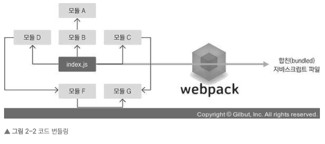

<p>대표적인 번들러로 웹팩, Parcel, browserify라는 도구들이 있으며, 각 도구마다 특성이 다릅니다. 리액트 프로젝트에서는 주로 웹팩을 사용하는 추세입니다. 편의성과 확장성이 다른 도구들보다 뛰어나기 때문입니다. 번들러 도구를 사용하면 import (또는 require)로 모듈을 불러왔을 때 불러온 모듈을 모두 합쳐서 하나의 파일을 생성해 줍니다. 또 최적화 과정에서 여러 개의 파일을 분리될 수도 있습니다. 이책의 프로젝트에서는 src/index.js를 시작으로 필요한 파일을 다 불러와서 번들링하게 됩니다</p>

<p>리액트를 불러오는 코드 하단에는 다음과 같이 SVG 파일과 CSS 파일을 import 하는 코드가 있습니다.</p>

```js
import logo from "./logo.svg";
import "./App.css";
```

<p>웹팩을 사용하면 SVG 파일과 CSS 파일도 불러와서 사용할 수 있습니다. 이렇게 파일들을 불러오는 것은 웹팩의 로더(loader)라는 기능이 담당합니다. 로더는 여러 가지 종류가 있습니다. babel-loader는 자바스크립트 파일들을 불러오면서 최신 자바스크립트 문법으로 작성된 코드를 바벨이라는 도구를 사용하여 ES5 문법으로 변환해 줍니다.</p>

> 최신 자바스크립트로 작성된 코드를 왜 변환하나요?

<p>ES(ECMA-SCRPIT)5는 이전 버전의 자바스크립트를 의미합니다. 최신 자바스크립트 문법을 ES5 형태로 변환하는 것은 구버전 웹 브라우저와 호환하기 위해서입니다. 현재 대부분의 최신 웹 브라우저에서는 자체적으로 최신 자바스크립트 문법을 바로 실행할 수 있지만, 구버전 웹 브라우저에서는 실행되지 않기 때문에 사전에 꼭 변환해 주어야 합니다. 또한, 우리가 앞으로 배우게 될 리액트 컴포넌트에서 사용하는 JSON 문법도 정식 자바스크립트 문법이 아니므로 ES5 형태의 코드로 변환해야 합니다.ES5 이후의 문법들은 ECMAScirpt등과 같은 형태로 이름이 지어집니다.</p>

### JSX란? (Java Script XML)

<p>JSX는 자바스크립트의 확장 문법이며 XML과 매우 비슷하게 생겼습니다. 이런 형식으로 작성한 코드는 브라우저에서 실행되기 전에 코드가 번들링되는 과정에서 바벨을 이용하여 일반 자바스크립트 형태의 코드로 변환됩니다.</p>

```js
📁 case JSX

function App() {
  return (
    <div>
      Hello <b>react</b>
    </div>
  );
}

```

<p>이렇게 작성된 코드는 다음과 같이 변환됩니다.</p>

```js
function App() {
return React.createElement(“div“, null, “Hello “, React.createElement(“b“, null, “react“));
}
```

<p>만약 컴포넌트를 렌더링할 때마다 JSX 코드를 작성하는 것이 아니라 위 코드처럼 매번 React.createElement 함수를 사용해야 한다면 매우 불편하겠지요? JSX를 사용하면 매우 편하게 UI를 렌더링할 수 있습니다.</p>

> 그러면 JSX도 자바스크립트 문법이라고 할 수 있을까요?

<p>JSX는 리액트로 프로젝트를 개발할 때 사용되므로 공식적인 자바스크립트 문법이 아닙니다. 바벨에서는 여러 문법을 지원할 수 있도록 preset 및 plugin을 설정합니다. 바벨을 통해 개발자들이 임의로 만든 문법, 혹은 차기 자바스크립트의 문법들을 사용할 수 있습니다.</p>

### JSX 문법

> 감싸인 요소

<p>컴포넌트에 여러 요소가 있다면 반드시 부모 요소 하나로 감싸야 합니다. 한번 App.js 파일의 App 컴포넌트 함수 내부를 지우고 다음과 같이 작성해 보세요. 상단에 있는 SVG와 CSS를 import하는 코드도 지워 주세요.</p>

```js
import React from ‘react‘;

function App() {
  return (
    <h1>리액트 안녕!</h1>
    <h2>잘 작동하니?</h2>
  )
}

export default App;
```

<p>이런 형태의 코드는 제대로 작동하지 않습니다. 코드를 저장한 후 웹 브라우저나 개발 서버를 실행했던 터미널을 열어 보세요. 다음 오류가 나타날 것입니다.</p>

```
./src/App.js
Line 6:  Parsing error: Adjacent JSX elements must be wrapped in an enclosing tag. Did you want a JSX fragment <>…</>?
```

<p>요소 여러 개가 부모 요소 하나에 의하여 감싸져 있지 않기 때문에 오류가 발생했습니다. 이 오류는 다음과 같이 코드를 작성하여 해결할 수 있습니다.</p>

```js
import React from "react";

function App() {
  return (
    <div>
      <h1>리액트 안녕!</h1>
      <h2>잘 작동하니?</h2>
    </div>
  );
}

export default App;
```

> 리액트 컴포넌트에서 요소 여러 개를 왜 하나의 요소로 꼭 감싸 주어야 할까요?

<p> 그것은 Virtual DOM에서 컴포넌트 변화를 감지해 낼 때 효율적으로 비교할 수 있도록 컴포넌트 내부는 하나의 DOM 트리 구조로 이루어져야 한다는 규칙이 있기 때문입니다.</p>

> 그런데 여기서 꼭 div 요소를 사용하고 싶지 않을 수도 있습니다. 그런 경우에는 리액트 v16 이상 부터 도입된 Fragment라는 기능을 사용하면 됩니다.

```js
import React from "react";

function App() {
  return (
    <> or <Fragment>
      <h1>리액트 안녕!</h1>
      <h2>잘 작동하니?</h2>
    </> or </Fragment>
  );
}

export default App;
```

### 자바스크립트 표현

<p>JSX가 단순히 DOM 요소를 렌더링하는 기능밖에 없었다면 뭔가 좀 아쉬웠을 것입니다. JSX 안에서는 자바스크립트 표현식을 쓸 수 있습니다. 자바스크립트 표현식을 작성하려면 JSX 내부에서 코드를 <b>{ }</b>로 감싸면 됩니다.</p>

```js
import React from "react";

function App() {
  const name = "리액트";
  return (
    <>
      <h1>{name} 안녕!</h1>
      <h2>잘 작동하니?</h2>
    </>
  );
}

export default App;
```

> ES6의 const 와 let

<p>const는 ES6 문법에서 새로 도입되었으며 한번 지정하고 나면 변경이 불가능한 상수를 선언할 때 사용하는 키워드입니다. let은 동적인 값을 담을 수 있는 변수를 선언할 때 사용하는 키워드입니다.</p>

<p>ES6 이전에는 값을 담는 데 var 키워드를 사용했는데요. var 키워드는 scope(해당 값을 사용할 수 있는 코드 영역)가 함수 단위입니다. 해당 함수 내에서 전역(글로벌)으로 불러와 사용할 수 있다는 뜻이겠죠?</p>

```js
function myFunction() {
  var a = "hello";
  if (true) {
    var a = "bye";
    console.log(a); // bye
  }
  console.log(a); // bye
}
myFunction();
```

<p>if 문 바깥에서 var 값을 hello로 선언하고, if 문 내부에서 bye로 설정했습니다. if 문 내부에서 새로 선언했음에도 if 문 밖에서 a를 조회하면 변경된 값이 나타납니다. var로 선언된 변수 a의 값이 재할당되었다는 뜻입니다.</p>

<p>이런 결점을 해결해주는 것이 바로 let과 const입니다.</p>

```js
function myFunction() {
  let a = 1;
  if (true) {
    let a = 2;
    console.log(a); // 2
  }
  console.log(a); // 1
}
myFunction();
```

<p>let과 const는 scope가 함수 단위가 아닌 블록 단위이므로, if 문 내부에서 선언한 a 값은 if 문 밖의 a 값을 변경하지 않습니다.</p>

> let과 const를 사용할 때 같은 블록 { ... } 내부에서 중복 선언이 불가능하다는 점에 주의하세요.

```js
let a = 1;
let a = 2; // 오류: Uncaught SyntaxError: Identifier 'a' has already been declared.
```

> 그리고 const는 한번 선언하면 재설정할 수 없습니다.

```js
const b = 1;
b = 2; // Uncaught TypeError: Assignment to constant variable.
```

<p>
그렇다면 어떤 상황에 각 키워드를 사용해야 할까요? 일단 ES6 문법에서 var을 사용할 일은 없습니다. let은 한번 선언한 후 값이 유동적으로 변할 수 있을 때만(예: for 문) 사용하고, const는 한번 설정한 후 변할 일이 없는 값에 사용합니다.

편하게 생각하면 기본적으로 const를 사용하고, 해당 값을 바꾸어야 할 때는 let을 사용하면 되겠습니다.</p>

> If 문 대신 조건부 연산자

<p>JSX 내부의 자바스크립트 표현식에서 if 문을 사용할 수는 없습니다. 하지만 조건에 따라 다른 내용을 렌더링해야 할 때는 JSX 밖에서 if 문을 사용하여 사전에 값을 설정하거나, { } 안에 조건부 연산자를 사용하면 됩니다. 조건부 연산자의 또 다른 이름은 삼항 연산자입니다. 이 연산자를 한번 사용해 볼까요?</p>

```js
function App() {
  const name = ‘리액트‘;
  return (
    <div>
      {name === ‘리액트‘ ? (
        <h1>리액트입니다.</h1>
      ) : (
        <h2>리액트가 아닙니다.</h2>
      )}
    </div>
  );
}
```

> AND 연산자(&&)를 사용한 조건부 렌더링

<p>개발하다 보면 특정 조건을 만족할 때 내용을 보여 주고, 만족하지 않을 때 아예 아무것도 렌더링하지 않아야 하는 상황이 올 수 있습니다.  다음과 같이 && 연산자를 사용해서 조건부 렌더링을 할 수 있습니다.</p>

```js
function App() {
  const name = ‘뤼왝트‘;
  return <div>{name === ‘리액트‘ && <h1>리액트입니다.</h1>}</div>;
}
```

> JSX는 언제 괄호로 감싸야 하나요?

<p>JSX를 작성할 때 괄호로 감쌀 때도 있고, 감싸지 않을 때도 있습니다. 주로 JSX를 여러 줄로 작성할 때 괄호로 감싸고, 한 줄로 표현할 수 있는 JSX는 감싸지 않습니다. JSX를 괄호로 감싸는 것은 필수 사항이 아닙니다. 감싸도 되고 감싸지 않아도 됩니다.</p>

## Chapter 3 컴포넌트

<p>리액트를 사용하여 애플리케이션의 인터페이스를 설계할 때 사용자가 볼 수 있는 요소는 여러 가지 컴포넌트로 구성되어 있습니다. 예를 들어 뒤에서 만들어 볼 일정 관리 애플리케이션을 미리 살펴봅시다.</p>

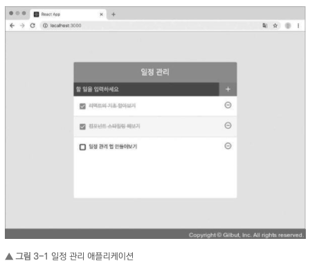

<p>위 프로젝트는 총 네 가지 컴포넌트를 사용하여 구성했습니다.</p>

- TodoTemplate
- TodoInput
- TodoList
- TodoItem

<p>먼저 전체적인 틀을 잡아 주는 TodoTemplate 컴포넌트입니다. 이 컴포넌트는 현재 화면의 중앙에 있는 사각형 레이아웃의 역할을 하고 있습니다. 그리고 새로운 항목을 추가할 수 있는 TodoInput 컴포넌트입니다. 위 화면에서는 검정색 영역이 바로 TodoInput입니다. 그리고 할 일 항목을 여러 개 보여 주는 TodoList 컴포넌트입니다. 마지막으로 TodoList에서 각 항목을 보여 주기 위해 사용되는 TodoItem 컴포넌트입니다. </p>

<p>컴포넌트의 기능은 단순한 템플릿 이상입니다. 데이터가 주어졌을 때 이에 맞추어 UI를 만들어 주는 것은 물론이고, 라이프사이클 API를 이용하여 컴포넌트가 화면에서 나타날 때, 사라질 때, 변화가 일어날 때 주어진 작업들을 처리할 수 있으며, 임의 메서드를 만들어 특별한 기능을 붙여 줄 수 있습니다.</p>

<p>이 장에서는 먼저 클래스형 컴포넌트에 대해 살펴본 뒤, 컴포넌트를 새로 만들고 사용하는 방법을 알아보겠습니다. 그리고 컴포넌트의 속성 값을 지닌 props와 상태 값을 지닌 state를 사용하는 방법도 알아보겠습니다.</p>

### 클래스형 컴포넌트

<p>컴포넌트를 선언하는 방식은 두 가지입니다. 하나는 함수형 컴포넌트이고, 또 다른 하나는 클래스형 컴포넌트입니다.</p>

> 클래스형 컴포넌트가 어떻게 이루어졌는지 확인해 볼까요?

```js
import React, { Component } from "react";

class App extends Component {
  render() {
    const name = "react";
    return <div className="react">{name}</div>;
  }
}

export default App;
```

<p>
클래스형 컴포넌트로 바뀌었지만 역할은 이전에 보았던 함수형 컴포넌트와 똑같습니다. 클래스형 컴포넌트와 함수형 컴포넌트의 차이점은 클래스형 컴포넌트의 경우 이후 배울 state 기능 및 라이프사이클 기능을 사용할 수 있다는 것과 임의 메서드를 정의할 수 있다는 것입니다.  클래스형 컴포넌트안에서는 render 함수가 꼭 있어야 하고, 그 안에서 보여 주어야 할 JSX를 반환해야 합니다.</p>

> ES6의 클래스 문법

<p>ES6 이전에는 자바스크립트에 클래스(class)가 없었습니다. 개념 자체는 있었지만, 그것을 구현하려면 class 대신에 prototype이라는 문법을 사용하여 다음과 같이 작업해야 했습니다.</p>

```js
function Dog(name) {
  this.name = name;
}

Dog.prototype.say = function () {
  console.log(this.name + ": 멍멍");
};
var dog = new Dog("검둥이");
dog.say(); // 검둥이: 멍멍
```

<p>ES6 문법부터는 이것과 기능이 똑같은 코드를 class를 사용하여 다음과 같이 작성할 수 있습니다.</p>

```js
class Dog {
  constructor(name) {
    this.name = name;
  }
  say() {
    console.log(this.name + ": 멍멍");
  }
}

const dog = new Dog("흰둥이");
dog.say(); // 흰둥이: 멍멍
```

> 컴포넌트를 선언할 수 있는 두 가지 방법 중 어느 상황에 함수형 컴포넌트를 사용해야 할까요?

<p>함수형 컴포넌트의 장점을 나열해 보면 다음과 같습니다.</p>

- 클래스형 컴포넌트보다 선언하기가 훨씬 편합니다.
- 메모리 자원도 클래스형 컴포넌트보다 덜 사용합니다.
- 프로젝트를 완성하여 빌드한 후 배포할 때도 함수형 컴포넌트를 사용하는 것이 결과물의 파일 크기가 더 작습니다.

<p>함수형 컴포넌트의 주요 단점은 state와 라이프사이클 API의 사용이 불가능하다는 점인데요. 이 단점은 리액트 v16.8 업데이트 이후 Hooks라는 기능이 도입되면서 해결되었습니다. 완전히 클래스형 컴포넌트와 똑같이 사용할 수 있는 것은 아니지만 조금 다른 방식으로 비슷한 작업을 할 수 있게 되었습니다. 이번 장에서 Hooks에 대한 내용은 맛보기로만 조금 배워 보고, 8장에서 더 자세히 다루겠습니다.</p>

<p>리액트 공식 매뉴얼에서는 컴포넌트를 새로 작성할 때 함수형 컴포넌트와 Hooks를 사용하도록 권장하고 있습니다. 하지만 그렇다고 해서 클래스형 컴포넌트가 사라지는 것은 아니므로 클래스형 컴포넌트의 기능은 꼭 알아 두어야 합니다.</p>

### 첫 컴포넌트 생성

> 먼저 함수형 컴포넌트로 작성하고, 나중에 클래스형 컴포넌트로도 작성해 보겠습니다.

```js
import React from "react";

const MyComponent = () => {
  return <div>나의 새롭고 멋진 컴포넌트</div>;
};

export default MyComponent;
```

<p>이번에 작성한 코드는 이전에 보았던 App 컴포넌트와 형태가 조금 다릅니다. 함수를 작성할 때 function 키워드를 사용하는 대신에 () => {}를 사용하여 함수를 만들어 주었습니다. 이는 ES6에 도입된 화살표 함수 문법입니다.</p>

> ES6의 화살표 함수

<p>화살표 함수(arrow function)는 ES6 문법에서 함수를 표현하는 새로운 방식입니다. 그렇다고 해서 기존 function을 이용한 함수 선언 방식을 아예 대체하지는 않습니다. 사용 용도가 조금 다릅니다. 이 문법은 주로 함수를 파라미터로 전달할 때 유용합니다.</p>

```js
case 1: 함수 선언식 사용
setTimeout(function() {
  console.log('hello world');
}, 1000);

case 2: 화살표 함수 사용
setTimeout(() => {
  console.log('hello world')
}), 1000);
```

<p>이 문법이 기존 function을 대체할 수 없는 것은 용도가 다르기 때문입니다. 무엇보다 서로 가리키고 있는 this 값이 다릅니다.</p>

> 다음 코드를 한번 확인해 보세요

```js
case 1 : 일반 함수

function BlackDog() {
  this.name = "흰둥이";
  return {
    name: "검둥이",
    bark: function () {
      console.log(this.name + ": 멍멍!");
    },
  };
}

const blackDog = new BlackDog();
blackDog.bark(); // 검둥이: 멍멍! why? 같은 블록 스코프 { } 내의 name을 this 키워드로 참조했기 때문에, 일반 함수는 자신이 종속된 객체를 this로 가리킨다

case 2 : 화살표 함수

function WhiteDog() {
  this.name = "흰둥이";
  return {
    name: "검둥이",
    bark: () => {
      console.log(this.name + ": 멍멍!");
    },
  };
}

const whiteDog = new WhiteDog();
whiteDog.bark(); // 흰둥이: 멍멍! why? 화살표 함수는 자신이 종속된 인스턴스 (whiteDog 함수)를 가리키기 때문에
```

<p>함수형 컴포넌트를 선언할 때 function 키워드를 사용하는 것과 화살표 함수 문법을 사용하는 것간에는 큰 차이가 없습니다. 화살표 함수를 사용하는 것이 좀 더 간결하기 때문에 이 책에서는 함수형 컴포넌트를 만들 때 화살표 함수 문법을 사용하겠습니다. 어떤 방식을 선택할지는 단지 각자의 취향에 달려 있습니다.</p>

### props

<p>props는 properties를 줄인 표현으로 컴포넌트 속성을 설정할 때 사용하는 요소입니다. props 값은 해당 컴포넌트를 불러와 사용하는 부모 컴포넌트에서 설정할 수 있습니다.</p>

> JSX 내부에서 props 렌더링

<p>우선 MyComponent 컴포넌트를 수정하여 해당 컴포넌트에서 name이라는 props를 렌더링하도록 설정해 봅시다. props 값은 컴포넌트 함수의 파라미터로 받아 와서 사용할 수 있습니다. props를 렌더링할 때 2장에서 배웠던 것처럼 JSX 내부에서 { } 기호로 감싸 주면 됩니다.</p>

```js
import React from ‘react‘;

const MyComponent = props => {
return <div>안녕하세요, 제 이름은 {props.name}입니다.</div>;
};

export default MyComponent;
```

> 컴포넌트를 사용할 때 props 값 지정하기

<p>App 컴포넌트에서 MyComponent의 props 값을 지정해 보겠습니다. App.js의 코드를 다음과 같이 수정해 보세요.</p>

```js
import React from "react";
import MyComponent from "./MyComponent";

const App = () => {
  return <MyComponent name="React" />;
};

export default App;
```

<p>상위 컴포넌트인 App에서 MyComponent라는 컴포넌트를 렌더링 해주는데 props로 React라는 키값을 가진 name을 보내주었습니다. 따라서 MyComponent에서는 props.name으로 상위 컴포넌트에서 props를 통해 넘겨준 해당 값을 렌더링 담아 사용하는 것을 알 수 있습니다.</p>

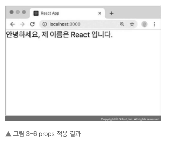

> props 기본값 설정: defaultProps

```js
(...)
return <MyComponent />;
(...)
```

<p>위와 같이 props를 내려주지 않는다면, MyComponent는 렌더링될 때 '안녕하세요 제 이름은 입니다.'라는 내용이 보일 것입니다. 따라서 기본 값을 하위 컴포넌트에서 설정하기 위해서는 defaultProps를 사용합니다</p>

```js
import React from "react";

const MyComponent = (props) => {
  return <div>안녕하세요, 제 이름은 {props.name}입니다.</div>;
};

MyComponent.defaultProps = {
  name: "기본 이름",
};

export default MyComponent;
```

<p>위와 같이 defaultProps를 해당 프로퍼티에 설정해준다면 상위 컴포넌트에서 지정해주지 않더라도 빈 값이 렌더링되는 불상사를 줄일 수 있습니다.</p>

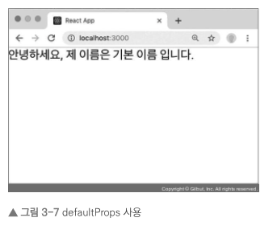

> 태그 사이의 내용을 보여 주는 children

<p>리액트 컴포넌트를 사용할 때 컴포넌트 태그 사이의 내용을 보여 주는 props가 있는데요. 바로 children입니다.</p>

```js
📁src/App.js

import React from "react";
import MyComponent from "./MyComponent";

const App = () => {
  return <MyComponent>리액트</MyComponent>;
};

export default App;
```

<p>위 코드에서 MyComponent 태그 사이에 작성한 리액트라는 문자열을 MyComponent 내부에서 보여 주려면 props.children 값을 보여 주어야 합니다.</p>

```js
📁src/MyComponent.js

import React from "react";

const MyComponent = (props) => {
  return (
    <div>
      안녕하세요, 제 이름은 {props.name}입니다. <br />
      children 값은 {props.children}
      입니다.
    </div>
  );
};

MyComponent.defaultProps = {
  name: "기본 이름",
};

export default MyComponent;
```

<p>하위 컴포넌트인 MyComponent에서 '리액트'라는 태그 사이의 내용을 props로 넘겨받아 사용합니다. { props.children } 을 통해 해당 props를 렌더링해주었습니다.</p>

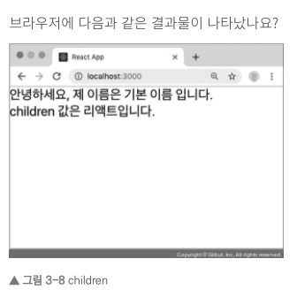

> 비구조화 할당 문법을 통해 props 내부 값 추출하기

<p>현재 MyComponent에서 props 값을 조회할 때마다 props.name, props.children과 같이 props.이라는 키워드를 앞에 붙여 주고 있습니다. 이러한 작업을 더 편하게 하기 위해 ES6의 비구조화 할당 문법을 사용하여 내부 값을 바로 추출하는 방법을 알아보겠습니다.</p>

```js
📁src/MyComponent.js

📁 case 1 : 비구조화 할당 문법 사용하기
const MyComponent = (props) => {
  const { name, children } = props;
  return (
    <div>
      안녕하세요, 제 이름은 {name}입니다. <br />
      children 값은 {children}
      입니다.
    </div>
  );
};

MyComponent.defaultProps = {
  name: "기본 이름",
};

export default MyComponent;

📁 case 2 : 함수의 파라미터 부분에서 비구조화 할당 문법 사용하기
const MyComponent = ({ name, children }) => {
  return (
    <div>
      안녕하세요, 제 이름은 {name}입니다. <br />
      children 값은 {children}
      입니다.
    </div>
  );
};

MyComponent.defaultProps = {
  name: '기본 이름'
};

```

<p>방금 사용한, 객체에서 값을 추출하는 문법을 비구조화 할당(destructuring assignment)이라고 부릅니다. 이 문법은 구조 분해 문법이라고도 불리며, 함수의 파라미터 부분에서도 사용할 수 있습니다. 만약 함수의 파라미터가 객체라면 그 값을 바로 비구조화해서 사용하는 것이죠.</p>

<p>어떤가요? 이렇게 props를 사용하면 훨씬 편하지요? 이 책에서는 앞으로 함수형 컴포넌트에서 props를 사용할 때 이렇게 파라미터 부분에서 비구조화 할당 문법을 사용합니다.</p>

> propTypes를 통한 props 검증

<p>컴포넌트의 필수 props를 지정하거나 props의 타입(type)을 지정할 때는 propTypes를 사용합니다. 컴포넌트의 propTypes를 지정하는 방법은 defaultProp을 설정하는 것과 비슷합니다. 우선 propTypes를 사용하려면 코드 상단에 import 구문을 사용하여 불러와야 합니다.</p>

```js
import React from ‘react‘;
import PropTypes from ‘prop-types‘;

const MyComponent = ({ name, children }) => {
  return (…);
};

MyComponent.defaultProps = {
  name: ‘기본 이름‘
};

MyComponent.propTypes = {
  name: PropTypes.string
};

export default MyComponent;
```

<p>만약 컴포넌트에 설정한 props가 propTypes에서 지정한 형태와 일치하지 않는다면 브라우저 개발자 도구의 Console 탭에 다음과 같은 결과가 나타납니다.</p>

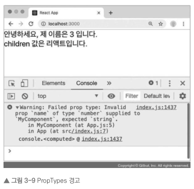

> 더 많은 PropTypes 종류 <a href="https://thebook.io/080203/ch03/03/06/02/">보러 가기</a>

> 클래스형 컴포넌트에서 props 사용하기

<p>클래스형 컴포넌트에서 props를 사용할 때는 render 함수에서 this.props를 조회하면 됩니다. 그리고 defaultProps와 propTypes는 똑같은 방식으로 설정할 수 있습니다. MyComponent를 다음과 같이 클래스형 컴포넌트로 변환해 보세요.</p>

```js
import React, { Component } from ‘react‘;
import PropTypes from ‘prop-types‘;

class MyComponent extends Component {
  render() {
    const { name, favoriteNumber, children } = this.props; // 비구조화 할당
    return (
      <div>
        안녕하세요, 제 이름은 {name}입니다. <br />
        children 값은 {children}
        입니다.
        <br />
        제가 좋아하는 숫자는 {favoriteNumber}입니다.
      </div>
    );
  }
}
...

생략

...

case 2 : defaultProps와 propTypes를 설정할 때 class 내부에서 지정하기

import React, { Component } from ‘react‘;
import PropTypes from ‘prop-types‘;


class MyComponent extends Component {
  static defaultProps = {
    name: ‘기본 이름‘
  };
  static propTypes = {
    name: PropTypes.string,
    favoriteNumber: PropTypes.number.isRequired
  };
  render() {
    const { name, favoriteNumber, children } = this.props; // 비구조화 할당
    return (…);
  }
}
```

> defaultProps와 propTypes는 꼭 사용해야 하나요?

<p>이 두 가지 설정은 컴포넌트의 필수 사항이 아니므로 꼭 사용할 필요가 없습니다. 하지만 여러분이 React를 사용하여 큰 규모의 프로젝트를 진행한다면, 특히 다른 개발자들과 협업한다면 해당 컴포넌트에 어떤 props가 필요한지 쉽게 알 수 있어 개발 능률이 좋아질 것입니다.</p>

### state

<p>리액트에서 state는 컴포넌트 내부에서 바뀔 수 있는 값을 의미합니다. props는 컴포넌트가 사용되는 과정에서 부모 컴포넌트가 설정하는 값이며, 컴포넌트 자신은 해당 props를 읽기 전용으로만 사용할 수 있습니다. props를 바꾸려면 무조건 부모 컴포넌트에서 바꾸어 주어야 합니다. 리액트에는 두 가지 종류의 state가 있습니다. 하나는 클래스형 컴포넌트가 지니고 있는 state 이고, 다른 하나는 함수형 컴포넌트에서 useState라는 훅 함수를 통해 사용하는 state입니다.</p>

> 클래스형 컴포넌트의 state

```js
import React, { Component } from ‘react‘;

class Counter extends Component {
  constructor(props) {
    super(props);
    // state의 초깃값 설정하기
    this.state = {
      number: 0
    };
  }
  render() {
    const { number } = this.state; // state를 조회할 때는 this.state로 조회합니다.
    return (
      <div>
        <h1>{number}</h1>
        <button
          // onClick을 통해 버튼이 클릭되었을 때 호출할 함수를 지정합니다.

          onClick={() => {
            // this.setState를 사용하여 state에 새로운 값을 넣을 수 있습니다.
            this.setState({ number: number + 1 });
          }}
        >
          +1
        </button>
      </div>
    );
  }
}

export default Counter;
```

<p>클래스형 컴포넌트에서 state를 설정할 때는 다음과 같이 constructor 메소드를 작성하여 설정합니다. 이는 컴포넌트의 생성자 메서드입니다. 클래스형 컴포넌트에서 constructor를 작성할 때는 반드시 super(props)를 호출해 주어야 합니다. 이 함수가 호출되면 현재 클래스형 컴포넌트가 상속받고 있는 리액트의 Component 클래스가 지닌 생성자 함수를 호출해 줍니다. 그 다음에는 this.state 값에 초깃값을 설정해 주었습니다. 컴포넌트의 state는 객체 형식 { 키 : 값 } 이어야합니다.</p>

> 이벤트로 설정할 함수를 호출하는 것이 아닌 직접 넣어 줄 때는 화살표 함수 문법을 사용하여 넣어 주어야 합니다

```js
<button onClick={()=> this.setState({ number: number + 1}; )}>

or

const plusNum = (number) => {
  setState(number : number + 1);
}
...

<button onClick={plusNum}>+ 1 </button>
```

> constructor 메서드 없이 초기값 선언하기

```js
import React, { Component } from 'react';

class Counter extends Component {
  state = {
    number: 0,
    fixedNumber: 0
  };
  render() {
    const { number, fixedNumber } = this.state; // state를 조회할 때는 this.state로 조회합니다.
    return (...);
  }
}

export default Counter;
```

<p>이렇게 하면 constructor 메서드를 선언하지 않고도 state 초깃값을 설정할 수 있습니다. 이 책에서는 앞으로 state를 사용할 때 이 방식을 사용하여 state의 초깃값을 설정하겠습니다.</p>

> 함수형 컴포넌트의 state

<p>Hooks를 사용하기 전에 배열 비구조화 할당이라는 것을 알아봅시다. 배열 비구조화 할당은 이전에 배운 객체 비구조화 할당과 비슷합니다. 즉, 배열 안에 들어 있는 값을 쉽게 추출할 수 있도록 해 주는 문법입니다.</p>

```js
const array = [1, 2];
const one = array[0];
const two = array[1];

// array 안에 있는 값을 one과 two에 담아 주는 코드인데요. 위 코드는 배열 비구조화 할당을 사용하면 다음과 같이 표현할 수 있습니다.

const array = [1, 2];
const [one, two] = array;
```

<p>배열 비구조화 할당 문법을 알고 나면 useState 사용 방법을 쉽게 이해할 수 있습니다. 새 컴포넌트를 만들어서 useState를 사용해 보겠습니다. src 디렉터리에 Say.js라는 파일을 생성하고 다음 코드를 작성해 보세요.</p>

```js
import React, { useState } from ‘react‘;

const Say = () => {
  const [message, setMessage] = useState(“);
  const onClickEnter = () => setMessage(‘안녕하세요!’);
  const onClickLeave = () => setMessage(‘안녕히 가세요!’);

return (
    <div>
      <button onClick={onClickEnter}>입장</button>
      <button onClick={onClickLeave}>퇴장</button>
      <h1>{message}</h1>
    </div>
  );
};

export default Say;
```

<p>useState 함수의 인자에는 상태의 초깃값을 넣어 줍니다. 클래스형 컴포넌트에서의 state 초깃값은 객체 형태를 넣어 주어야 한다고 배웠는데요. useState에서는 반드시 객체가 아니어도 상관없습니다. 값의 형태는 자유입니다. 숫자일 수도, 문자열일 수도, 객체일 수도, 배열일 수도 있습니다.</p>

### state를 사용할 때 주의 사항

<p>클래스형 컴포넌트든 함수형 컴포넌트든 state를 사용할 때는 주의해야 할 사항이 있습니다. state 값을 바꾸어야 할 때는 setState 혹은 useState를 통해 전달받은 세터 함수를 사용해야 합니다.</p>

```js
// 클래스형 컴포넌트에서…
this.state.number = this.state.number + 1;
this.state.array = this.array.push(2);
this.state.object.value = 5;

// 함수형 컴포넌트에서…
const [object, setObject] = useState({ a: 1, b: 1 });
object.b = 2;
```

<p>그렇다면 배열이나 객체를 업데이트해야 할 때는 어떻게 해야 할까요? 이런 상황에서는 배열이나 객체 사본을 만들고 그 사본에 값을 업데이트한 후, 그 사본의 상태를 setState 혹은 세터 함수를 통해 업데이트합니다.</p>

> 사본을 만들어서 업데이트하기

```js
// 객체 다루기
const object = { a: 1, b: 2, c: 3 };
const nextObject = { ...object, b: 2 }; // 사본을 만들어서 b 값만 덮어 쓰기

// 배열 다루기
const array = [
{ id: 1, value: true },
{ id: 2, value: true },
{ id: 3, value: false }
];
let nextArray = array.concat({ id: 4 }); // 새 항목 추가
nextArray.filter(item => item.id != = 2); // id가 2인 항목 제거
nextArray.map(item => (item.id === 1 ? { ...item, value: false } : item)); // id가 1인 항목의 value를 false로 설정
```

<p>객체에 대한 사본을 만들 때는 spread 연산자라 불리는 ...을 사용하여 처리하고, 배열에 대한 사본을 만들 때는 배열의 내장 함수들을 활용합니다</p>

### 정리

<p>props와 state는 둘 다 컴포넌트에서 사용하거나 렌더링할 데이터를 담고 있으므로 비슷해 보일 수 있지만, 그 역할은 매우 다릅니다. props는 부ㅜ모 컴포넌트가 설정하고, state는 컴포넌트 자체적으로 지닌 값으로 컴포넌트 내부에서 값을 업데이트할 수 있습니다.</p>

<p>props를 사용한다고 해서 값이 무조건 고정적이지는 않습니다. 부모 컴포넌트의 state를 자식 컴포넌트의 props로 전달하고, 자식 컴포넌트에서 특정 이벤트가 발생할 때 부모 컴포넌트의 메서드를 호출하면 props도 유동적으로 사용할 수 있습니다. 이후 만들어 볼 일정 관리 애플리케이션에서 이러한 구조로 프로젝트를 설계하게 됩니다.</p>

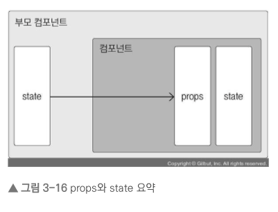

## Chapter4 Event Handling

<p>사용자가 웹 브라우저에서 DOM 요소들과 상호 작용하는 것을 이벤트라고 합니다. 예를 들어 버튼에 마우스 커서를 올렸을 때는 onmouseover 이벤트를 실행하고, 클릭헸을 때는 onclick 이벤트를 실행합니다. </p>

### 리액트의 이벤트 시스템

<p>리액트의 이벤트 시스템은 웹 브라우저의 HTML 이벤트와 인터페이스가 동일하기 대문에 사용법이 꽤 비슷합니다. 사용법은 일반 HTML에서 이벤트를 작성하는 것과 비슷한데, 주의해야 할 몇 가지 사항이 있습니다.</p>

> 이벤트를 사용할 때 주의 사항

1. 이벤트 이름은 카멜 표기법으로 작성합니다. (낙타 등 표기법)
2. 이벤트에 실행할 자바스크립트 코드를 전달하는 것이 아니라. 함수 형태의 값을 전달합니다. <p>HTML에서 이벤트를 설정할 때는 큰따옴표 안에 실행할 코드를 넣었지만, 리액트에서는 함수형태의 객체를 전달합니다.</p>
3. DOM 요소에만 이벤트를 설정할 수 있습니다. <p> 즉 div, button, input, form, ...등의 DOM 요소에는 이벤트를 설정할 수 있지만, 우리가 직접 만든 컴포넌트에는 이벤트를 자체적으로 설정할 수 없습니다. </p><p>예를 들어 다음과 같이 MyComponent에 onClick 값을 설정한다면 MyComponent를 클릭할 때 doSomething 함수를 실행하는 것이 아니라, 그냥 이름이 onclick인 props를 MyComponent에게 전달해 줄 뿐입니다.</p><p>따라서 컴포넌트에 자체적으로 이벤트를 설정할 수는 없습니다. 하지만 전달받은 props를 컴포넌트 내부의 DOM 이벤트로 설정할 수는 있습니다.</p>

```js
case 1 : 내가 만든 컴포넌트에서 이벤트를 사용한다면 props로 하여금 해당 함수를 전달
<MyComponent onClick={doSomething} />

...

case 2 : 기존 DOM 요소를 사용한다면 그대로 이벤트 핸들러 사용 가능
<div onClick={this.props.onClick}>
```

> 이벤트 종류 알아보기 <a href="https://reactjs.org/docs/events.html">공식 문서 링크</a>

### onChange 이벤트 핸들링하기

> 클래스형 컴포넌트에서 이벤트 핸들링하기

<p>이번 컴포넌트에서는 input 요소를 렌더링하는 코드와 해당 요소에 onChange 이벤트를 설정하는 코드를 작성합니다.</p>

```js
import React, { Component } from ‘react‘;

class EventPractice extends Component {
  render() {
    return (
      <div>
        <h1>이벤트 연습</h1>
        <input
          type=“text“
          name=“message“
          placeholder=“아무거나 입력해 보세요“
          onChange={
            (e) => {
              console.log(e); // console.log(e.target.value)
            }
          }
        />
      </div>
    );
  }
}

export default EventPractice;
```

<p>여기서 콘솔에 기록되는 e 객체는 SyntheticEvent 웹 브라우저의 네이티브 이벤트를 감싸는 객체입니다. 네이티브 이벤트와 인터페이스가 같으므로 순수 자바스크립트에서 HTML 이벤트를 다룰 때와 똑같이 사용하면 됩니다. SyntheticEvent는 네이티브 이벤트와 달리 이벤트가 끝나고 나면 이벤트가 초기화되므로 정보를 참조할 수 없습니다. 예를 들어, 0.5초 뒤에 e 객체를 참조하면 e 객체 내부의 모든 값이 비워지게 됩니다. 만약 비동기적으로 이벤트 객체를 참조할 일이 있다면 e.persist() 함수를 호출해 주어야 합니다. console.log(e)의 값을 console.log(e.target.value)로 바꿔보세요. 이벤트가 발생할 때마다 콘솔창에서 확인할 수 있게 됩니다.</p>

> 임의 메서드 만들기

<p>기존에 '이벤트에 실행할 자바스크립트 코드를 전달하는 것이 아니라, 함수 형태의 값을 전달합니다'라고 배웠습니다. 그렇기에 이벤트를 처리할 때 렌더링을 하는 동시에 함수를 만들어서 전달해 주었습니다. 이 방법 대신 함수를 미리 준비하여 전달하는 방법도 있습니다. 성능상으로는 차이가 거의 없지만, 가독성을 훨씬 높습니다. onChange와 onClick에 전달한 함수를 따로 빼내서 컴포넌트 임의 메서드를 만들어 보겠습니다.</p>

```js

case 1: 클래스형 컴포넌트에서 기존 형태의 함수 설정

import React, { Component } from ‘react‘;

class EventPractice extends Component {

state = {
    message: “
  }

constructor(props) {
    super(props);
    // 새롭게 사용자 정의한 함수들을 바인딩하는 과정입니다
    this.handleChange = this.handleChange.bind(this);
    this.handleClick = this.handleClick.bind(this);
  }

handleChange(e) {
    this.setState({
      message: e.target.value
    });
  }

handleClick() {
    alert(this.state.message);
    this.setState({
      message: “
    });
  }

render() {
    return (
      <div>
        <h1>이벤트 연습</h1>
        <input
          type=“text“
          name=“message“
          placeholder=“아무거나 입력해 보세요“
          value={this.state.message}
          onChange={this.handleChange}
        />
        <button onClick={this.handleClick}>확인</button>
      </div>
    );
  }
}

export default EventPractice;

case 2: 클래스형 컴포넌트에서 화살표 함수를 통한 함수 설정

import React, { Component } from 'react';

class EventPractice extends Component {

  state = {
    message: ''
  }

  handleChange = (e) => {
    this.setState({
      message: e.target.value
    });
  }

  handleClick = () => {
    alert(this.state.message);
    this.setState({
      message: ''
    });
  }

  render() {
    return (
      <div>
        <h1>이벤트 연습</h1>
        <input
          type="text"
          name="message"
          placeholder="아무거나 입력해 보세요"
          value={this.state.message}
          onChange={this.handleChange}
        />
        <button onClick={this.handleClick}>확인</button>
      </div>
    );
  }
}

export default EventPractice;
```

<p>함수가 호출될 때 this는 호출부에 따라 결정되므로, 클래스의 임의 메서드가 특정 HTML 요소의 이벤트로 등록되는 과정에서 메서드와 this의 관계가 끊어져 버립니다. 이 때문에 임의 메서드가 이벤트로 등록되어도 this를 컴포넌트 자신으로 제대로 가리키기 위해서는 메서드를 this와 바인딩(binding)하는 작업이 필요합니다. 만약 바인딩하지 않는 경우라면 this가 undefined를 가리키게 됩니다.</p>

<p>현재 constructor 함수에서 함수를 바인딩하는 작업이 이루어지고 있습니다.</p>

> 함수형 컴포넌트에서 이벤트 핸들링하기

<p>앞서 설명한 내용이므로 함수형 컴포넌트로 변경된 코드만 보겠습니다.</p>

```js
import React, { useState } from ‘react‘;


const EventPractice = () => {
  const [username, setUsername] = useState("");
  const [message, setMessage] = useState("");
  const onChangeUsername = e => setUsername(e.target.value);
  const onChangeMessage = e => setMessage(e.target.value);
  const onClick = () => {
    alert(username + ": " + message);
    setUsername("");
    setMessage("");
  };
  const onKeyPress = e => {
    if (e.key === ‘Enter‘) {
      onClick();
    }
  };
  return (
    <div>
      <h1>이벤트 연습</h1>
      <input
        type=“text”
        name=“username“
        placeholder=“사용자명“
        value={username}
        onChange={onChangeUsername}
      />
      <input
        type=“text“
        name=“message“
        placeholder=“아무거나 입력해 보세요“
        value={message}
        onChange={onChangeMessage}
        onKeyPress={onKeyPress}
      />
      <button onClick={onClick}>확인</button>
    </div>
  );
};
export default EventPractice;
```

## Chapter 5 ref DOM에 이름 달기

<p>일반 HTML에서 DOM 요소에 이름을 달 때는 id 선택자를 사용합니다.</p>

```html
<div id="“my-element“"></div>
```

<p>특정 DOM 요소에 어떤 작업을 해야 할 때 이렇게 요소에 id를 달면 CSS에서 특정 id에 특정 스타일을 적용하거나 자바스크립트에서 해당 id를 가진 요소를 찾아서 작업할 수 있겠죠. 이 책에서 다루는 리액트 프로젝트에 사용하는 public/index.html 파일에도 id가 root인 div 요소가 있습니다.</p>

```html
<html lang="“en“">
  <head>
    <meta charset="“utf-8“" />
    <meta
      name="“viewport“"
      content="“width"
      ="device-width,"
      initial-scale="1“"
    />
    <link rel=“shortcut icon“ href=“%PUBLIC_URL%/favicon.ico“>
    <title>React App</title>
  </head>
  <body>
    <div id="“root“"></div>
  </body>
</html>
```

<p>그리고 src/index.js 파일 중에는 id가 root인 요소에 리액트 컴포넌트를 렌더링하라는 코드가 있습니다.</p>

```js
📁src/index.js

…
ReactDOM.render(<App />, document.getElementById(‘root‘));
```

<p>이렇게 HTML에서 id를 사용하여 DOM에 이름을 다는 것처럼 리액트 프로젝트 내부에서 DOM에 이름을 다는 방법이 있습니다. 바로 ref(reference의 줄임말) 개념입니다.</p>

> 리액트 컴포넌트 안에서는 id를 사용하면 안 되나요?

<p>리액트 컴포넌트 안에서도 id를 사용할 수는 있습니다. JSX 안에서 DOM에 id를 달면 해당 DOM을 렌더링할 때 그대로 전달됩니다. 하지만 특수한 경우가 아니면 사용을 권장하지 않습니다. 예를 들어 같은 컴포넌트를 여러 번 사용한다고 가정해 보세요. HTML에서 DOM의 id는 유일(unique)해야 하는데, 이런 상황에서는 중복 id를 가진 DOM이 여러 개 생기니 잘못된 사용입니다.</p>

<p>ref는 전역적으로 작동하지 않고 컴포넌트 내부에서만 작동하기 때문에 이런 문제가 생기지 않습니다.</p>

<p>대부분은 id를 사용하지 않고도 원하는 기능을 구현할 수 있지만, 다른 라이브러리나 프레임워크와 함께 id를 사용해야 하는 상황이 발생할 수 있습니다. 이런 상황에서는 컴포넌트를 만들 때마다 id 뒷부분에 추가 텍스트를 붙여서(예: button01 button02 button03…) 중복 id가 발생하는 것을 방지해야 합니다.</p>

### ref는 어떤 상황에서 사용해야 할까?

<p>먼저 ref는 어떤 상황에 사용해야 하는지 제대로 짚고 넘어가 봅시다. 일단 특정 DOM에 작업을 해야 할 때 ref를 사용한다는 것은 이미 파악했습니다. 하지만 대체 어떤 작업을 할 때 ref를 사용해야 할까요? 'DOM을 꼭 직접적으로 건드려야 할 때' 입니다.하지만 리액트에서 이런 작업은 굳이 DOM에 접근하지 않아도 state로 구현할 수 있습니다.</p>

<p>이 장에서는 클래스형 컴포넌트에서 ref를 사용하는 방법을 알아보겠습니다. 함수형 컴포넌트에서 ref를 사용하려면 Hooks를 사용해야 하기 때문에 8장에서 Hooks를 배우면서 알아볼 것입니다.</p>

```js
📁exams/src/components/ValidationSample.js

import React, { Component } from "react";
import "./style.css";

class ValidationSample extends Component {
  state = {
    password: "",
    clicked: false,
    validated: false,
  };

  handleChange = (e) => {
    this.setState({
      password: e.target.value,
    });
  };

  handleButtonClick = () => {
    this.setState({
      clicked: true,
      validated: this.state.password === "0000",
    });
  };

  render() {
    return (
      <div>
        <input
          type="password"
          value={this.state.password}
          onChange={this.handleChange}
          className={
            this.state.clicked
              ? this.state.validated
                ? "success"
                : "failure"
              : ""
          }
        />
        <button onClick={this.handleButtonClick}>검증하기</button>
      </div>
    );
  }
}

export default ValidationSample;
```

<p>input 에서는 onChange 이벤트가 발생하면 handleChange를 호출하여 state의 password 값을 업데이트하게 했습니다. button에서는 onClick 이벤트가 발생하면 handleButtonClick을 호출하여 Clicked 값을 참으로 설정했고, validate 값을 검증 결과로 설정했습니다. </p>

<p>input의 className 값은 버튼을 누르기 전에는 비어 있는 문자열을 전달하며, 버튼을 누른 후 검증 경과에 따라 success 또는 failure 값을 설정합니다.</p>

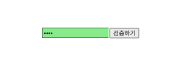
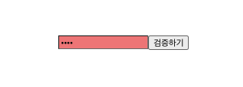

> DOM을 꼭 사용해야 하는 상황

<p>앞 예제에서는 state를 사용하여 우리에게 필요한 기능을 구현했지만, 가끔 state만으로 해결할 수 없는 기능이 있습니다. 어떤 상황인지 알아볼까요?</p>

- 특정 input에 포커스 주기
- 스크롤 박스 조작하기
- Canvas 요소에 그림 그리기 등

<p>이때는 어쩔 수 없이 DOM에 직접 접근해야 하는데, 이를 위해 바로 ref를 사용합니다.</p>

### ref 사용

<p>ref를 사용하는 방법은 두 가지입니다.</p>

- 콜백 함수를 통한 ref 설정
- createRef를 통한 ref 설정

> 콜백 함수를 통한 ref(레퍼런스) 설정

<p>ref를 만드는 가장 기본적인 방법은 콜백 함수를 사용하는 것입니다. ref를 달고자 하는 요소에 ref라는 콜백 함수를 props로 전달해 주면 됩니다. 이 콜백 함수는 ref 값을 파라미터로 전달받습니다. 그리고 함수 내부에서 파라미터로 받으 ref를 컴포넌트의 멤버 변수로 설정해 줍니다.</p>

```
<input ref={(ref) => {this.input=ref}} />
```

<p>이렇게 하면 앞으로 this.input은 input 요소의 DOM을 가리킵니다. ref의 이름은 원하는 것으로 자유롭게 지정할 수 있습니다. DOM 타입과 관계없이 this.superman = ref처럼 마음대로 지정합니다.</p>

> createRef를 통한 ref 설정

<p>ref를 만드는 또 다른 방법은 리액트에 내장되어 있는 createRef라는 함수를 사용하는 것입니다. 이 함수를 사용해서 만들면 더 적은 코드로 쉽게 사용할 수 있습니다. 이 기능은 리액트 v16.3부터 도입되었으며 이전 버전에서는 작동하지 않습니다.</p>

```js
import React, { Component } from ‘react‘;

class RefSample extends Component {
  input = React.createRef();

handleFocus = () => {
    this.input.current.focus();
  }

render() {
    return (
      <div>
        <input ref={this.input} />
      </div>
    );
  }
}

export default RefSample;
```

<p>createRef를 사용하여 ref를 만들려면 우선 컴포넌트 내부에서 멤버 변수로 React.createRef()를 담아 주어야 합니다. 그리고 해당 멤버 변수를 ref를 달고자 하는 요소에 ref props로 넣어 주면 ref 설정이 완료됩니다.</p>

<p>설정한 뒤 나중에 ref를 설정해 준 DOM에 접근하려면 this.input.current를 조회하면 됩니다. 콜백 함수를 사용할 때와 다른 점은 이렇게 뒷부분에 .current를 넣어 주어야 한다는 것입니다.</p>

### 컴포넌트에 ref 달기

<p>리액트에서는 컴포넌트에도 ref를 달 수 있습니다. 이 방법은 주로 컴포넌트 내부에 있는 DOM을 컴포넌트 외부에서 사용할 때 씁니다. 컴포넌트에 ref를 다는 방법은 DOM에 ref를 다는 방법과 똑같습니다.</p>

```
<MyComponent ref={(ref) => {this.myComponent=ref}}/>
```

<p>이렇게 하면 MyComponent 내부의 메서드 및 멤버 변수에도 접근할 수 있습니다. 즉, 내부의 ref에도 접근할 수 있습니다(예: myComponent.handleClick, myComponent.input 등).</p>

### 정리

<p>컴포넌트 내부에서 DOM에 직접 접근해야 할 때는 ref를 사용합니다. 먼저 ref를 사용하지 않고도 기능을 구현할 수 있는지 반드시 고려한 후에 활용하세요 </p>

<p>컴포넌트끼리 데이터를 교류할 때는 언제나 데이터를 부모 ↔ 자식 흐름으로 교류해야 합니다. 나중에 리덕스 혹은 Context API를 사용하여 효율적으로 교류하는 방법을 배울 것입니다.</p>

## Chapter 6 컴포넌트 반복

<p>웹 애플리케이션을 만들다 보면 다음과 같이 반복되는 코드를 작성할 때가 있습니다. </p>

```js
import React from ‘react‘;

const IterationSample = () => {
  return (
    <ul>
      <li>눈사람</li>
      <li>얼음</li>
      <li>눈</li>
      <li>바람</li>
    </ul>
  );
};

export default IterationSample;
```

<p>코드에서 다음 형태가 계속 반복되는 것을 볼 수 있습니다.</p>

```js
<li>...</li>
```

<p>리액트 프로젝트에서 반복적인 내용을 효율적으로 보여 주고 관리하기 위해서 자바스크립트 배열의 프로토타입 함수인 map( ) 함수를 이용합니다.</p>

> <a href="https://developer.mozilla.org/ko/docs/Web/JavaScript/Reference/Global_Objects/Array">자바스크립트 배열 프로토타입 함수 보기</a>

### 자바스크립트 배열의 map( ) 함수

<p>자바스크립트 배열 객체의 내장 함수인 map 함수를 사용하여 반복되는 컴포넌트를 렌더링할 수 있습니다. map 함수는 파라미터로 전달된 함수를 사용해서 배열 내 각 요소를 원하는 규칙에 따라 변환한 후 그 결과로 새로운 배열을 생성합니다.</p>

```
arr.map(callback, [thisArg])

- callback: 새로운 배열의 요소를 생성하는 함수로 파라미터는 다음 세 가지입니다.
  > currentValue: 현재 처리하고 있는 요소
  > index: 현재 처리하고 있는 요소의 index 값
  > array: 현재 처리하고 있는 원본 배열
- thisArg(선택 항목): callback 함수 내부에서 사용할 this 레퍼런스
```

<p>map 함수를 사용하여 배열 [1, 2, 3, 4, 5]의 각 요소를 제곱해서 새로운 배열을 생성하겠습니다.</p>

```js
case 1 : 기본 문법으로 map 활용하기

var numbers = [1, 2, 3, 4, 5];
var result = numbers.map(function (num) {  // 파라미터 자리에 콜백으로 함수를 작성한 모습입니다
  return num * num;
});

console.log(result);

case 2 : 화살표 함수를 통해 map 활용하기

const numbers = [1, 2, 3, 4, 5];
const result = numbers.map(num => num * num);
console.log(result);

>>>
[1, 4, 9, 16, 26] // 두 result 값 모두 같은 값을 보여줍니다.
```

### 데이터 배열을 컴포넌트 배열로 변환하기

<p>기존 배열에 있는 값들을 제곱하여 새로운 배열을 생성했습니다. 똑같은 원리로 기존 배열로 컴포넌트로 구성된 배열을 생성할 수도 있답니다.</p>

```js
import React from "react";

const IterationSample = () => {
  const names = ["눈사람", "얼음", "눈", "바람"];
  const nameList = names.map((name) => <li>{name}</li>);
  return <ul>{nameList}</ul>;
};

export default IterationSample;
```

<p>map 함수에서 JSX를 작성할 때는 앞서 다룬 예제처럼 DOM 요소를 작성해도 되고, 컴포넌트를 사용해도 됩니다.</p>

### key

<p>리액트에서 key는 컴포넌트 배열을 렌더링했을 때 어떤 원소에 변동이 있었는지 알아내려고 사용합니다. 예를 들어 유동적인 데이터를 다룰 때는 원소를 새로 생성할 수도, 제거할 수도, 수정할 수도 있죠. key가 없을 때는 Virtual DOM을 비교하는 과정에서 리스트를 순차적으로 비교하면서 변화를 감지합니다. 하지만 key가 있다면 이 값을 사용하여 어떤 변화가 일어났는지 더욱 빠르게 알아낼 수 있습니다.</p>

<p>key 값을 설정할 때는 map 함수의 인자로 전달되는 함수 내부에서 컴포넌트 props를 설정하듯이 설정하면 됩니다. key 값은 언제나 유일해야 합니다. 따라서 데이터가 가진 고윳값을 key 값으로 설정해야 합니다.</p>

```js
import React from "react";

const IterationSample = () => {
  const names = ["눈사람", "얼음", "눈", "바람"];
  const namesList = names.map((name, index) => <li key={index}>{name}</li>);
  return <ul>{namesList}</ul>;
};

export default IterationSample;

// 위 함수에서는 각 배열이 가진 고유 값인 index 값을 key로 사용하였습니다.
```

### 응용

> 데이터 추가<br/>
> 데이터 제거<br/>
> useRef()를 통한 input 포커싱 <br/>
> map( ) 함수를 통해 배열 매핑

```js
import React, { useRef, useState } from "react";

const IterationSample = () => {
  const style = { cursor: "pointer" };
  const inputRef = useRef();
  const [names, setNames] = useState([
    { id: 1, text: "눈사람" },
    { id: 2, text: "얼음" },
    { id: 3, text: "눈" },
    { id: 4, text: "바람" },
  ]);
  const [inputText, setInputText] = useState("");
  const [nextId, setNextId] = useState(5); // 새로운 항목을 추가할 때 사용할 id

  // change 감지
  const onChange = (e) => {
    setInputText(e.target.value);
  };

  // 데이터 추가
  const onClick = (e) => {
    e.preventDefault();
    if (inputText) {
      const nextNames = names.concat({
        id: nextId,
        text: inputText,
      });
      setNextId(nextId + 1);
      setNames(nextNames);
      setInputText("");
    } else {
      alert("입력한 값이 없습니다\n아무거나 입력해주세요🥲");
      inputRef.current.focus();
    }
  };

  // 데이터 제거

  const onRemove = (id) => {
    // 해당 id 값을 가진 객체 filter, id가 클릭한 아이디가 아닌것 만 보여줘
    const nextNames = names.filter((name) => name.id != id);
    console.log(nextNames);
    // 추후 결과값은 namse 배열에 다시 렌더링
    setNames(nextNames);
  };

  return (
    <div>
      <form onSubmit={onClick}>
        <input ref={inputRef} value={inputText} onChange={onChange} />
        <button onClick={onClick}>추가</button>
      </form>
      {names &&
        names.map((name) => (
          <li
            style={style}
            key={name.id}
            onDoubleClick={() => {
              onRemove(name.id);
            }}
          >
            {name.text}
          </li>
        ))}
    </div>
  );
};

export default IterationSample;
```

### 정리

<p>상태 안에서 배열을 변형할 때는 배열에 직접 접근하여 수정하는 것이 아니라 concat, filter 등의 배열 내장 함수를 사용하여 새로운 배열을 만든 후 이를 새로운 상태로 설정해 주어야 한다는 점을 명심하세요. 이 책에서는 더욱 다양한 배열 및 객체 업데이트 방법들을 계속 배워 나갈 것입니다.</p>

## Chapter 7 컴포넌트의 라이프사이클 메서드

<p>모든 리액트 컴포넌트에는 라이프사이클(수명주기)이 존재합니다. 컴포넌트의 수명은 페이지에 렌더링되기 전인 준비 과정에서 시작하여 페이지에서 사라질 때 끝납니다. 리액트 프로젝트를 진행하다 보면 가끔 컴포넌트를 처음으로 렌더링할 때 어떤 작업을 처리해야 하거나 컴포넌트를 업데이트하기 전후로 어떤 작업을 처리해야 할 수도 있고, 또 불필요한 업데이트를 방지해야 할 수도 있습니다.</p>
<p>이때는 라이프 사이클 메소드를 사용합니다. 참고로 라이프사이클 메소드는 클래스형 컴포넌트에서만 사용할 수 있습니다. 함수형 컴포넌트에서는 사용할 수 없는데요, 그 대신에 Hooks 라는 기능을 사용하여 비슷한 작업을 처리할 수 있습니다.</p>

### 라이프사이클 메서드의 이해

<p>라이프사이클 메서드의 종류는 총 아홉 가지입니다.</p>

- <b>will</b> 접두사가 붙은 메서드는 어떤 작업을 작동하기 전에 실행되는 메서드입니다.
- <b>Did</b> 접두사가 붙은 메서드는 어떤 작업을 작동한 후에 실행되는 메서드입니다.

<p>이 메서드들은 우리가 컴포넌트 클래스에서 덮어 써 선언함으로써 사용할 수 있습니다. 라이프사이클은 총 세 가지, 즉 마운트, 업데이트, 언마운트 카테고리로 나눕니다. </p>

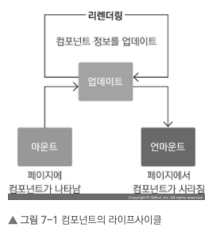

> 마운트(Mount)

<p>DOM이 생성되고 웹 브라우저상에 나타는 것을 마운트라고 합니다. 이때 호출하는 메서드는 다음과 같습니다.</p>

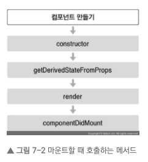

- constructor: 컴포넌트를 새로 만들 때마다 호출되는 클래스 생성자 메서드입니다.
- getDerivedStateFromProps: props에 있는 값을 state에 넣을 때 사용하는 메서드입니다. (derive: ~을 끌어내다)
- render: 우리가 준비한 UI를 렌더링하는 메서드입니다.
- componentDidMount: 컴포넌트가 웹 브라우저상에 나타난 후 호출하는 메서드입니다.

> 업데이트

<p>컴포넌트는 다음과 같은 총 네 가지 경우에 업데이트합니다.</p>

1. props가 바뀔 때
2. state가 바뀔 때
3. 부모 컴포넌트가 리렌더링될 때
4. this.forceUpdate로 강제로 렌더링을 트리거할 때

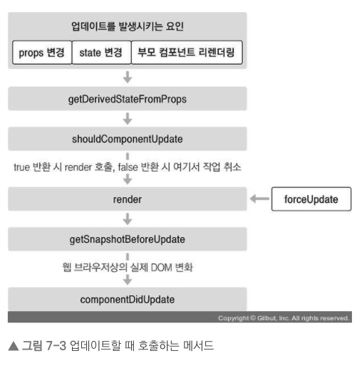

- getDerivedStateFromProps: 이 메서드는 마운트 과정에서도 호출되며, 업데이트가 시작하기 전에도 호출됩니다. props의 변화에 따라 state 값에도 변화를 주고 싶을 때 사용합니다.
- shouldComponentUpdate: 컴포넌트가 리렌더링을 해야 할지 말아야 할지를 결정하는 메서드입니다. 이 메서드에서는 true 혹은 false 값을 반환해야 하며, true를 반환하면 다음 라이프사이클 메서드를 계속 실행하고, false를 반환하면 작업을 중지합니다. 즉, 컴포넌트가 리렌더링되지 않습니다. 만약 특정 함수에서 this.forceUpdate() 함수를 호출한다면 이 과정을 생략하고 바로 render 함수를 호출합니다.
- render: 컴포넌트를 리렌더링합니다.
- getSnapshotBeforeUpdate: 컴포넌트 변화를 DOM에 반영하기 바로 직전에 호출하는 메서드입니다.
- componentDidUpdate: 컴포넌트의 업데이트 작업이 끝난 후 호출하는 메서드입니다.

> 언마운트

<p>마운트의 반대 과정, 즉 컴포넌트를 DOM에서 제거하는 것을 언마운트(unmount)라고 합니다.</p>

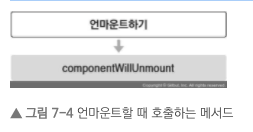

- componentWillUnmount: 컴포넌트가 웹 브라우저상에서 사라지기 전에 호출하는 메서드입니다.

### 라이프사이클 메서드 살펴보기

> 1.render() 함수

```
render(){ ... }
```

<p>이 메서드는 모양새를 정의합니다. 그렇기에 컴포넌트에서 가장 중요한 메서드라고 할 수 있습니다. 라이프사이클 메서드 중 유일한 필수 메서드이기도 합니다. 이 메서드 안에서 this.props와 this.state에 접근할 수 있으며, 리액트 요소를 반환합니다. 요소는 div 같은 태그가 될 수도 있고, 따로 선언한 컴포넌트가 될 수도 있습니다. 아무것도 보여 주고 싶지 않다면 null 값이나 false 값을 반환하도록 하세요. 그리고 다음 사항에 주의하세요. 이 메서드 안에서는 이벤트 설정이 아닌 곳에서 setState를 사용하면 안 되며, 브라우저의 DOM에 접근해서도 안 됩니다. DOM 정보를 가져오거나 state에 변화를 줄 때는 componentDidMount에서 처리해야 합니다.</p>

> 2.constructor 메서드

```
constructor(props) { ... }
```

<p>이것은 컴포넌트의 생성자 메서드로 컴포넌트를 만들 때 처음으로 실행됩니다. 이 메서드에서는 초기 state를 정할 수 있습니다.</p>

> 3.getDerivedStateFromProps 메서드

<p>이것은 리액트 v16.3 이후에 새로 만든 라이프사이클 메서드입니다. props로 받아 온 값을 state에 동기화시키는 용도로 사용하며, 컴포넌트가 마운트될 때와 업데이트 될 때 호출됩니다.</p>

```js
static getDerivedStateFromProps(nextProps, prevState) {
    if(nextProps.value != = prevState.value) { // 조건에 따라 특정 값 동기화
      return { value: nextProps.value };
    }
    return null; // state를 변경할 필요가 없다면 null을 반환
}
```

> 4.componentDidMount 메서드

```
componentDidMount() { ... }
```

<p>이것은 컴포넌트를 만들고, 첫 렌더링을 다 마친 후 실행합니다. 이 안에서 다른 자바스크립트 라이브러리 또는 프레임워크의 함수를 호출하거나 이벤트 등록, setTimeout, setInterval, 네트워크 요청 같은 비동기 작업을 처리하면 됩니다.</p>

> 5.shouldComponentUpdate 메서드

```
shouldComponentUpdate(nextProps, nextState) { ... }
```

<p>이것은 props 또는 state를 변경했을 때, 리렌더링을 시작할지 여부를 지정하는 메서드입니다. 이 메서드에서는 반드시 true 값 또는 false 값을 반환해야 합니다. 컴포넌트를 만들 때 이 메서드를 따로 생성하지 않으면 기본적으로 언제나 true 값을 반환합니다. 이 메서드가 false 값을 반환한다면 업데이트 과정은 여기서 중지됩니다.</p>

<p>이 메서드 안에서 현재 props와 state는 this.props와 this.state로 접근하고, 새로 설정될 props 또는 state는 nextProps와 nextState로 접근할 수 있습니다.</p>

<p>프로젝트 성능을 최적화할 때, 상황에 맞는 알고리즘을 작성하여 리렌더링을 방지할 때는 false 값을 반환하게 합니다. 컴포넌트를 최적화하는 부분은 앞으로 리액트를 공부하면서 더 자세히 알아보겠습니다.</p>

> 6.getSnapshotBeforeUpdate 메서드

<p>이것은 리액트 v16.3 이후 만든 메서드입니다. 이 메서드는 render에서 만들어진 결과물이 브라우저에 실제로 반영되기 직전에 호출됩니다. 이 메서드에서 반환하는 값은 componentDidUpdate에서 세 번째 파라미터인 snapshot 값으로 전달받을 수 있는데요. 주로 업데이트하기 직전의 값을 참고할 일이 있을 때 활용됩니다(예: 스크롤바 위치 유지).</p>

```
getSnapshotBeforeUpdate(prevProps, prevState) {
    if(prevState.array != = this.state.array) {
    const { scrollTop, scrollHeight } = this.list
      return { scrollTop, scrollHeight };
    }
}
```

> 7.componentDidUpdate 메서드

```
componentDidUpdate(prevProps, prevState, snapshot) { ... }
```

<p>이것은 리렌더링을 완료한 후 실행합니다. 업데이트가 끝난 직후이므로, DOM 관련 처리를 해도 무방합니다. 여기서는 prevProps 또는 prevState를 사용하여 컴포넌트가 이전에 가졌던 데이터에 접근할 수 있습니다. 또 getSnapshotBeforeUpdate에서 반환한 값이 있다면 여기서 snapshot 값을 전달받을 수 있습니다.</p>

> 8.componenetWillUnMount 메서드

```
componentWillUnmount() { ... }
```

<p>이것은 컴포넌트를 DOM에서 제거할 때 실행합니다. componentDidMount에서 등록한 이벤트, 타이머, 직접 생성한 DOM이 있다면 여기서 제거 작업을 해야 합니다.</p>

> 9.componentDidCatch 메서드

<p>componentDidCatch 메서드는 리액트 v16에서 새롭게 도입되었으며, 컴포넌트 렌더링 도중에 에러가 발생했을 때 애플리케이션이 먹통이 되지 않고 오류 UI를 보여 줄 수 있게 해 줍니다. 사용 방법은 다음과 같습니다.</p>

```
componentDidCatch(error, info) {
  this.setState({
      error: true
  });
  console.log({ error, info });
}
```

### 라이프사이클 메서드 사용하기

> LifeCycleSample 컴포넌트를 작성해보겠습니다.

```js
import React, { Component } from "react";

class LifeCycleSample extends Component {
  state = {
    number: 0,
    color: null,
  };

  myRef = null; // ref를 설정할 부분

  constructor(props) {
    super(props);
    console.log("constructor");
  }

  static getDerivedStateFromProps(nextProps, prevState) {
    console.log("getDerivedStateFromProps");
    if (nextProps.color !== prevState.color) {
      return { color: nextProps.color };
    }
    return null;
  }

  componentDidMount() {
    console.log("componentDidMount");
  }

  shouldComponentUpdate(nextProps, nextState) {
    console.log("shouldComponentUpdate", nextProps, nextState);
    // 숫자의 마지막 자리가 4면 리렌더링하지 않습니다.
    return nextState.number % 10 !== 4;
  }

  componentWillUnmount() {
    console.log("componentWillUnmount");
  }

  handleClick = () => {
    this.setState({
      number: this.state.number + 1,
    });
  };

  getSnapshotBeforeUpdate(prevProps, prevState) {
    console.log("getSnapshotBeforeUpdate");
    if (prevProps.color !== this.props.color) {
      return this.myRef.style.color;
    }
    return null;
  }

  componentDidUpdate(prevProps, prevState, snapshot) {
    console.log("componentDidUpdate", prevProps, prevState);
    if (snapshot) {
      console.log("업데이트되기 직전 색상: ", snapshot);
    }
  }

  render() {
    console.log("render");

    const style = {
      color: this.props.color,
    };

    return (
      <div>
        <h1 style={style} ref={(ref) => (this.myRef = ref)}>
          {this.state.number}
        </h1>
        <p>color: {this.state.color}</p>
        <button onClick={this.handleClick}>더하기</button>
      </div>
    );
  }
}

export default LifeCycleSample;
```

> 콘솔창에서 해당 결과를 보도록 하겠습니다.

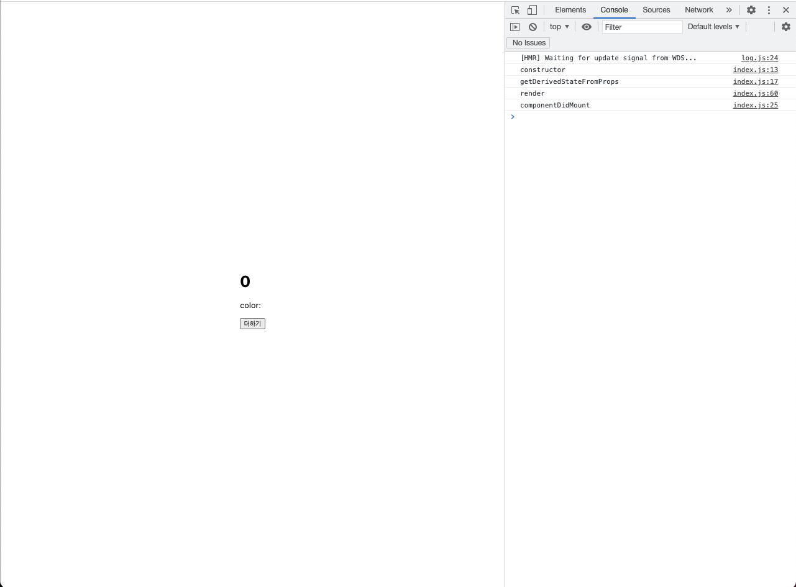

> 처음 컴포넌트가 DOM에 렌더링된 상태에서의 구조는 다음과 같습니다

- constructor로 생성자 생성
- getDerivedStateFromProps 메서드를 통해 이전 상태의 state 탐지
- render > 렌더링
- componentDidMount를 통해 마운트가 일어난 뒤의 상황 감지

> 그럼 더하기 버튼을 눌러 이벤트를 실행해보도록 하겠습니다

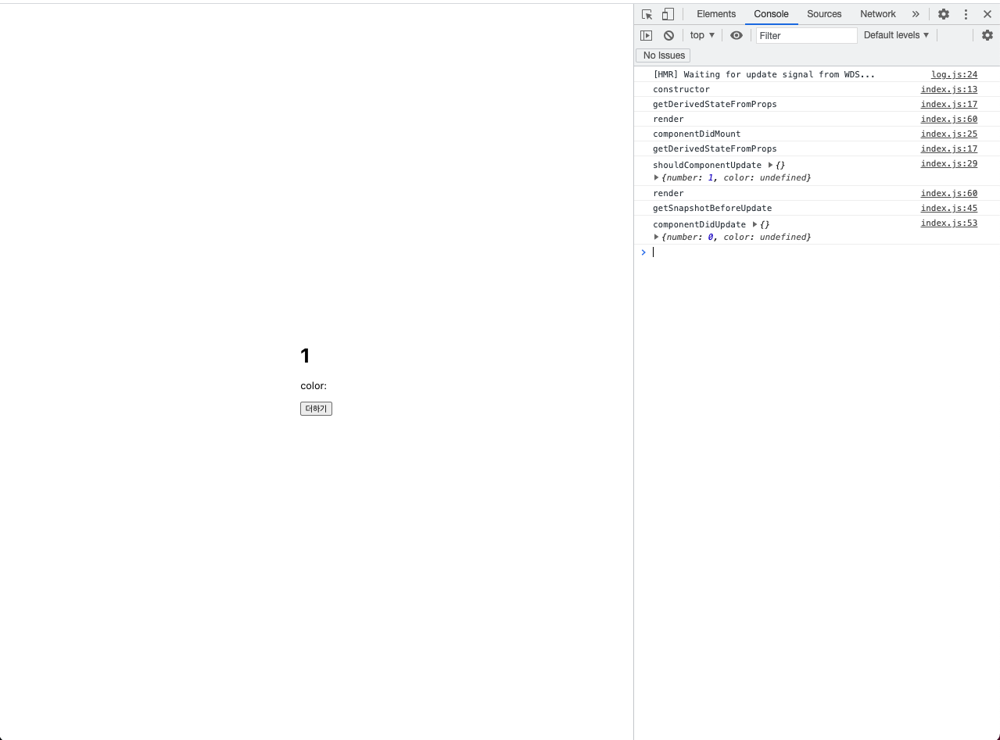

- getDerivedStateFromProps 메서드를 통해 이전 state 값과 바뀐 상태를 감지
- shouldComponentUpdate 메서드를 통해 이벤트에 따른 state 업데이트 후 결과값 업데이트
- render > 해당 업데이트를 virtual DOM에서 감지하고 리렌더링
- getSnapshotBeforeUpdate 컴포넌트 변화를 DOM에 반영하기 직전에 호출
- componentDidUpdate 메서드를 통해 이전 업데이트 된 후에 이전 state 값을 출력 (컴포넌트의 업데이트 작업이 끝난 후 호출)

### 정리

<p>이 컴포넌트는 각 라이프사이클 메서드를 실행할 때마다 콘솔 디버거에 기록하고, 부모 컴포넌트에서 props로 색상을 받아 버튼을 누르면 state.number 값을 1씩 더합니다.

getDerivedStateProps는 부모에게서 받은 color 값을 state에 동기화하고 있습니다. 그리고 getSnapshotBeforeUpdate는 DOM에 변화가 일어나기 직전의 색상 속성을 snapshot 값으로 반환하여 이것을 componentDidUpdate에서 조회할 수 있게 했습니다.

추가로 shouldComponentUpdate 메서드에서 state.number 값의 마지막 자리 수가 4이면(예: 4, 14, 24, 34) 리렌더링을 취소하도록 설정했습니다.</p>


<p>라이프사이클 메서드는 컴포넌트 상태에 변화가 있을 때마다 실행하는 메서드입니다. 이 메서드들은 서드파티 라이브러리를 사용하거나 DOM을 직접 건드려야 하는 상황에서 유용합니다. 추가로 컴포넌트 업데이트의 성능을 개선할 때는 shouldComponentUpdate가 중요하게 사용됩니다.</p>

## Chapter 8 Hooks

<p>Hooks는 리액트 v16.8에 새로 도입된 기능으로 함수형 컴포넌트에서도 상태 관리를 할 수 있는 useState, 렌더링 직후 작업을 설정하는 useEffect 등의 기능을 제공하여 기존의 함수형 컴포넌트에서 할 수 없었던 다양한 작업을 할 수 있게 해줍니다.</p>

### useState

> <a href="https://github.com/junh0328/TIL/blob/master/React/exams/src/components/LearningUseState/index.js">예제 코드 보기</a>

<p>useState는 가장 기본적인 Hook이며, 함수형 컴포넌트에서도 가변적인 상태를 지닐 수 있게 해 줍니다. 3장에서도 이미 사용해 보았는데, 이번 장에서 다시 복습해 봅시다. 만약 함수형 컴포넌트에서 상태를 관리해야 한다면 이 Hook을 사용하면 됩니다.</p>

<p>useState는 코드 상단에서 import 구문을 통해 불러오고, 다음과 같이 사용합니다.</p>

```js
import { useState } from "react";

const [value, setValue] = useState(0);
```

<p>useState 함수의 파라미터에는 상태의 기본값을 넣어 줍니다. 현재 0을 넣어 주었는데, 결국 카운터의 기본값을 0으로 설정하겠다는 의미입니다. 이 함수가 호출되면 배열을 반환하는데요. 그 배열의 첫 번째 원소는 상태 값, 두 번째 원소는 상태를 설정하는 함수입니다. 이 함수에 파라미터를 넣어서 호출하면 전달받은 파라미터로 값이 바뀌고 컴포넌트가 정상적으로 리렌더링됩니다.</p>

### useEffect

> <a href="https://github.com/junh0328/TIL/blob/master/React/exams/src/components/LearningUseEffect/index.js">예제 코드 보기</a>

<p>useEffect는 리액트 컴포넌트가 렌더링될 때마다 특정 작업을 수행하도록 설정할 수 있는 Hook입니다. 클래스형 컴포넌트의 componentDidMount와 componentDidUpdate를 합친 형태로 보아도 무방합니다.</p>

> 1.마운트될 때만 실행하고 싶을 때

<p>useEffect에서 설정한 함수를 컴포넌트가 화면에 맨 처음 렌더링될 때만 실행하고, 업데이트될 때는 실행하지 않으려면 함수의 두 번째 파라미터로 비어 있는 배열을 넣어 주면 됩니다.</p>

```js
useEffect(() => {
  console.log("마운트될 때만 실행됩니다.");
}, []);
```

> 2.특정 값이 업데이트될 때만 실행하고 싶을 때

<p>useEffect를 사용할 때, 특정 값이 변경될 때만 호출하고 싶을 경우도 있겠지요? 클래스형 컴포넌트라면 다음과 같이 작성할 것입니다.</p>

```js
📁 case 1 : class형에서 사용

componentDidUpdate(prevProps, prevState) {
  if (prevProps.value != = this.props.value) {
    doSomething();
  }
}
```

<p>이러한 작업을 useEffect에서 해야 한다면, 어떻게 해야 할까요? 바로 useEffect의 두 번째 파라미터로 전달되는 배열 안에 검사하고 싶은 값을 넣어 주면 됩니다.</p>

```js
useEffect(() => {
  console.log(name);
}, [name]);
```

<p> 배열 안에는 useState를 통해 관리하고 있는 상태를 넣어 주어도 되고, props로 전달받은 값을 넣어 주어도 됩니다.</p>

> 3.뒷정리하기

<p>useEffect는 기본적으로 렌더링되고 난 직후마다 실행되며, 두 번째 파라미터 배열에 무엇을 넣는지에 따라 실행되는 조건이 달라집니다.</p>

<p>컴포넌트가 언마운트되기 전이나 업데이트되기 직전에 어떠한 작업을 수행하고 싶다면 useEffect에서 뒷정리(cleanup) 함수를 반환해 주어야 합니다.</p>

```js
useEffect(() => {
    console.log("렌더링이 완료되었습니다!");
    console.log("none clean up: ", { name, nickname });
    return () => {
      console.log("clean up!");
      console.log("clean up name: ", { name });
    };
  }
```

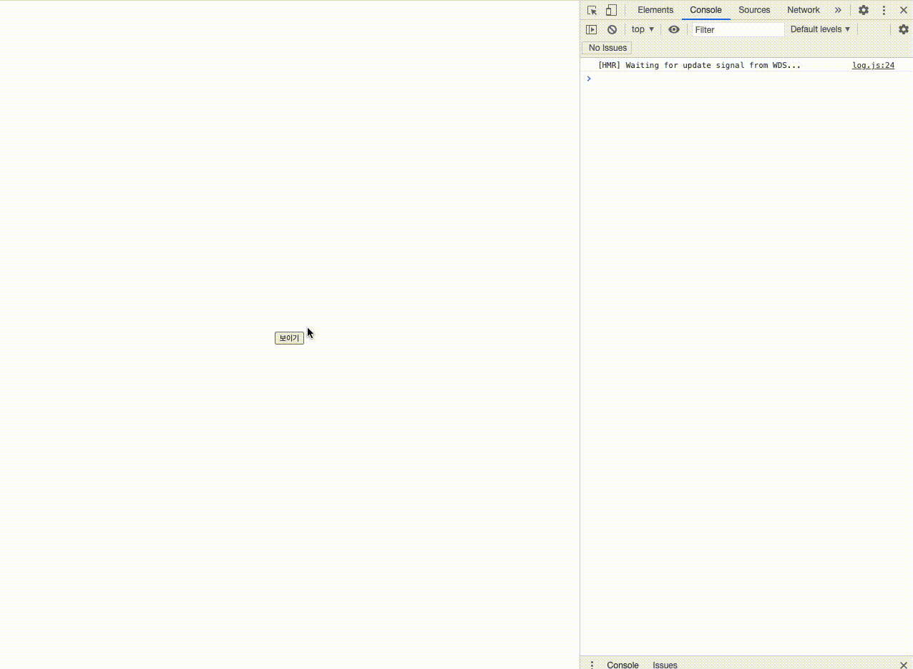

### useMemo

> <a href="https://github.com/junh0328/TIL/blob/master/React/exams/src/components/LearningUseMemo/index.js">예제 코드 보기</a>

<p>useMemo를 사용하면 함수형 컴포넌트 내부에서 발생하는 연산을 최적화할 수 있습니다. 먼저 리스트에 숫자를 추가하면 추가된 숫자들의 평균을 보여 주는 함수형 컴포넌트를 작성해 봅시다.</p>

<p>그런데 숫자를 등록할 때뿐만 아니라 인풋 내용이 수정될 때도 우리가 만든 getAverage 함수가 호출되는 것을 확인할 수 있습니다. 인풋 내용이 바뀔 때는 평균값을 다시 계산할 필요가 없는데, 이렇게 렌더링할 때마다 계산하는 것은 낭비겠지요?</p>

<p>useMemo Hook을 사용하면 이러한 작업을 최적화할 수 있습니다. 렌더링하는 과정에서 특정 값이 바뀌었을 때만 연산을 실행하고, 원하는 값이 바뀌지 않았다면 이전에 연산했던 결과를 다시 사용하는 방식입니다.</p>

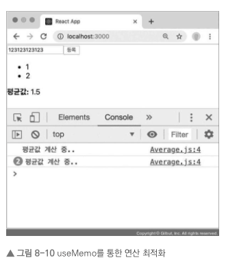

> 이제 list 배열의 내용이 바뀔 때만 getAverage 함수가 호출됩니다.

### useCallback

> <a href="https://github.com/junh0328/TIL/blob/master/React/exams/src/components/LearningUseMemo/index.js">예제 코드 보기</a>

<p>useCallback은 useMemo와 상당히 비슷한 함수입니다. 주로 렌더링 성능을 최적화해야 하는 상황에서 사용하는데요. 이 Hook을 사용하면 이벤트 핸들러 함수를 필요할 때만 생성할 수 있습니다</p>

<p>방금 구현한 Average 컴포넌트를 보세요. onChange와 onInsert라는 함수를 선언해 주었지요? 이렇게 선언하면 컴포넌트가 리렌더링될 때마다 이 함수들이 새로 생성됩니다. 대부분의 경우 이러한 방식은 문제없지만, 컴포넌트의 렌더링이 자주 발생하거나 렌더링해야 할 컴포넌트의 개수가 많아지면 이 부분을 최적화해 주는 것이 좋습니다.</p>

```js
const onChange = useCallback((e) => {
  setNumber(e.target.value);
}, []); // 컴포넌트가 처음 렌더링될 때만 함수 생성


const onInsert = useCallback(
  (e) => {
    const nextList = list.concat(parseInt(number));
    setList(nextList);
    setNumber("");
  },
  [number, list] // number 혹은 list가 바뀌었을 때만 함수 생성
);


useMemo(() => {
  const fn = () => {
    console.log(‘hello world!‘);
  };
  return fn;
}, [])
```

<p>onChange처럼 비어 있는 배열을 넣게 되면 컴포넌트가 렌더링될 때 단 한 번만 함수가 생성되며, onInsert처럼 배열 안에 number와 list를 넣게 되면 인풋 내용이 바뀌거나 새로운 항목이 추가될 때마다 함수가 생성됩니다.</p>

<p>함수 내부에서 상태 값에 의존해야 할 때는 그 값을 반드시 두 번째 파라미터 안에 포함시켜 주어야 합니다. 예를 들어 onChange의 경우 기존의 값을 조회하지 않고 바로 설정만 하기 때문에 배열이 비어 있어도 상관없지만, onInsert는 기존의 number와 list를 조회해서 nextList를 생성하기 때문에 배열 안에 number와 list를 꼭 넣어 주어야 합니다.</p>

<p>참고로 다음 두 코드는 완전히 똑같은 코드입니다. useCallback은 결국 useMemo로 함수를 반환하는 상황에서 더 편하게 사용할 수 있는 Hook입니다. 숫자, 문자열, 객체처럼 일반 값을 재사용하려면 useMemo를 사용하고, 함수를 재사용하려면 useCallback을 사용하세요.</p>

### useRef

> <a href="https://github.com/junh0328/TIL/blob/master/React/exams/src/components/LearningUseMemo/index.js">예제 코드 보기</a>

### 다른 Hooks

> <a href="https://nikgraf.github.io/react-hooks/">사용자 생성 커스텀 훅</a></br><a href="https://ko.reactjs.org/docs/hooks-custom.html">자신만의 Hook 만들기</a>

## Chapter 9 컴포넌트 스타일링

<p>리액트에서 컴포넌트를 스타일링할 때는 다양한 방식을 사용할 수 있습니다. 여러 방식 중에서 딱히 정해진 방식이란 없습니다. 회사마다 요구하는 스펙이 다르고, 개발자마다 각자 취향에 따라 선택하기 때문입니다. 이 장에서는 어떠한 방식이 있는지 알아보고, 자주 사용하는 방식을 하나하나 사용해 보겠습니다</p>

> 대표적인 스타일링 방식은 다음과 같습니다

- 일반 CSS: 컴포넌트를 스타일링하는 가장 기본적인 방식입니다.
- Sass: 자주 사용되는 CSS 전처리(pre-processor)중 하나로 확장된 CSS 문법을 사용하여 CSS 코드를 더욱 쉽게 작성할 수 있도록 해 줍니다.
- CSS Module: 스타일을 작성할 때 CSS 클래스가 다른 CSS 클래스의 이름과 절대 충돌하지 않도록 파일마다 고유한 이름을 자동으로 생성해 주는 옵션입니다.
- styled-components: 스타일을 자바스크립트 파일에 내장시키는 방식으로 스타일을 작성함과 동시에 해당 스타일이 적용된 컴포넌트를 만들 수 있게 해줍니다.

### 가장 흔한 방식, 일반 CSS

```css
.App {
  text-align: center;
}

/.App 안에 들어 있는 .logo/ .App .logo {
  animation: App-logo-spin infinite 20s linear;
  height: 40vmin;
}

/* .App 안에 들어 있는 header 
   header 클래스가 아닌 header 태그 자체에
   스타일을 적용하기 때문에 .이 생략되었습니다. */
.App header {
  background-color: #282c34;
  min-height: 100vh;
  display: flex;
  flex-direction: column;
  align-items: center;
  justify-content: center;
  font-size: calc(10px + 2vmin);
  color: white;
}

/* .App 안에 들어 있는 a 태그 */
.App a {
  color: #61dafb;
}

@keyframes App-logo-spin {
  from {
    transform: rotate(0deg);
  }
  to {
    transform: rotate(360deg);
  }
}
```

### styled-components

<p>컴포넌트 스타일링의 또 다른 패러다임은 자바스크립트 파일 안에 스타일을 선언하는 방식입니다. 이 방식을 ‘CSS-in-JS’라고 부르는데요. 이와 관련된 라이브러리는 정말 많습니다. 라이브러리의 종류는 https://github.com/MicheleBertoli/css-in-js에서 확인할 수 있습니다.</p>

> styled-components를 대체할 수 있는 라이브러리로는 현재 emotion이 대표적입니다. 작동 방식은 styled-components와 꽤 비슷합니다.

<p>이 라이브러리를 통해 예제 컴포넌트를 한번 만들어 보겠습니다. styled-components를 사용하면 자바스크립트 파일 하나에 스타일까지 작성할 수 있기 때문에 .css 또는 .scss 확장자를 가진 스타일 파일을 따로 만들지 않아도 된다는 큰 이점이 있습니다.</p>

> <a href="https://github.com/junh0328/TIL/blob/master/React/exams/src/components/StyledComponents/index.js">예제 코드 보기</a>

<p>styled-components와 일반 classNames를 사용하는 CSS/Sass를 비교했을 때, 가장 큰 장점은 props 값으로 전달해 주는 값을 쉽게 스타일에 적용할 수 있다는 것입니다.</p>

> 1.스타일링된 엘리먼트 만들기

<p>styled-components를 사용하여 스타일링된 엘리먼트를 만들 때는 컴포넌트 파일의 상단에서 styled를 불러오고, styled.태그명을 사용하여 구현합니다.</p>

```js
import styled from "styled-components";

const MyComponent = styled.div`
  font-size: 2rem;
`;
```

<p>하지만 사용해야 할 태그명이 유동적이거나 특정 컴포넌트 자체에 스타일링해 주고 싶다면 다음과 같은 형태로 구현할 수 있습니다.</p>

```js
const Myinput = styled("input")`
  background: gray;
`;

// 이미 만들어진 Link 태그에 추가 커스텀 스타일링을 적용한다
const StyledLink = styled(Link)`
  color: blue;
`;
```

> 2.스타일에서 props 조회하기

<p>styled-components를 사용하면 스타일 쪽에서 컴포넌트에게 전달된 props 값을 참조할 수 있습니다.</p>

```js
const Box = styled.div`
  /* props로 넣어 준 값을 직접 전달해 줄 수 있습니다. */
  // <Box color="black"> color props가 없다면 기본 색상은 blue로 출력
  background: ${(props) => props.color || "blue"};
  padding: 1rem;
  display: flex;
`;

...

<Box color="black"></Box>

```

<p>이 코드를 보면 background 값에 props를 조회해서 props.color의 값을 사용하게 했습니다. 그리고 color 값이 주어지지 않았을 때는 blue를 기본 색상으로 설정했습니다.

이렇게 만들어진 코드는 JSX에서 사용될 때 다음과 같이 color 값을 props로 넣어 줄 수 있습니다.</p>

> 3.props에 따른 조건부 스타일링

<p>일반 CSS 클래스를 사용하여 조건부 스타일링을 해야 할 때는 className을 사용하여 조건부 스타일링을 해 왔는데요. styled-components에서는 조건부 스타일링을 간단하게 props로도 처리할 수 있습니다.</p>

```js
// 여기서 props는 우리가 만든 StyledComponent에게 부여된 props입니다
  ${(props) =>
    // props를 만들어서 해당 조건에 따라 css를 지정해줄 수도 있습니다
    props.inverted &&
    css`
      background: none;
      border: 2px solid white;
      color: white;

      &:hover {
        background: white;
        color: black;
      }
    `}
    ...

    <Button inverted={true}>테두리만</Button>
    // props.inverted 인 상황에서만 쓸 수 있는 조건부 css 스타일링을 구현하였습니다

```

> 4.반응형 디자인

<p>이번에는 styled-components를 사용할 때 반응형 디자인을 어떻게 하는지 한번 알아봅시다. 브라우저의 가로 크기에 따라 다른 스타일을 적용하기 위해서는 일반 CSS를 사용할 때와 똑같이 media 쿼리(query)를 사용하면 됩니다. 조금 전 작성한 Box 컴포넌트를 다음과 같이 수정해 보세요.</p>

```js
const Box = styled.div`
  background: ${(props) => props.color || "blue"};
  padding: 1rem;
  display: flex;
  width: 1024px;
  @media (max-width: 1024px) {
    width: 768px;
    background-color: salmon;
  }
  @media (max-width: 768px) {
    width: 100%;
    background-color: crimson;
  }
`;
```

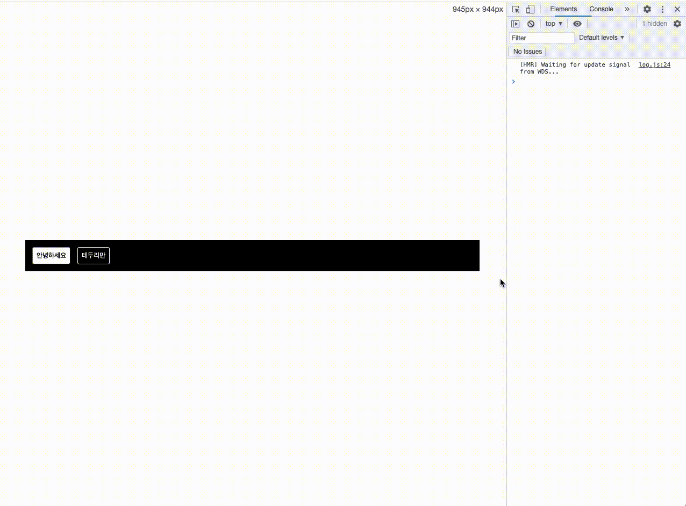

<p>하지만 이렇게 작업한다면 일반 CSS에서 할 때랑 큰 차이가 없습니다. 그런데 이러한 작업을 여러 컴포넌트에서 반복해야 한다면 조금 귀찮을 수도 있습니다. 그럴 때는 이 작업을 함수화하여 간편하게 사용할 수 있습니다. styled-components 매뉴얼에서 제공하는 유틸 함수를 따라 사용해 봅시다.</p>

> 참고: <a href="https://www.styled-components.com/docs/advanced#media-templates">링크, 스타일드 컴포넌트</a>

```js
onst sizes = {
  desktop: 1024,
  tablet: 768,
};

// 위에 있는 size 객체에 따라 자동으로 media 쿼리 함수를 만들어 줍니다.

const media = Object.keys(sizes).reduce((acc, label) => {
  acc[label] = (...args) => css`
    @media (max-width: ${sizes[label] / 16}em) {
      ${css(...args)};
    }
  `;

  return acc;
}, {});

const Box = styled.div`
  /* props로 넣어 준 값을 직접 전달해 줄 수 있습니다. */
  // <Box color="black"> color props가 없다면 기본 색상은 blue로 출력
  background: ${(props) => props.color || "blue"};
  padding: 1rem;
  display: flex;
  width: 1024px;
  ${media.desktop`width: 768px;`}
  ${media.tablet`width: 100%;`};
`;
```

## Chapter 13 리액트 라우터로 SPA 개발하기

### SPA란?

<p>SPA는 Single Page Application(싱글 페이지 애플리케이션)의 약어입니다. 말 그대로 한 개의 페이지로 이루어진 애플리케이션이라는 의미입니다. 전통적인 웹 페이지는 다음과 같이 여러 페이지로 구성되어 있습니다.</p>

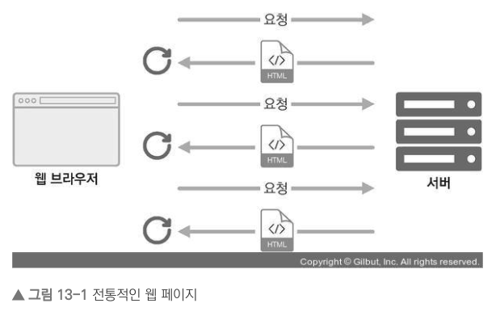

<p>기존에는 사용자가 다른 페이지로 이동할 때마다 새로운 html을 받아 오고, 페이지를 로딩할 때마다 서버에서 리소스를 전달받아 해석한 뒤 화면에 보여 주었습니다. 이렇게 사용자에게 보이는 화면은 서버 측에서 준비했습니다. 사전에 html 파일을 만들어서 제공하거나, 데이터에 따라 유동적인 html을 생성해주는 템플릿 엔진을 사용하기도 했죠.</p>

<p>요즘에는 웹에서 제공되는 정보가 정말 많기 때문에 새로운 화면을 보여 주어야 할 때마다 서버 측에서 모든 뷰를 준비한다면 성능상의 문제가 발생할 수 있습니다. 예를 들어 트래픽이 너무 많이 나올 수도 있고, 사용자가 몰려 서버에 높은 부하가 쉽게 걸릴 수도 있습니다. 그래서 리액트 같은 라이브러리 혹은 프레임워크를 사용하여 뷰(View) 렌더링을 사용자의 브라우저가 담당하도록 하고, 우선 애플리케이션을 브라우저에 불러와서 실행시킨 후에 사용자와의 인터랙션이 발생하면 <b>필요한 부분만 자바스크립트를 사용하여 업데이트해 줍니다.</b> 만약 새로운 데이터가 필요하다면 서버 API를 호출하여 필요한 데이터만 새로 불러와 애플리케이션에서 사용할 수도 있습니다.</p>

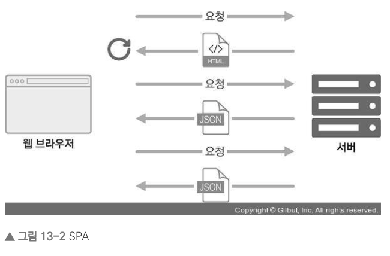

> 사용자와의 인터렉션이 발생하면 필요한 부분만 자바스크립트를 사용하여 업데이트 (JSON 형식으로 요청함)

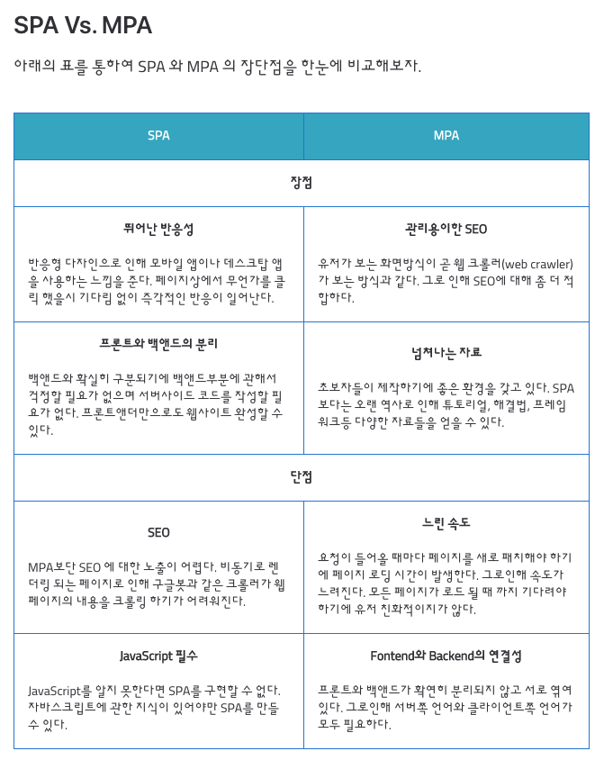

[출처 : https://babytiger.netlify.app/posts/SPA/]

<p>싱글 페이지라고 해서 화면이 한 종류인 것은 아닙니다. SPA의 경우 서버에서 사용자에게 제공하는 페이지는 한 종류이지만, 해당 페이지에서 로딩된 자바스크립트와 현재 사용자 브라우저의 주소 상태에 따라 다양한 화면을 보여 줄 수 있습니다.</p>

<p>다른 주소에 다른 화면을 보여 주는 것을 라우팅이라고 합니다. 리액트 라이브러리 자체에 이 기능이 내장되어 있지 않기 때문에, 브라우저의 API를 직접 사용하여 이를 관리하거나, 라이브러리를 사용하여 이 작업을 더욱 쉽게 구현할 수 있습니다.</p>

<p>리액트 라우팅 라이브러리는 리액트 라우터(react-router), 리치 라우터(reach-router), Next.js 등 여러 가지가 있습니다. 이러한 리액트 라우팅 라이브러리는 클라이언트 사이드에서 이루어지는 라우팅을 아주 간단하게 구현할 수 있도록 해 줍니다. 더 나아가 나중에 서버 사이드 렌더링을 할 때도 라우팅을 도와주는 컴포넌트들을 제공해 줍니다.</p>

> SPA의 단점

<p>SPA의 단점은 앱의 규모가 커지면 자바스크립트 파일이 너무 커진다는 것입니다. 페이지 로딩 시 사용자가 실제로 방문하지 않을 수도 있는 페이지의 스크립트도 불러오기 때문이죠. 하지만 후에 배울 코드 스플리팅(code splitting)을 사용하면 라우트별로 파일들을 나누어서 트래픽과 로딩 속도를 개선할 수 있습니다.</p>

<p>리액트 라우터처럼 브라우저에서 자바스크립트를 사용하여 라우팅을 관리하는 것은 자바스크립트를 실행하지 않는 일반 크롤러에서는 페이지의 정보를 제대로 수집해 가지 못한다는 잠재적인 단점이 따릅니다. 그렇기 때문에 구글, 네이버, 다음과 같은 검색 엔진의 검색 결과에 페이지가 잘 나타나지 않을 수도 있습니다. 또한, 자바스크립트가 실행될 때까지 페이지가 비어 있기 때문에 자바스크립트 파일이 로딩되어 실행되는 짧은 시간 동안 흰 페이지가 나타날 수 있다는 단점도 있습니다. 하지만 이런 문제점들은 다행히 나중에 배우게 될 서버 사이드 렌더링(server-side-rendering)을 통해 모두 해결할 수 있습니다.</p>

### SSR? (Server Side Rendering)

<p>리액트는 대표적인 CSR(client side rendering)입니다. 이러한 리액트의 CSR적인 부분에서 SSR 적으로 바꿔 주기 위해서 next.js와 같은 라이브러리를 사용합니다.</p>

<p>SSR을 사용하는 가장 큰 이유는 효율적인 SEO를 위해서 입니다. 아래 문단에서 다루겠지만, SEO는 google, naver와 같은 검색 엔진들이 우리의 웹사이트에서 html 태그안의 내용을(title, meta-data 등등,,,) 분석하여 사용자가 입력한 정보를 바탕으로 알맞은(사용자가 원하는) 정보를 찾을 수 있게 하는 기능입니다. 리액트는 CSR으로 작동되는데, 사용자가 우리의 해당 도메인에 접속하면, 클라이언트 서버(사용자의 컴퓨터)가 html과 js 등의 파일을 다운받아 보여주는 형식입니다. CSR 상태에서는 사전에 html을 가지고 있지 않기 때문에 검색 엔진에 노출되는 빈도가 현저히 적거나, 브라우저에 따라 검색 엔진에 해당 정보가 노출되지 않아 검색을 해도 나오지 않을 수 있습니다.(도메인을 통해 접속하는 것은 가능해지는 정도, 해당 사이트에 관련된 정보를 검색 엔진이 크롤링하지 못할 수 있음)그래서 SSR을 통해 서버가 사전에 html과 일부 js 파일을 넘겨주게 되면, 검색 엔진에서 이를 캐치하여 사용자가 원하는 정보가 담긴 우리 사이트를 보여줄 수 있을 것입니다.</p>

### SEO(Search Engine Optimization), 검색 엔진 최적화

<p>SEO란, Search Engine Optimization의 약자로, SEO는 구글, 네이버와 같은 검색 엔진들이 서버에 등록된 웹사이트를 하나하나씩 돌아 다니면서 웹사이트의 HTML 문서를 분석해줍니다. 이때 HTML에 사용된 태그를 바탕으로 사용자가 검색할 때, 웹사이트를 빠르게 검색할 수 있게 도와줍니다. 하지만, CSR에서 사용되고있는 HTML의 body는 텅텅 비어 있다가(div id="root"의 리액트 특성), 사용자가 해당 도메인을 가진 페이지에 접근하면, 클라이언트 서버에서 js 밑 html 태그를 불러오는 형식이기 때문에 사전에 html 정보를 가지고 있지 않습니다. 그래서 검색 엔진이 해당 도메인에 접근할 때 어려움이 있습니다. (우리 사이트를 검색 엔진을 통해 다양한 키워드를 통해 유입되는 것이 힘들다 why? 검색 엔진이 우리 html 파일을 분석할 수 없기 때문에 why? CSR 형식은 사용자가 접근해야 html, js 등의 파일을 불러오기 때문에) 따라서, 검색 엔진을 통해 사용자가 입력하여 얻고자하는 정보를 입력했을때, 검색 엔진이 우리의 웹 사이트에서 해당 내용을 캐치하는데 어려움이 있습니다.</p>

<p>따라서 우리는 SEO 즉, 검색 엔진 최적화를 해주기 위해, SSR을 사용하여 사전에 html 문서를 검색 엔진이 찾을 수 있도록 제공하여 SEO를 향상시킬 수 있게 됩니다. SSR은 서버에서 필요한 데이터를 가져와 사전에 html 파일을 만들게 되고 이렇게 만들어진 HTML 파일을 일부 초기 세팅에 필요한 js와 함께 클라이언트 서버에 보내주게 됩니다. 그러면 클라이언트 측에서는 서버에서 만들어준 문서를 받아 와서 바로 사용자에게 보여줄 수 있게 되는 거죠. 이렇게 SSR을 사용하게 되면 사전에 HTML 문서를 클라이언트 측으로 전달했기 때문에, 페이지 로딩이 빨라지고, 검색 엔진이 사용자의 요청에 따라 검색어를 찾을 때(데이터를 크롤링할 때), 우리의 웹사이트에 해당 검색어가 포함되어 있다면 우리 페이지를 보여주는 효율적인 SEO가 될 수 있습니다.</p>

<p>하지만 SSR이 CSR의 모든 문제점에 해결책이 되지는 않습니다. 서버에서 데이터를 사전에 받아오는 것이기 때문에 첫 번째로 blinking issue가 여전히 존재하고(페이지가 넘어갈 때마다 깜빡임 why? html 및 js 파일을 새로 받아오기 때문에), 두 번째로 사용자가 증가함에 따라 서버는 사용자의 요청에 의해 더 많은 데이터를 가지고 와서 HTML을 만들어야 하므로 과부화가 올 수 있습니다. 마지막으로 가장 큰 문제는 사용자가 빠르게 웹사이트를 확인할 수는 있지만, SSR시 모든 js파일을 다운 받은 상태가 아니기 때문에, js파일이 완전히 다운로드 되지 않은 상태에서 페이지의 여러 부분을 클릭하면, 작동이 되지 않는 부분이 존재할 수 있습니다.</p>

### TTV(Time To View) TTI(Time To Interact)

> TTV는 보여지는 시점, TTI는 인터렉션 사용자와의 통신이 가능해지는 시점입니다

<p>CSR은 사용자에게 보여짐과 동시에 모든 html과 js를 불러온 상태이기 때문에, TTV과 됨과 동시에 TTI 모든 동적인 행동을 할 수 있게 됩니다.</p>


[출처: <a href="https://www.youtube.com/watch?v=iZ9csAfU5Os">유튜브, 드림 코딩 엘리님의 SSR 강의</a>]

<p>하지만, SSR은 html과 일부 js파일은 서버로부터 사전에 받아 놓았기 때문에 TTV 상태에서도 TTI가 전부 활성화되어 있지는 않습니다</p>


[출처: <a href="https://www.youtube.com/watch?v=iZ9csAfU5Os">유튜브, 드림 코딩 엘리님의 SSR 강의</a>]

<p>최종적으로 CSR을 많이 사용한다면, 우리가 최종적으로 번들링하여 사용자게에 보내주는 js 파일을 어떻게 하면 효율적으로 많이 분할하여 첫 번째로 사용자가 보기 위해서 필요한 정말 필수적인 html 요소만 보낼 수 있을지 고민해봐야 하고, SSR의 경우 사용자가 보고, 인터렉션(TTI)하는 이 시간의 단차를 줄이기 위해서 어떤 노력을 할 수 있을지 고민해봐야 합니다. 예를 들면 어떻게 하면 조금 더 매끄러운 UI와 UX를 제공할 수 있을지에 대한 고민들이 포함됩니다.</p>

<p>요즘에는 SSR, CSR 뿐만 아니라 SSG(Static Site Generation)또한 렌더링 방법으로 등장하였습니다. SSG는 리액트를 예로 들면 'Gatsby' 또는 'Next'와 같은 라이브러리를 추가적으로 사용하여 렌더링을 하는 것인데, 웹페이지를 정적으로 미리 생성해두고, 서버에 배포해놓는 것입니다. SSG에서도 자바스크립트 파일을 html 파일과 함께 가지고 있을 수 있기 때문에, 동적인 요소도 충분히 추가할 수 있습니다. Next에서는 SSR뿐만 아니라, static generation, no pre-rendering, pre-rendering상태를 모두 지원하기 때문에 리액트로 작업을 계속한다면 next.js를 배워보는 것도 매우 효과적일 겁니다.</p>

<p>어떤 것이 최고다, 제일 낫다라는 판단 보다는 우리가 만들어야 하는 웹사이트 특성에 맞게 다양한 방식의 렌더링을 활용하여 페이지를 구성한다면 최선의 선택이 될 것입니다.</p>

### 프로젝트에 리액트 라우터 적용하기

<p>SPA에서 리액트 라우팅을 담당하는 라이브러리 중 하나인, react-router-dom을 사용하여 라우팅을 적용해보도록 하겠습니다</p>

> <a href="https://reactrouter.com/web/example/basic">리액트 라우터 공식 홈페이지</a>

<p>프로젝트에서 리액트 라우터를 적용할 때는 'react-router-dom'에 모듈에 내장되어 있는 'BrowserRouter'라는 컴포넌트를 사용하여 감싸면 됩니다. 이 컴포넌트는 웹 애플리케이션에서 HTML5의 History API를 사용하여 페이지를 새로고침하지 않고도 주소를 변경하고, 현재 주소에 관련된 정보를 props로 쉽게 조회하거나 사용할 수 있도록 해 줍니다</p>

```js
import React from ‘react‘;
import ReactDOM from ‘react-dom‘;
import { BrowserRouter } from ‘react-router-dom‘;
import ‘./index.css‘;
import App from ‘./App‘;
import * as serviceWorker from ‘./serviceWorker‘;


ReactDOM.render(
  <BrowserRouter>
    <App />
  </BrowserRouter>,
  document.getElementById(‘root‘)
);

```

> Route 컴포넌트로 특정 주소에 컴포넌트 연결

<p>Route라는 컴포넌트를 사용하여 사용자의 현재 경로에 따라 다른 컴포넌트를 보여 주겠습니다. Route 컴포넌트를 사용하면 어떤 규칙을 가진 경로에 어떤 컴포넌트를 보여 줄지 정의할 수 있습니다</p>

```js
<Route path="주소규칙" component={보여 줄 컴포넌트} />
```

<p>/about 경로로 들어가면 About 컴포넌트만 나오기를 기대했지만, 예상과 다르게 두 컴포넌트가 모두 나타납니다. /about 경로가 / 규칙에도 일치하기 때문에 발생한 현상입니다. 이를 수정하려면 Home을 위한 Route 컴포넌트를 사용할 때 exact라는 props를 true로 설정하면 됩니다.</p>

```js
const App = () => {
  return (
    <div>
      <Route path="/" component={Home} exact={true} />
      <Route path="/about" component={About} />
    </div>
  );
};
```

> Link 컴포넌트로 특정 주소로 이동하기

<p>Link 컴포넌트는 클릭하면 다른 주소로 이동시켜 주는 컴포넌트입니다. 일반 웹 애플리케이션에서는 a 태그를 사용하여 페이지를 전환하는데요. 리액트 라우터를 사용할 때는 이 태그를 직접 사용하면 안 됩니다. 이 태그는 페이지를 전환하는 과정에서 페이지를 새로 불러오기 때문에 애플리케이션이 들고 있던 상태들을 모두 날려 버리게 됩니다. 렌더링된 컴포넌트들도 모두 사라지고 다시 처음부터 렌더링하게 되죠.</p>

<p>Link 컴포넌트를 사용하여 페이지를 전환하면, 페이지를 새로 불러오지 않고 애플리케이션은 그대로 유지한 상태에서 HTML5 History API를 사용하여 페이지의 주소만 변경해 줍니다. Link 컴포넌트 자체는 a 태그로 이루어져 있지만, 페이지 전환을 방지하는 기능이 내장되어 있습니다.</p>

```js
<Link to="주소">내용</Link>
```

> Route 하나에 여러 개의 path 설정하기

<p> Route를 두 번 사용하는 대신, path props를 배열로 설정해 주면 여러 경로에서 같은 컴포넌트를 보여 줄 수 있습니다.</p>

```js
...

const App = () => {
  return (
    <div>
      <Route path={["/about", "/info"]} component={About} />
    </div>
  );
};
```

### URL 파라미터와 쿼리

<p>페이지 주소를 정의할 때 가끔은 유동적인 값을 전달해야 할 때도 있습니다. 이는 파라미터와 쿼리로 나눌 수 있습니다.</p>

```
1. 파라미터 예시 : /profiles/velopert
2. 쿼리 예시 : /about?details=true
```

<p>유동적인 값을 사용해야 하는 상황에서 파라미터를 써야 할지 쿼리를 써야 할지 정할 때, 무조건 따라야 하는 규칙은 없습니다. 다만 일반적으로 파라미터는 특정 아이디 혹은 이름을 사용하여 조회할 때 사용하고, 쿼리는 우리가 어떤 키워드를 검색하거나 페이지에 필요한 옵션을 전달할 때 사용합니다.</p>

> 1.URL 파라미터

<p>Profile 페이지에서 파라미터를 사용해 봅시다. /profile/velopert와 같은 형식으로 뒷부분에 유동적인 username 값을 넣어 줄 때 해당 값을 props로 받아 와서 조회하는 방법을 알아보겠습니다.</p>

<p>URL 파라미터를 사용할 때는 라우트로 사용되는 컴포넌트에서 받아 오는 match라는 객체 안의 params 값을 참조합니다. match 객체 안에는 현재 컴포넌트가 어떤 경로 규칙에 의해 보이는지에 대한 정보가 들어 있습니다.</p>

```js
<Route path="/profile/:username" component={Profile} />
```

<p>이번에 사용할 path 규칙에는 /profiles/:username이라고 넣어 줍니다. 이렇게 설정하면 match.params.username 값을 통해 현재 username 값을 조회할 수 있습니다.</p>

```js
📁/pages/Profile;
import React from "react";

const data = {
  leejunhee: {
    name: "이준희",
    description: "리액트를 좋아하는 개발자",
  },
  gildong: {
    name: "홍길동",
    description: "고전 소설 홍길동전의 주인공",
  },
};

const Profile = ({ match }) => {    // match 객체를 통해 Route 처리에 담긴 :username에 접근할 수 있게됨
  const { username } = match.params;
  console.log("match: ", match);  // match 객체 확인
  console.log("match.params ", match.params); // match.params 객체 확인
  console.log("match.params.username: ", username); // // match.params.username 객체 확인
  const profile = data[username];
  if (!profile) {
    return <div>존재하지 않는 사용자입니다.</div>;
  }
  return (
    <div>
      <h3>
        {username}({profile.name})
      </h3>
      <p>{profile.description}</p>
    </div>
  );
};

export default Profile;
```

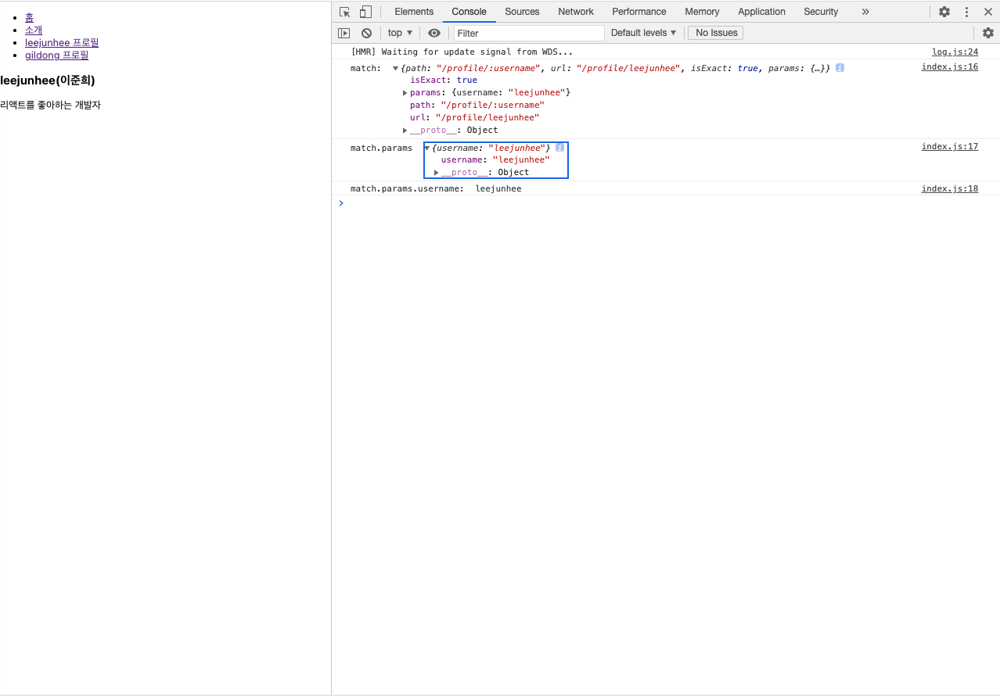

<p>match 객체 안에는 path, params, url 파라미터가 들어있습니다. 이 params를 통해 params 프로퍼티 내부의 username 프로퍼티에 접근하여 해당 값을 비교하게 됩니다</p>

> 2.URL 쿼리

<p>이번에는 About 페이지에서 쿼리를 받아 오겠습니다. 쿼리는 location 객체에 들어 있는 search 값에서 조회할 수 있습니다. location 객체는 라우트로 사용된 컴포넌트에게 props로 전달되며, 웹 애플리케이션의 현재 주소에 대한 정보를 지니고 있습니다.</p>

> location의 형태는 다음과 같습니다.

```
{
“pathname”: “/about”,
“search”: “?detail=true”,
“hash”: “”
}
```

> 위 location 객체는 http://localhost:3000/about?detail=true 주소로 들어갔을 때의 값입니다.

<p>URL 쿼리를 읽을 때는 위 객체가 지닌 값 중에서 search 값을 확인해야 합니다. 이 값은 문자열 형태로 되어 있습니다. URL 쿼리는 ?detail=true&another=1과 같이 문자열에 여러 가지 값을 설정해 줄 수 있습니다. search 값에서 특정 값을 읽어 오기 위해서는 이 문자열을 객체 형태로 변환해 주어야 합니다.</p>

<p>쿼리 문자열을 객체로 변환할 때는 qs라는 라이브러리를 사용합니다.</p>

> case 1 : url : http://localhost:3000/about [쿼리문 x]

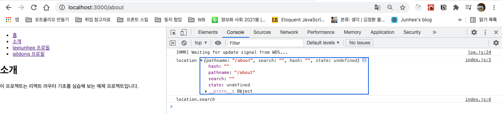

> case 1 : url : http://localhost:3000/about?detail=true [쿼리문 o]

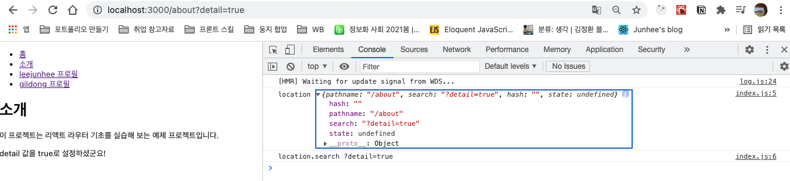

### 서브 라우트

<p>서브 라우트는 라우트 내부에 또 라우트를 정의하는 것을 의미합니다. 이 작업은 그렇게 복잡하지 않습니다. 그냥 라우트로 사용되고 있는 컴포넌트의 내부에 Route 컴포넌트를 또 사용하면 됩니다.</p>

### Switch

> <a href="https://github.com/junh0328/TIL/blob/master/React/exams/src/App.js">예제 코드 보기</a>

<p>Switch 컴포넌트는 여러 Route를 감싸서 그중 일치하는 단 하나의 라우트만을 렌더링시켜 줍니다. Switch를 사용하면 모든 규칙과 일치하지 않을 때 보여 줄 Not Found 페이지도 구현할 수 있습니다.</p>

### NavLink

> <a href="https://github.com/junh0328/TIL/blob/master/React/exams/src/pages/Profiles/index.js">예제 코드 보기</a>

<p>NavLink는 Link와 비슷합니다. 현재 경로와 Link에서 사용하는 경로가 일치하는 경우 특정 스타일 혹은 CSS 클래스를 적용할 수 있는 컴포넌트입니다.</p>

<p>NavLink에서 링크가 활성화되었을 때의 스타일을 적용할 때는 activeStyle 값을, CSS 클래스를 적용할 때는 activeClassName 값을 props로 넣어 주면 됩니다</p>

## Chapter 14 외부 API를 연동하여 뉴스 뷰어 만들기

### 비동기 작업의 이해

<p>웹 애플리케이션을 만들다 보면 처리할 때 시간이 걸리는 작업이 있습니다. 예를 들어 웹 애플리케이션에서 서버 쪽 데이터가 필요할 때는 Ajax 기법을 사용하여 서버의 API를 호출함으로써 데이터를 수신합니다. 이렇게 서버의 API를 사용해야 할 때는 네트워크 송수신 과정에서 시간이 걸리기 때문에 작업이 즉시 처리되는 것이 아니라, 응답을 받을 때까지 기다렸다가 전달받은 응답 데이터를 처리합니다. 이 과정에서 해당 작업을 비동기적으로 처리하게 됩니다.</p>

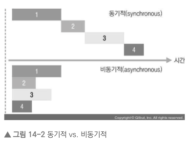

<p>만약 작업을 동기적으로 처리한다면 요청이 끝날 때까지 기다리는 동안 중지 상태가 되기 때문에 다른 작업을 할 수 없습니다. 그리고 요청이 끝나야 비로소 그다음 예정된 작업을 할 수 있죠. 하지만 이를 비동기적으로 처리한다면 웹 애플리케이션이 멈추지 않기 때문에 동시에 여러 가지 요청을 처리할 수도 있고, 기다리는 과정에서 다른 함수도 호출할 수 있습니다.</p>

<p>이렇게 서버 API를 호출할 때 외에도 작업을 비동기적으로 처리할 때가 있는데, 바로 setTimeout 함수를 사용하여 특정 작업을 예약할 때입니다. 예를 들어 다음 코드는 3초 후에 printMe 함수를 호출합니다.</p>

```js
function printMe() {
  console.log("Hello World!");
}
setTimeout(printMe, 3000);
console.log("대기 중...");

>>>
대기 중...
Hello World!
```

<p>자바스크립트에서 비동기 작업을 할 때 가장 흔히 사용하는 방법은 콜백 함수를 사용하는 것입니다. 위 코드에서는 printMe가 3초 뒤에 호출되도록 printMe 함수 자체를 setTimeout 함수의 인자로 전달해 주었는데, 이런 함수를 콜백 함수라고 부릅니다.</p>

> <a href="https://github.com/junh0328/upgrade_javascript/tree/master/BASIC#Chapter-11-%EB%B9%84%EB%8F%99%EA%B8%B0-%ED%94%84%EB%A1%9C%EA%B7%B8%EB%9E%98%EB%B0%8D">JS 콜백, 비동기 기능 자세히 보기</a>

> Promise

<p>Promise는 콜백 지옥 같은 코드가 형성되지 않게 하는 방안으로 ES6에 도입된 기능입니다. 앞에서 본 코드를 Promise를 사용하여 구현해 볼까요? 다음 예제를 확인해 봅시다.</p>

```js
📁 case 1 : 일반적인 promise 코드 사용
function increase(number) {
  const promise = new Promise((resolve, reject) => {
    // resolve는 성공, reject는 실패
    setTimeout(() => {
      const result = number + 10;
      if (result > 50) {
        const e = new Error("NumberTooBig");
        return reject(e);
      }
      resolve(result);
    }, 1000);
  });
  return promise;
}

increase(0).then((number) => {
  // Promise에서 resolve된 값은 .then을 통해 받아 올 수 있음
  console.log(number);
  return increase(number);
});
```

<p>여러 작업을 연달아 처리한다고 해서 함수를 여러 번 감싸는 것이 아니라 .then을 사용하여 그다음 작업을 설정하기 때문에 콜백 지옥이 형성되지 않습니다.</p>

> async/await

<p>async/await는 Promise를 더욱 쉽게 사용할 수 있도록 해 주는 ES2017(ES8) 문법입니다. 이 문법을 사용하려면 함수의 앞부분에 async 키워드를 추가하고, 해당 함수 내부에서 Promise의 앞부분에 await 키워드를 사용합니다. 이렇게 하면 Promise가 끝날 때까지 기다리고, 결과 값을 특정 변수에 담을 수 있습니다.</p>

```js
function increase(number) {
const promise = new Promise((resolve, reject) => {
  // resolve는 성공, reject는 실패
  setTimeout(() => {
    const result = number + 10;
    if (result > 50) { // 50보다 높으면 에러 발생시키기
      const e = new Error(‘NumberTooBig‘);
              return reject(e);
    }
          resolve(result); // number 값에 +10 후 성공 처리
  }, 1000)
});
return promise;
}

...

📁 case 1: 변수에 결과값 담기
async function runTasks() {
try { // try/catch 구문을 사용하여 에러를 처리합니다.
  let result = await increment(0);
  console.log(result);
}catch(error){
  console.error(error);
}


📁 case 2: 담긴 값을 바로 출력하기
async function runTasks() {
try { // try/catch 구문을 사용하여 에러를 처리합니다.
  let result = await increment(0)
  .then(()=> console.log(result));
}catch(error){
  console.error(error);
}
```

> 실제 코드로 흐름 이해하기

```js

📁 요청하는 (함수를 호출하는) 코드

 const onChangeValue = useCallback((e) => {
    setSearchValue(e.target.value);
    if (e.target.value !== '') {
      (async () => {
        await getSearchData(e.target.value).then((result) => {
          setFetchedData(result);
        });
      })();
    }
  }

  📁 요청받는 코드

  export function getSearchData(keyword) {
  try {
    return new Promise((resolve) => {
      ps.keywordSearch(keyword, (data, status) => {
        if (status === kakao.maps.services.Status.OK) {
          console.log('getSearchData 결과물 출력:', data);
          resolve(data);
        } else if (status === kakao.maps.services.Status.ERROR) {
          alert('검색 결과 중 오류가 발생했습니다.');
          return;
        }
      });
    });
  } catch (error) {
    console.error(error);
  }
}
```

> axios 요청 처리하기 (리턴편)

```js
case 1 함수의 실행 결과를 변수에 바인딩하고 변수를 리턴
export const getPostAPI = (id) => {
  let result = axios.get(`https://jsonplaceholder.typicode.com/posts/${id}`);
  return result;
};

case 2 함수 결과값 리턴하기
export const getPostAPI = (id) => {
  return axios.get(`https://jsonplaceholder.typicode.com/posts/${id}`);
};

case 3 화살표 함수의 중괄호 { ... }와 리턴문 생략
export const getPostAPI = (id) => axios.get(`https://jsonplaceholder.typicode.com/posts/${id}`);
```

### axios로 API 호출해서 데이터 받아 오기

> <a href="https://github.com/junh0328/TIL/blob/master/React/exams/src/pages/AxiosData/index.js">예제 코드 보기</a>

<p>onClick 함수에서는 axios.get 함수를 사용했습니다. 이 함수는 파라미터로 전달된 주소에 GET 요청을 해 줍니다. 그리고 이에 대한 결과는 .then을 통해 비동기적으로 확인할 수 있습니다.</p>

### newsapi API 키 발급받기

<p>사용할 API 주소는 두 가지 형태입니다.</p>

```js
전체 뉴스 불러오기 - GET https://newsapi.org/v2/top-headlines?country=kr&apiKey=0a8c4202385d4ec1bb93b7e277b3c51f

특정 카테고리 뉴스 불러오기 - GET https://newsapi.org/v2/top-headlines?country=kr&category=business&apiKey=0a8c4202385d4ec1bb93b7e277b3c51f
```

### 뉴스 뷰어 UI 만들기

> <a href="https://github.com/junh0328/react-newsviewer">완성된 코드 보기</a>

### 데이터 연동하기

<p>useEffect를 사용하여 컴포넌트가 처음 렌더링되는 시점에 API를 요청하면 됩니다. 여기서 주의할 점은 useEffect에 등록하는 함수에 async를 붙이면 안 된다는 것입니다. useEffect에서 반환해야 하는 값은 뒷정리 함수이기 때문입니다. 따라서 useEffect 내부에서 async/await를 사용하고 싶다면, 함수 내부에 async 키워드가 붙은 또 다른 함수를 만들어서 사용해 주어야 합니다. 코드를 보면 훨씬 이해하기 편할 것입니다.</p>

<p>추가로 loading이라는 상태도 관리하여 API 요청이 대기 중인지 판별할 것입니다. 요청이 대기 중일 때는 loading 값이 true가 되고, 요청이 끝나면 loading 값이 false가 되어야 합니다.</p>

```js
const NewsList = () => {
  const [articles, setArticles] = useState(null);
  const [loading, setLoading] = useState(false);

  useEffect(() => {
    // async를 사용하는 함수 따로 선언, 위 문단의 주장에 대한 설명
    fetchData();
  }, []);

   const fetchData = async () => {
      setLoading(true);
      try {
        const response = await axios.get(
          ‘https://newsapi.org/v2/top-headlines?country=kr&apiKey=0a8c4202385d4ec1bb93b7e277b3c51f‘,
        );
        setArticles(response.data.articles);
      } catch (e) {
        console.log(e);
      }
      setLoading(false);
    };
  // 대기 중일 때
  if (loading) {
    return <NewsListBlock>대기 중…</NewsListBlock>;
  }
  // 아직 articles 값이 설정되지 않았을 때
  if (!articles) {
    return null;
  }

  // articles 값이 유효할 때
  return (
    <NewsListBlock>
      {articles.map(article => (
        <NewsItem key={article.url} article={article} />
      ))}
    </NewsListBlock>
  );
};
```

<p>현재도 워낙 반복적으로 작업하고 있는 부분이고, 특별히 정리할 부분이 없어 해당 레포지토리 링크를 남겨 두었습니다.</p>

> <a href="https://github.com/junh0328/movie_app_2020-2021">다른 예제 코드 보기: movie_app_2020-2021</a>

## Chapter 16 리덕스 라이브러리 이해하기

<p>리덕스는 가장 많이 사용하는 리액트 상태 관리 라이브러리입니다. 리덕스를 사용하면 컴포넌트의 상태 업데이트 관련 로직을 다른 파일로 분리시켜서 더욱 효율적으로 관리할 수 있습니다. 또한, 컴포넌트끼리 똑같은 상태를 공유해야 할 때도 여러 컴포넌트를 거치지 않고 손쉽게 상태 값을 전달하거나 업데이트할 수 있습니다. 단순히 전역 상태 관리만 한다면 Context API를 사용하는 것만으로도 충분하지만, 리덕스를 사용하면 상태를 더욱 체계적으로 관리할 수 있기 때문에 프로젝트의 규모가 클 경우에는 리덕스를 사용하는 편이 좋습니다. 코드의 유지 보수성도 높여 주고 작업 효율도 극대화해 주기 때문입니다. 추가로 아주 편리한 개발자 도구도 지원하며, <b>미들웨어</b>라는 기능을 제공하여 비동기 작업을 훨씬 효율적으로 관리할 수 있게 해 주기도 합니다.</p>

### 개념 미리 정리하기

> 1.액션

<p>상태에 어떠한 변화가 필요하면 액션(action)이란 것이 발생합니다. 이는 하나의 객체로 표현되는데요. 액션 객체는 다음과 같은 형식으로 이루어져 있습니다. 액션 객체는 type 필드를 반드시 가지고 있어야 합니다. 이 값을 액션의 이름이라고 생각하면 됩니다. 그리고 그 외의 값들은 나중에 상태 업데이트를 할 때 참고해야 할 값이며, <b>작성자 마음대로 넣을 수 있습니다.</b></p>

```js
{
  type: ‘ADD_TODO‘,
  data: {
    id: 1,
    text: ‘리덕스 배우기‘
}
...

{
  type: ‘CHANGE_INPUT‘,
  text: ‘안녕하세요‘
}
```

> 2.액션 생성 함수

<p>액션 생성 함수(action creator)는 액션 객체를 만들어 주는 함수입니다. 어떤 변화를 일으켜야 할 때마다 액션 객체를 만들어야 하는데 매번 액션 객체를 직접 작성하기 번거로울 수 있고, 만드는 과정에서 실수로 정보를 놓칠 수도 있습니다. 이러한 일을 방지하기 위해 이를 함수로 만들어서 관리합니다.</p>

```js
function addTodo(data) {
  return {
    type: "ADD_TODO",
    data,
  };
}

// 화살표 함수로도 만들 수 있습니다.
const changeInput = (text) => ({
  // 소괄호로 중괄호를 감싸는 형태, return 없이 작성 가능
  type: "CHANGE_INPUT",
  text,
});

const changeInput = (text) => {
  return {
    type: "CHANGE_INPUT",
    text,
  };
};
```

> 3.리듀서

<p>리듀서(reducer)는 변화를 일으키는 함수입니다. 액션을 만들어서 발생시키면 리듀서가 현재 상태와 전달받은 액션 객체를 파라미터로 받아 옵니다. 그리고 두 값을 참고하여 새로운 상태를 만들어서 반환해 줍니다.</p>

```js
const initialState = {
  counter: 1,
};

function reducer(state = initialState, action) {
  switch (action.type) {
    case INCREMENT:
      return {
        counter: state.counter + 1,
      };
    default:
      return state;
  }
}
```

> 4.스토어

<p>프로젝트에 리덕스를 적용하기 위해 스토어(store)를 만듭니다. 한 개의 프로젝트는 단 하나의 스토어만 가질 수 있습니다. 스토어 안에는 현재 애플리케이션 상태와 리듀서가 들어가 있으며, 그 외에도 몇 가지 중요한 내장 함수를 지닙니다.</p>

> 5.디스패치

<p>디스패치(dispatch)는 스토어의 내장 함수 중 하나입니다. 디스패치는 ‘액션을 발생시키는 것’이라고 이해하면 됩니다. 이 함수는 dispatch(action)과 같은 형태로 액션 객체를 파라미터로 넣어서 호출합니다. 이 함수가 호출되면 스토어는 리듀서 함수를 실행시켜서 새로운 상태를 만들어 줍니다.</p>

> 6.구독

<p>구독(subscribe)도 스토어의 내장 함수 중 하나입니다. subscribe 함수 안에 리스너 함수를 파라미터로 넣어서 호출해 주면, 이 리스너 함수가 액션이 디스패치되어 상태가 업데이트될 때마다 호출됩니다.</p>

```js
const listener = () => {
console.log(‘상태가 업데이트됨‘);
}
const unsubscribe = store.subscribe(listener);

unsubscribe(); // 추후 구독을 비활성화할 때 함수를 호출
```

### 리액트 없이 쓰는 리덕스

<p>리덕스는 리액트에 종속되는 라이브러리가 아닙니다. 리액트에서 사용하려고 만들어졌지만 실제로 다른 UI 라이브러리/프레임워크와 함께 사용할 수도 있습니다. 리덕스는 바닐라(vanila) 자바스크립트와 함께 사용할 수도 있습니다. 바닐라 자바스크립트는 라이브러리나 프레임워크 없이 사용하는 순수 자바스크립트 그 자체를 의미합니다.</p>

> <a href="https://github.com/junh0328/redux">예제 코드 보기</a>

### 리덕스의 세 가지 규칙

> 1.단일 스토어

<p>하나의 애플리케이션 안에는 하나의 스토어가 들어 있습니다. 사실 여러 개의 스토어를 사용하는 것이 완전히 불가능하지는 않습니다. 특정 업데이트가 너무 빈번하게 일어나거나 애플리케이션의 특정 부분을 완전히 분리시킬 때 여러 개의 스토어를 만들 수도 있지만, 상태 관리가 복잡해질 수 있으므로 권장하지 않습니다.</p>

> 2.읽기 전용 상태

<p>리덕스 상태는 읽기 전용입니다. 기존에 리액트에서 setState를 사용하여 state를 업데이트할 때도 객체나 배열을 업데이트하는 과정에서 불변성을 지켜주기 위해 spread 연산자를 사용하거나 immer와 같은 불변성 라이브러리를 사용했습니다. 리덕스도 마찬가지로 상태를 업데이트할 때는 기존의 객체를 건드리지 않고 새로운 객체를 생성해 주어야 합니다.</p>

<p>리덕스에서 불변성을 유지해야 하는 이유는 내부적으로 데이터가 변경되는 것을 감지하기 위해 얕은 비교(shallow equality) 검사를 하기 때문입니다. 객체의 변화를 감지할 때 객체의 깊숙한 안쪽까지 비교하는 것이 아니라 겉핥기 식으로 비교하여 좋은 성능을 유지할 수 있는 것입니다.</p>

> 3.리듀서는 순수한 함수

<p>변화를 일으키는 리듀서 함수는 순수한 함수여야 합니다. 순수한 함수는 다음 조건을 만족합니다.</p>

1. 리듀서 함수는 이전 상태와 액션 객체를 파라미터로 받습니다.
2. 파라미터 외의 값에는 의존하면 안 됩니다.
3. 이전 상태는 절대로 건드리지 않고, 변화를 준 새로운 상태 객체를 만들어서 변환합니다.
4. 똑같은 파라미터로 호출된 리듀서 함수는 언제나 똑같은 결과 값을 반환해야 합니다.

<p>리듀서를 작성할 때는 위 네 가지 사항을 주의해 주세요. 예를 들어 리듀서 함수 내부에서 랜덤 값을 만들거나, Date 함수를 사용하여 현재 시간을 가져오거나, 네트워크 요청을 한다면, 파라미터가 같아도 다른 결과를 만들어 낼 수 있기 때문에 사용하면 안 됩니다. 이러한 작업은 리듀서 함수 바깥에서 처리해 주어야 합니다. 액션을 만드는 과정에서 처리해도 되고, 추후 배울 리덕스 미들웨어에서 처리해도 됩니다. 주로 네트워크 요청과 같은 비동기 작업은 미들웨어를 통해 관리합니다.</p>

> dispatch를 통해 액션을 받더라도 reducer 내부에서 네트워크 요청을 전달하지 말고 미들웨어를 통해 네트워크 요청을 관리할 것

## Chapter 17 리덕스를 사용한 리액트 상태 관리 애플리케이션

<p>소규모 프로젝트에서는 컴포넌트가 가진 state를 사용하는 것만으로도 충분하지만, 프로젝트의 규모가 커짐에 따라 상태 관리가 번거로워질 수 있습니다. 리액트에서 리덕스 라이브러리를 사용하면, 상태 업데이트에 관한 로직을 모듈로 따로 분리하여 컴포넌트 파일과 별개로 관리할 수 있으므로 코드를 유지 보수하는 데 도움이 됩니다. 또한, 여러 컴포넌트에서 동일한 상태를 공유해야 할 때 매우 유용하며, 실제 업데이트가 필요한 컴포넌트만 리렌더링되도록 쉽게 최적화해 줄 수도 있습니다.</p>

<p>앞에서 바닐라 자바스크립트 환경에서 리덕스를 사용할 때 스토어의 내장 함수인 store.dispatch와 store.subscribe 함수를 사용했지요? 리액트 애플리케이션에서 리덕스를 사용할 때는 store 인스턴스를 직접 사용하기보다는 주로 react-redux라는 라이브러리에서 제공하는 유틸 함수(connect)와 컴포넌트(Provider)를 사용하여 리덕스 관련 작업을 처리합니다.</p>

<p>리액트 프로젝트에서 리덕스를 사용할 때 가장 많이 사용하는 패턴은 프레젠테이셔널 컴포넌트와 컨테이너 컴포넌트를 분리하는 것입니다. 여기서 프레젠테이셔널 컴포넌트란 주로 상태 관리가 이루어지지 않고, 그저 props를 받아 와서 화면에 UI를 보여 주기만 하는 컴포넌트를 말합니다. 이와 달리 컨테이너 컴포넌트는 리덕스와 연동되어 있는 컴포넌트로, 리덕스로부터 상태를 받아 오기도 하고 리덕스 스토어에 액션을 디스패치하기도 합니다.</p>

<p>이러한 패턴은 리덕스를 사용하는 데 필수 사항은 아닙니다. 다만 이 패턴을 사용하면 코드의 재사용성도 높아지고, 관심사의 분리가 이루어져 UI를 작성할 때 좀 더 집중할 수 있습니다.</p>

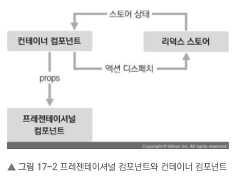

<p>이 장의 프로젝트에서는 이 패턴을 사용하여 코드를 작성해 보겠습니다. UI에 관련된 프레젠테이셔널 컴포넌트는 src/components 경로에 저장하고, 리덕스와 연동된 컨테이너 컴포넌트는 src/containers 컴포넌트에 작성합니다.</p>

> <a href="https://github.com/junh0328/react-redux-tutorial/commits/master">예제 코드 보기</a>

<p>리덕스를 사용할 때는 액션 타입, 액션 생성 함수, 리듀서 코드를 작성해야 하는데요. 이 코드들을 각각 다른 파일에 작성하는 방법도 있고, 기능별로 묶어서 파일 하나에 작성하는 방법도 있습니다.</p>

> 공식 패턴

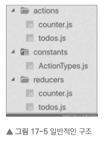

<p>그림 17-5는 가장 일반적인 구조로 actions, constants, reducers라는 세 개의 디렉터리를 만들고 그 안에 기능별로 파일을 하나씩 만드는 방식입니다. 코드를 종류에 따라 다른 파일에 작성하여 정리할 수 있어서 편리하지만, 새로운 액션을 만들 때마다 세 종류의 파일을 모두 수정해야 하기 때문에 불편하기도 합니다. 이 방식은 리덕스 공식 문서에서도 사용되므로 가장 기본적이라 할 수 있지만, 사람에 따라서는 불편할 수도 있는 구조입니다.</p>

> Ducks 패턴

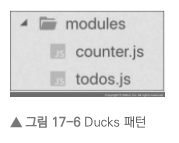

<p>그림 17-6은 액션 타입, 액션 생성 함수, 리듀서 함수를 기능별로 파일 하나에 몰아서 다 작성하는 방식입니다. 이러한 방식을 Ducks 패턴이라고 부르며, 앞서 설명한 일반적인 구조로 리덕스를 사용하다가 불편함을 느낀 개발자들이 자주 사용합니다.</p>

<p>리덕스 관련 코드에 대한 디렉터리 구조는 정해진 방법이 없기 때문에 마음대로 작성해도 되지만, 위 두 가지 방법이 주로 사용됩니다. 이 책에서는 두 번째로 소개한 방식인 Ducks 패턴을 사용하여 코드를 작성하겠습니다.</p>

### 단계로 알아보기

> 리듀서 구성

- UI를 구성한다
- 액션 타입을 정의한다
- 액션 생성 함수를 만든다
- 초기 상태를 포함한 리듀서 함수를 만든다
- 다양한 리듀서가 있다면, 루트 리듀서를 만들어 하나로 합쳐준다

> 리덕스 적용

- 스토어를 만든다
- Provider 컴포넌트를 사용하여 프로젝트에 리덕스를 적용한다
- 리덕스의 useSelector(), useDispatch() 함수를 사용하여 상태 및 액션을 관리한다

### connect 함수와 useSelector()의 주요 차이점

<p>앞으로 컨테이너 컴포넌트를 만들 때 connect 함수를 사용해도 좋고, useSelector와 useDispatch를 사용해도 좋습니다. 리덕스 관련 Hook이 있다고 해서 기존 connect 함수가 사라지는 것은 아니므로, 더 편한 것을 사용하면 됩니다.</p>

<p>하지만 Hooks를 사용하여 컨테이너 컴포넌트를 만들 때 잘 알아 두어야 할 차이점이 있습니다. connect 함수를 사용하여 컨테이너 컴포넌트를 만들었을 경우, 해당 컨테이너 컴포넌트의 부모 컴포넌트가 리렌더링될 때 해당 컨테이너 컴포넌트의 props가 바뀌지 않았다면 리렌더링이 자동으로 방지되어 성능이 최적화됩니다.</p>

<p>반면 useSelector를 사용하여 리덕스 상태를 조회했을 때는 이 최적화 작업이 자동으로 이루어지지 않으므로, 성능 최적화를 위해서는 React.memo를 컨테이너 컴포넌트에 사용해 주어야 합니다. 다음과 같이 말이죠.</p>

```js
import React from 'react';
import { useSelector } from 'react-redux';
import { changeInput, insert, toggle, remove } from '../modules/todos';
import Todos from '../components/Todos';
import useActions from '../lib/useActions';

const TodosContainer = () => {
  (...)
};

export default React.memo(TodosContainer);    // 컨테이너 컴포넌트를 React.memo를 사용하여 관리해줘야 한다.
```

## Chapter 18 리덕스 미들웨어를 통한 비동기 작업 관리

<p>리액트 웹 애플리케이션에서 API 서버를 연동할 때는 API 요청에 대한 상태도 잘 관리해야 합니다. 예를 들어 요청이 시작되었을 때는 로딩 중임을, 요청이 성공하거나 실패했을 때는 로딩이 끝났음을 명시해야 합니다. 요청이 성공하면 서버에서 받아 온 응답에 대한 상태를 관리하고, 요청이 실패하면 서버에서 반환한 에러에 대한 상태를 관리해야 합니다.</p>

<p>리액트 프로젝트에서 리덕스를 사용하고 있으며 이러한 비동기 작업을 관리해야 한다면, ‘미들웨어(middleware)’를 사용하여 매우 효율적이고 편하게 상태 관리를 할 수 있습니다.</p>

### 작업 환경 준비

> <a href="https://github.com/junh0328/TIL/tree/master/React/redux-middleware/src">예제 코드 보기</a>

### 미들웨어란?

<p>리덕스 미들웨어는 액션을 디스패치했을 때 리듀서에서 이를 처리하기에 앞서 사전에 지정된 작업들을 실행합니다. 미들웨어는 액션과 리듀서 사이의 중간자라고 볼 수 있습니다.</p>

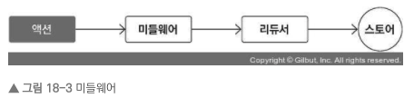

<p>리듀서가 액션을 처리하기 전에 미들웨어가 할 수 있는 작업은 여러 가지가 있습니다. 전달받은 액션을 단순히 콘솔에 기록하거나, 전달받은 액션 정보를 기반으로 액션을 아예 취소하거나, 다른 종류의 액션을 추가로 디스패치할 수도 있습니다.</p>

### 비동기 작업을 처리하는 미들웨어 사용

<p>미들웨어가 어떤 방식으로 작동하는지 이해했나요? 이제 오픈 소스 커뮤니티에 공개된 미들웨어를 사용하여 리덕스를 사용하고 있는 프로젝트에서 비동기 작업을 더욱 효율적으로 관리해 보겠습니다.</p>

<p>비동기 작업을 처리할 때 도움을 주는 미들웨어는 정말 다양합니다. 이 책에서 다룰 미들웨어는 다음과 같습니다.</p>

- redux-thunk: 비동기 작업을 처리할 때 가장 많이 사용하는 미들웨어입니다. 객체가 아닌 함수 형태의 액션을 디스패치할 수 있게 해 줍니다.
- redux-saga: redux-thunk 다음으로 가장 많이 사용되는 비동기 작업 관련 미들웨어 라이브러리입니다. 특정 액션이 디스패치되었을 때 정해진 로직에 따라 다른 액션을 디스패치시키는 규칙을 작성하여 비동기 작업을 처리할 수 있게 해 줍니다.

> 트렌드로 동향 알아보기 (21년 06월 기준)

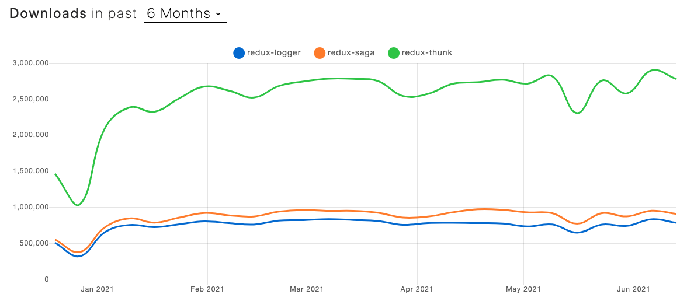

### redux-thunk

> <a href="https://github.com/reduxjs/redux-thunk">공식 깃헙 바로가기</a>

> Thunk 란?

<p>Thunk는 특정 작업을 나중에 할 수 있도록 미루기 위해 함수 형태로 감싼 것을 의미합니다. 예를 들어 주어진 파라미터에 1을 더하는 함수를 만들고 싶다면 다음과 같이 작성할 것입니다.</p>

```js
const addOne = (x) => x + 1;
addOne(1); // 2
```

<p>이 코드를 실행하면 addOne을 호출했을 때 바로 1 + 1이 연산됩니다. 그런데 이 연산 작업을 나중에 하도록 미루고 싶다면 어떻게 해야 할까요?</p>

```js
case 1 : 함수 선언식 Thunk 사용
const addOne = (x) => x + 1;
function addOneThunk(x) {
  const thunk = () => addOne(x);
  return thunk;
}

case 2 : 화살표 함수로 Thunk 사용
const addOne = x => x + 1;
const addOneThunk = x => () => addOne(x);

...
const fn = addOneThunk(1);
setTimeout(() => {
  const value = fn(); // fn이 실행되는 시점에 연산
  console.log(value);
}, 1000);
```

<p>이렇게 하면 특정 작업을 나중에 하도록 미룰 수 있습니다. redux-thunk 라이브러리를 사용하면 thunk 함수를 만들어서 디스패치할 수 있습니다. 그러면 리덕스 미들웨어가 그 함수를 전달받아 store의 dispatch와 getState를 파라미터로 넣어서 호출해 줍니다.</p>

> 다음은 redux-thunk에서 사용할 수 있는 예시 thunk 함수입니다.

```js
const sampleThunk = () => (dispatch, getState) => {
  // 현재 상태를 참조할 수 있고,
  // 새 액션을 디스패치할 수도 있습니다.
};
```

> Thunk 생성 함수 만들기

<p>전에는 redux-actions 모듈에서 사용하는 createAction 함수를 통해서 프레젠테이셔널 컴포넌트에서 보내지는 요청이 바로 리듀서를 업데이트 하는 과정이였습니다. Thunk를 사용하면서 increaseAsync, decreaseAsync 함수를 새로 작성하여 일정 기간이 흐른 뒤에 작업을 할 수 있도록 구현해 보았습니다. </p>

```js
import { createAction, handleActions } from "redux-actions";

const INCREASE = "counter/INCREASE";
const DECREASE = "counter/DECREASE";

export const increase = createAction(INCREASE);
export const decrease = createAction(DECREASE);

// 1초 뒤에 increase 혹은 decrease 함수를 디스패치함
export const increaseAsync = () => (dispatch) => {
  console.log("increase Async!");
  setTimeout(() => {
    dispatch(increase());
  }, 1000);
};

export const decreaseAsync = () => (dispatch) => {
  console.log("decrease Async!");
  setTimeout(() => {
    dispatch(decrease());
  }, 1000);
};
```

> 리팩토링

<p>API를 요청해야 할 때마다 17줄 정도 되는 thunk 함수를 작성하는 것과 로딩 상태를 리듀서에서 관리하는 작업은 귀찮을 뿐 아니라 코드도 길어지게 만듭니다. 그러므로 반복되는 로직을 따로 분리하여 코드의 양을 줄여 봅시다.</p>

```js
📁lib/createRequestThunk

export default function createRequestThunk(type, request) {
  // 성공 및 실패 액션 타입을 정의합니다.
  const SUCCESS = `${type}_SUCCESS`;
  const FAILURE = `${type}_FAILURE`;
  return (params) => async (dispatch) => {
    dispatch({ type }); // 시작됨
    try {
      const response = await request(params);
      dispatch({
        type: SUCCESS,
        payload: response.data,
      }); // 성공
    } catch (e) {
      dispatch({
        type: FAILURE,
        payload: e,
        error: true,
      }); // 에러 발생
      throw e;
    }
  };
}

// 사용법: createRequestThunk(‘GET_USERS‘,api.getUsers);
```

### redux-saga

### 정리

## Chapter 19 코드 스플리팅

## Chapter 20 서버 사이드 렌더링
