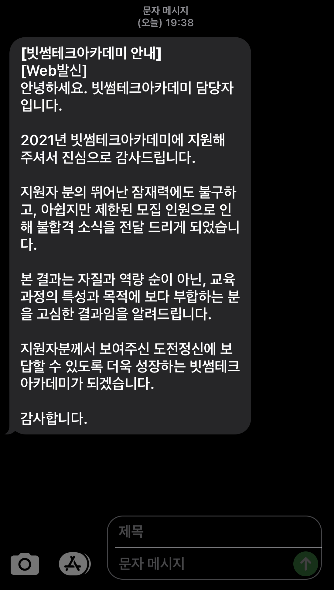
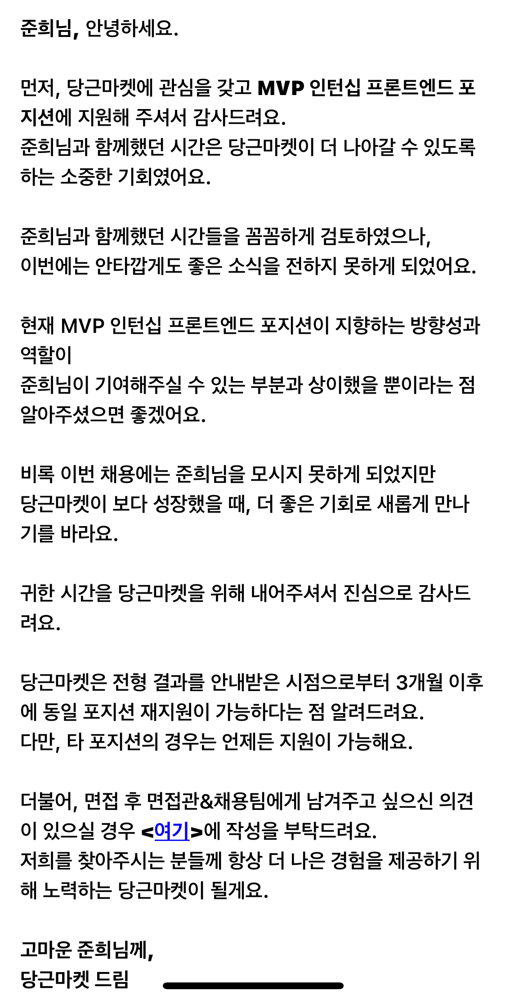

# 🕰 TIL : Today I Learned

> 기억 속에서 자리 잡지 못한 개념들을 정리합니다  
> 또한 레포지토리, 노션에 정리한 개념들을 통합적으로 관리합니다

## 월별 계획표

> 월별 목표 및 프로젝트의 진행 사항에 대해서 미리 정리합니다  
> 미리 계획을 세워 번아웃을 방지하고, 목표를 이룰 수 있도록 노력합니다

### 6월 목표 및 계획

목차 보기

React

- [x] 타입스크립트 리덕스 사가 적용 로직 정리
- [x] 리액트 개념 TIL에 정리

Netflix clone project

- [x] netflix 클론 프로젝트 부족한 부분 정리하기
- [x] netflix 클론 프로젝트 타입스크립트 환경에서 리덕스 사가 적용하기
- [x] netflix 클론 프로젝트 배포하기 (netflify)

colamap project

- [x] colamap 프로젝트 커스텀 오버레이 구현 (더미 데이터를 통해 배열 형식으로 받아온 배열을 렌더링하기) > 마커 이미지로 표현
- [x] colamap 프로젝트 백엔드 서버와 연결
- [x] colamap 프로젝트 가게별 세부 페이지 구현

### 7월 목표 및 계획

목차 보기

### JavaScript

- [x] 모던 자바스크립트 Deep Dive 1회독 및 정리(개강 전 까지) [진행중]

### Algorithm

~~바닐라 JS를 사용하여 알고리즘 공부 시작 (개강 전 까지 1회독)~~

<b>자바스크립트 개념 및 프로젝트 배포를 위해 잠시 중단</b>

### colamap project

~~팀원간 피드백 및 1차 배포 (7월까지)~~

<b>작업 중이나 8월 중순까지 되어야 끝날 것 같음</b>

### 8월 목표 및 계획

목차 보기

### JavaScript

- [x] 모던 자바스크립트 Deep Dive 1회독 및 정리

### colamap project

- [x] 콜라맵 프로젝트 작업 마무리 및 배포 [배포는 하지 않게됨..]

### 빗썸 테크아카데미

~~지원 결과 08.09일 발표로 후에 계획 변동 예정~~

결과 보기

### 🔥합격

 

빠르게 자바스크립트 1회독을 9월 중순까지 마치고 알고리즘을 병행하여 취업 준비를 하는 방향으로 설정 🥲 

### 9월 목표 및 계획

목차 보기

### JavaScript

- [x] 모던 자바스크립트 Deep Dive 1회독 및 정리 (9월 둘째주 마무리)
- [x] velog 정리 추가

### Algorithm

- [ ] 기존 알고리즘 강의 복습 및 재시작!

### wellseecoding

- [ ] 새로운 프로젝트 팀 작업 중 10월 배포 예상 (마크업 단계에서 vercel로 선 배포 완료)

### 당근마켓 MVP 인턴십

결과보기

### 🔥합격

 

내 나름대로는 질문에 답을 잘했다고 생각했지만, 멘토님의 질문에 대한 나의 대답에 경험적인 부분과 기술적인 부분이 모두 부족한 것으로 보인다.

더 많은 경험을 하는 것도 좋지만, 취준인 만큼 기존의 지식들도 잊지 않고 복습하는 방향으로 결정

자바스크립트 deep dive 1회독을 완료했으므로, 이를 바탕으로 velog 정리 및 알고리즘 공부 시작!

velog에 deep dive에 대한 정리와 알고리즘 강의 1회독이 완료되는 대로 복습 및 본격 취준 start 🔥

## React (+ typescript)

### Webpack

[웹팩](https://github.com/junh0328/CAPATIN_WEBPACK)

### React 개념

목차 보기

- <a href="https://github.com/junh0328/TIL/tree/master/React#Chapter-1-%EB%A6%AC%EC%95%A1%ED%8A%B8-%EC%8B%9C%EC%9E%91">Chapter 1, 리액트 시작</a>
- <a href="https://github.com/junh0328/TIL/tree/master/React#Chapter-2-JSX">Chapter 2, JSX</a>
- <a href="https://github.com/junh0328/TIL/tree/master/React#Chapter-3-%EC%BB%B4%ED%8F%AC%EB%84%8C%ED%8A%B8">Chapter 3, 컴포넌트</a>
- <a href="https://github.com/junh0328/TIL/tree/master/React#Chapter4-Event-Handling">Chapter 4, Event Handling</a>
- <a href="https://github.com/junh0328/TIL/blob/master/React/readme.md#Chapter-5-ref-DOM%EC%97%90-%EC%9D%B4%EB%A6%84-%EB%8B%AC%EA%B8%B0">Chapter 5, ref DOM에 이름 달기</a>
- <a href="https://github.com/junh0328/TIL/blob/master/React/readme.md#Chapter-6-%EC%BB%B4%ED%8F%AC%EB%84%8C%ED%8A%B8-%EB%B0%98%EB%B3%B5">Chapter 6, 컴포넌트 반복</a>
- <a href="https://github.com/junh0328/TIL/blob/master/React/readme.md#Chapter-7-%EC%BB%B4%ED%8F%AC%EB%84%8C%ED%8A%B8%EC%9D%98-%EB%9D%BC%EC%9D%B4%ED%94%84%EC%82%AC%EC%9D%B4%ED%81%B4-%EB%A9%94%EC%84%9C%EB%93%9C">Chapter 7, 컴포넌트의 라이프사이클 메서드</a>
- <a href="https://github.com/junh0328/TIL/tree/master/React#Chapter-8-Hooks">Chapter 8, Hooks</a>
- <a href="https://github.com/junh0328/TIL/tree/master/React#Chapter-9-%EC%BB%B4%ED%8F%AC%EB%84%8C%ED%8A%B8-%EC%8A%A4%ED%83%80%EC%9D%BC%EB%A7%81">Chapter 9, 컴포넌트 스타일링</a>
- <a href="https://github.com/junh0328/TIL/tree/master/React#Chapter-13-%EB%A6%AC%EC%95%A1%ED%8A%B8-%EB%9D%BC%EC%9A%B0%ED%84%B0%EB%A1%9C-SPA-%EA%B0%9C%EB%B0%9C%ED%95%98%EA%B8%B0">Chapter 13, 리액트 라우터로 SPA 개발하기</a>
- <a href="https://github.com/junh0328/TIL/tree/master/React#Chapter-14-%EC%99%B8%EB%B6%80-API%EB%A5%BC-%EC%97%B0%EB%8F%99%ED%95%98%EC%97%AC-%EB%89%B4%EC%8A%A4-%EB%B7%B0%EC%96%B4-%EB%A7%8C%EB%93%A4%EA%B8%B0">Chapter 14, 외부 API를 연동하여 뉴스 뷰어 만들기</a>
- <a href="https://github.com/junh0328/TIL/tree/master/React#Chapter-16-%EB%A6%AC%EB%8D%95%EC%8A%A4-%EB%9D%BC%EC%9D%B4%EB%B8%8C%EB%9F%AC%EB%A6%AC-%EC%9D%B4%ED%95%B4%ED%95%98%EA%B8%B0">Chapter 16, 리덕스 라이브러리 이해하기</a>
- <a href="https://github.com/junh0328/TIL/tree/master/React#Chapter-17-%EB%A6%AC%EB%8D%95%EC%8A%A4%EB%A5%BC-%EC%82%AC%EC%9A%A9%ED%95%9C-%EB%A6%AC%EC%95%A1%ED%8A%B8-%EC%83%81%ED%83%9C-%EA%B4%80%EB%A6%AC-%EC%95%A0%ED%94%8C%EB%A6%AC%EC%BC%80%EC%9D%B4%EC%85%98">Chapter 17, 리덕스를 사용한 리액트 상태 관리 애플리케이션</a>
- <a href="https://github.com/junh0328/TIL/tree/master/React#Chapter-18-%EB%A6%AC%EB%8D%95%EC%8A%A4-%EB%AF%B8%EB%93%A4%EC%9B%A8%EC%96%B4%EB%A5%BC-%ED%86%B5%ED%95%9C-%EB%B9%84%EB%8F%99%EA%B8%B0-%EC%9E%91%EC%97%85-%EA%B4%80%EB%A6%AC">Chapter 18, 리덕스 미들웨어를 통한 비동기 작업 관리</a>
- <a href="https://github.com/junh0328/TIL/tree/master/React#Chapter-19-%EC%BD%94%EB%93%9C-%EC%8A%A4%ED%94%8C%EB%A6%AC%ED%8C%85">Chapter 19, 코드 스플리팅</a>
- <a href="https://github.com/junh0328/TIL/tree/master/React#Chapter-20-%EC%84%9C%EB%B2%84-%EC%82%AC%EC%9D%B4%EB%93%9C-%EB%A0%8C%EB%8D%94%EB%A7%81">Chpater 20, 서버 사이드 렌더링</a>

### React에 타입스크립트 적용하기

목차보기

- <a href="https://github.com/junh0328/learning_typescript/blob/master/ReactByTS/readme.md#-todolist">todolist에 타입스크립트 환경 적용하기</a>
- <a href="https://github.com/junh0328/learning_typescript/blob/master/ReactByTS/readme.md#-todo-redux">todolist에 타입스크립트 리덕스 적용하기</a>
- <a href="https://github.com/junh0328/learning_typescript/blob/master/ReactByTS/readme.md#-redux-thunk">타입스크립트 환경에서 thunk 미들웨어 사용하기</a>
- <a href="https://github.com/junh0328/learning_typescript/blob/master/ReactByTS/readme.md#-redux-saga">리덕스-사가 보일러플레이트 만들어보기</a>
- <a href="https://github.com/junh0328/learning_typescript/blob/master/ReactByTS/readme.md#-social-login">소셜 로그인 구현하기</a>

## JavaScript

Eloquent Javascript

- <a href="https://github.com/junh0328/upgrade_javascript/tree/master/BASIC#Chapter-1-%EC%9E%90%EB%B0%94%EC%8A%A4%ED%81%AC%EB%A6%BD%ED%8A%B8%EB%9E%80">Chapter 1, 자바스크립트란</a>
- <a href="https://github.com/junh0328/upgrade_javascript/tree/master/BASIC#Chapter-2-%ED%94%84%EB%A1%9C%EA%B7%B8%EB%9E%A8-%EA%B5%AC%EC%A1%B0">Chapter 2, 프로그램 구조</a>
- <a href="https://github.com/junh0328/upgrade_javascript/tree/master/BASIC#Chapter-3-%ED%95%A8%EC%88%98">Chapter 3, 함수</a>
- <a href="https://github.com/junh0328/upgrade_javascript/tree/master/BASIC#Chapter-4-%EA%B0%9D%EC%B2%B4%EC%99%80-%EB%B0%B0%EC%97%B4-%EC%9E%90%EB%A3%8C-%EA%B5%AC%EC%A1%B0">Chapter 4, 객체와 배열 자료 구조</a>
- <a href="https://github.com/junh0328/upgrade_javascript/tree/master/BASIC#Chapter-6-%EA%B0%9D%EC%B2%B4%EC%9D%98-%EC%9D%B4%EC%A4%91-%EC%83%9D%ED%99%9C">Chapter 6, 객체의 이중 생활</a>
- <a href="https://github.com/junh0328/upgrade_javascript/tree/master/BASIC#Chapter-8-%EB%B2%84%EA%B7%B8%EC%99%80-%EC%98%A4%EB%A5%98">Chapter 8, 버그와 오류</a>
- <a href="https://github.com/junh0328/upgrade_javascript/tree/master/BASIC#Chapter-10-%EB%AA%A8%EB%93%88">Chapter 10, 모듈</a>
- <a href="https://github.com/junh0328/upgrade_javascript/tree/master/BASIC#Chapter-11-%EB%B9%84%EB%8F%99%EA%B8%B0-%ED%94%84%EB%A1%9C%EA%B7%B8%EB%9E%98%EB%B0%8D">Chapter 11, 비동기 프로그래밍</a>
- <a href="https://github.com/junh0328/upgrade_javascript/tree/master/BASIC#Chapter-13-%EC%9E%90%EB%B0%94%EC%8A%A4%ED%81%AC%EB%A6%BD%ED%8A%B8%EC%99%80-%EB%B8%8C%EB%9D%BC%EC%9A%B0%EC%A0%80">Chapter 13, 자바스크립트와 브라우저</a>

모던 자바스크립트 DEEP DIVE

- <a href="https://github.com/junh0328/upgrade_javascript/tree/master/DEEPDIVE#1%EC%9E%A5-%ED%94%84%EB%A1%9C%EA%B7%B8%EB%9E%98%EB%B0%8D">프로그래밍</a>
- <a href="https://github.com/junh0328/upgrade_javascript/tree/master/DEEPDIVE#2%EC%9E%A5-%EC%9E%90%EB%B0%94%EC%8A%A4%ED%81%AC%EB%A6%BD%ED%8A%B8%EB%9E%80">자바스크립트란?</a>
- <a href="https://github.com/junh0328/upgrade_javascript/tree/master/DEEPDIVE#3%EC%9E%A5-%EC%9E%90%EB%B0%94%EC%8A%A4%ED%81%AC%EB%A6%BD%ED%8A%B8-%EA%B0%9C%EB%B0%9C-%ED%99%98%EA%B2%BD%EA%B3%BC-%EC%8B%A4%ED%96%89-%EB%B0%A9%EB%B2%95">자바스크립트 개발 환경과 실행 방법</a>
- <a href="https://github.com/junh0328/upgrade_javascript/tree/master/DEEPDIVE#4%EC%9E%A5-%EB%B3%80%EC%88%98">변수</a>
- <a href="https://github.com/junh0328/upgrade_javascript/tree/master/DEEPDIVE#5%EC%9E%A5-%ED%91%9C%ED%98%84%EC%8B%9D%EA%B3%BC-%EB%AC%B8">표현식과 문</a>
- <a href="https://github.com/junh0328/upgrade_javascript/tree/master/DEEPDIVE#6%EC%9E%A5-%EB%8D%B0%EC%9D%B4%ED%84%B0-%ED%83%80%EC%9E%85">데이터 타입</a>
- <a href="https://github.com/junh0328/upgrade_javascript/tree/master/DEEPDIVE#8%EC%9E%A5-%EC%A0%9C%EC%96%B4%EB%AC%B8">제어문</a>
- <a href="https://github.com/junh0328/upgrade_javascript/tree/master/DEEPDIVE#9%EC%9E%A5-%ED%83%80%EC%9E%85%EB%B3%80%ED%99%98%EA%B3%BC-%EB%8B%A8%EC%B6%95-%ED%8F%89%EA%B0%80">타입변환과 단축 평가</a>
- <a href="https://github.com/junh0328/upgrade_javascript/tree/master/DEEPDIVE#10%EC%9E%A5-%EA%B0%9D%EC%B2%B4-%EB%A6%AC%ED%84%B0%EB%9F%B4">객체 리터럴</a>
- <a href="https://github.com/junh0328/upgrade_javascript/tree/master/DEEPDIVE#11%EC%9E%A5-%EC%9B%90%EC%8B%9C-%EA%B0%92%EA%B3%BC-%EA%B0%9D%EC%B2%B4-%EB%B9%84%EA%B5%90">원시 값과 객체 비교</a>
- <a href="https://github.com/junh0328/upgrade_javascript/tree/master/DEEPDIVE#12%EC%9E%A5-%ED%95%A8%EC%88%98">함수</a>
- <a href="https://github.com/junh0328/upgrade_javascript/tree/master/DEEPDIVE#13%EC%9E%A5-%EC%8A%A4%EC%BD%94%ED%94%84">스코프</a>
- <a href="https://github.com/junh0328/upgrade_javascript/tree/master/DEEPDIVE#14%EC%9E%A5-%EC%A0%84%EC%97%AD-%EB%B3%80%EC%88%98%EC%9D%98-%EB%AC%B8%EC%A0%9C%EC%A0%90">전역 변수의 문제점</a>
- <a href="https://github.com/junh0328/upgrade_javascript/tree/master/DEEPDIVE#15%EC%9E%A5-let,-const-%ED%82%A4%EC%9B%8C%EB%93%9C%EC%99%80-%EB%B8%94%EB%A1%9D-%EB%A0%88%EB%B2%A8-%EC%8A%A4%EC%BD%94%ED%94%84">let, const 키워드와 블록 레벨 스코프</a>
- <a href="https://github.com/junh0328/upgrade_javascript/blob/master/DEEPDIVE/readme2.md#17%EC%9E%A5-%EC%83%9D%EC%84%B1%EC%9E%90-%ED%95%A8%EC%88%98%EC%97%90-%EC%9D%98%ED%95%9C-%EA%B0%9D%EC%B2%B4-%EC%83%9D%EC%84%B1">생성자 함수에 의한 객체 생성</a>
- <a href="https://github.com/junh0328/upgrade_javascript/blob/master/DEEPDIVE/readme2.md#18%EC%9E%A5-%ED%95%A8%EC%88%98%EC%99%80-%EC%9D%BC%EA%B8%89-%EA%B0%9D%EC%B2%B4">함수와 일급 객체</a>
- <a href="https://github.com/junh0328/upgrade_javascript/blob/master/DEEPDIVE/readme2.md#19%EC%9E%A5-%ED%94%84%EB%A1%9C%ED%86%A0%ED%83%80%EC%9E%85">프로토타입</a>
- <a href="https://github.com/junh0328/upgrade_javascript/blob/master/DEEPDIVE/readme2.md#20%EC%9E%A5-strict-mode">strict mode</a>
- <a href="https://github.com/junh0328/upgrade_javascript/blob/master/DEEPDIVE/readme2.md#21%EC%9E%A5-%EB%B9%8C%ED%8A%B8%EC%9D%B8-%EA%B0%9D%EC%B2%B4">빌트인 객체</a>
- <a href="https://github.com/junh0328/upgrade_javascript/blob/master/DEEPDIVE/readme2.md#22%EC%9E%A5-this">this</a>
- <a href="https://github.com/junh0328/upgrade_javascript/blob/master/DEEPDIVE/readme2.md#23%EC%9E%A5-%EC%8B%A4%ED%96%89-%EC%BB%A8%ED%85%8D%EC%8A%A4%ED%8A%B8">실행 컨텍스트</a>
- <a href="https://github.com/junh0328/upgrade_javascript/blob/master/DEEPDIVE/readme3.md#24%EC%9E%A5-%ED%81%B4%EB%A1%9C%EC%A0%80">클로저</a>
- <a href="https://github.com/junh0328/upgrade_javascript/blob/master/DEEPDIVE/readme3.md#25%EC%9E%A5-%ED%81%B4%EB%9E%98%EC%8A%A4">클래스</a>
- <a href="https://github.com/junh0328/upgrade_javascript/blob/master/DEEPDIVE/readme3.md#26%EC%9E%A5-ES6-%ED%95%A8%EC%88%98%EC%9D%98-%EC%B6%94%EA%B0%80-%EA%B8%B0%EB%8A%A5">ES6 함수의 추가 기능</a>
- <a href="https://github.com/junh0328/upgrade_javascript/blob/master/DEEPDIVE/readme4.md#27%EC%9E%A5-%EB%B0%B0%EC%97%B4">배열</a>
- <a href="https://github.com/junh0328/upgrade_javascript/blob/master/DEEPDIVE/readme4.md#28%EC%9E%A5-Number">Number</a>
- <a href="https://github.com/junh0328/upgrade_javascript/blob/master/DEEPDIVE/readme4.md#29%EC%9E%A5-Math">Math</a>
- <a href="https://github.com/junh0328/upgrade_javascript/blob/master/DEEPDIVE/readme4.md#30%EC%9E%A5-Date">Date</a>
- <a href="https://github.com/junh0328/upgrade_javascript/blob/master/DEEPDIVE/readme4.md#31%EC%9E%A5-RegExp">RegExp</a>
- <a href="https://github.com/junh0328/upgrade_javascript/blob/master/DEEPDIVE/readme4.md#32%EC%9E%A5-String">String</a>
- <a href="https://github.com/junh0328/upgrade_javascript/blob/master/DEEPDIVE/readme5.md#33%EC%9E%A5-Symbol">Symbol</a>
- <a href="https://github.com/junh0328/upgrade_javascript/blob/master/DEEPDIVE/readme5.md#34%EC%9E%A5-%EC%9D%B4%ED%84%B0%EB%9F%AC%EB%B8%94">이터러블</a>
- <a href="https://github.com/junh0328/upgrade_javascript/blob/master/DEEPDIVE/readme5.md#35%EC%9E%A5-%EC%8A%A4%ED%94%84%EB%A0%88%EB%93%9C-%EB%AC%B8%EB%B2%95">스프레드(...) 문법</a>
- <a href="https://github.com/junh0328/upgrade_javascript/blob/master/DEEPDIVE/readme5.md#36%EC%9E%A5-%EB%94%94%EC%8A%A4%ED%8A%B8%EB%9F%AD%EC%B2%98%EB%A7%81-%ED%95%A0%EB%8B%B9">디스트럭처링 할당(구조 분해 할당)</a>
- <a href="https://github.com/junh0328/upgrade_javascript/blob/master/DEEPDIVE/readme6.md#38%EC%9E%A5-%EB%B8%8C%EB%9D%BC%EC%9A%B0%EC%A0%80-%EB%A0%8C%EB%8D%94%EB%A7%81-%EA%B3%BC%EC%A0%95">브라우저 렌더링 과정</a>
- <a href="https://github.com/junh0328/upgrade_javascript/blob/master/DEEPDIVE/readme6.md#39%EC%9E%A5-DOM">DOM</a>
- <a href="https://github.com/junh0328/upgrade_javascript/blob/master/DEEPDIVE/readme6.md#40%EC%9E%A5-%EC%9D%B4%EB%B2%A4%ED%8A%B8">이벤트</a>
- <a href="https://github.com/junh0328/upgrade_javascript/blob/master/DEEPDIVE/readme7.md#41%EC%9E%A5-%ED%83%80%EC%9D%B4%EB%A8%B8">타이머</a>
- <a href="https://github.com/junh0328/upgrade_javascript/blob/master/DEEPDIVE/readme7.md#42%EC%9E%A5-%EB%B9%84%EB%8F%99%EA%B8%B0-%ED%94%84%EB%A1%9C%EA%B7%B8%EB%9E%98%EB%B0%8D">비동기 프로그래밍</a>
- <a href="https://github.com/junh0328/upgrade_javascript/blob/master/DEEPDIVE/readme7.md#43%EC%9E%A5-Ajax">Ajax</a>
- <a href="https://github.com/junh0328/upgrade_javascript/blob/master/DEEPDIVE/readme7.md#44%EC%9E%A5-REST-API">REST API</a>
- <a href="https://github.com/junh0328/upgrade_javascript/blob/master/DEEPDIVE/readme7.md#45%EC%9E%A5-%ED%94%84%EB%A1%9C%EB%AF%B8%EC%8A%A4">Promise</a>
- <a href="https://github.com/junh0328/upgrade_javascript/blob/master/DEEPDIVE/readme7.md#46%EC%9E%A5-%EC%A0%9C%EB%84%88%EB%A0%88%EC%9D%B4%ED%84%B0%EC%99%80-async/await">제너레이터와 async/await</a>
- <a href="https://github.com/junh0328/upgrade_javascript/blob/master/DEEPDIVE/readme8.md#47%EC%9E%A5-%EC%97%90%EB%9F%AC%EC%B2%98%EB%A6%AC">에러처리</a>
- <a href="https://github.com/junh0328/upgrade_javascript/blob/master/DEEPDIVE/readme8.md#48%EC%9E%A5-%EB%AA%A8%EB%93%88">모듈</a>

## Typescript

- <a href="https://github.com/junh0328/learning_typescript#-%ED%8A%B9%EC%A7%95">타입스크립트 특징</a>
- <a href="https://github.com/junh0328/learning_typescript#-%EC%82%AC%EC%9A%A9%EB%B2%95">사용법</a>
- <a href="https://github.com/junh0328/learning_typescript#-%ED%83%80%EC%9E%85-%EC%B6%94%EB%A1%A0">타입 추론</a>
- <a href="https://github.com/junh0328/learning_typescript#-%ED%83%80%EC%9E%85-%EB%AA%85%EC%8B%9C">타입 명시</a>
- <a href="https://github.com/junh0328/learning_typescript#-%EC%9D%B8%ED%84%B0%ED%8E%98%EC%9D%B4%EC%8A%A4%EB%A1%9C-%EA%B0%9D%EC%B2%B4-%EA%B5%AC%EC%A1%B0-%EC%A0%95%EC%9D%98%ED%95%98%EA%B8%B0">인터페이스로 객체 구조 정의하기</a>
- <a href="https://github.com/junh0328/learning_typescript#-%EC%97%B4%EA%B1%B0%ED%98%95%EA%B3%BC-%EB%A6%AC%ED%84%B0%EB%9F%B4-%ED%83%80%EC%9E%85">열거형과 리터럴 타입</a>
- <a href="https://github.com/junh0328/learning_typescript#-Any-Union-Type-Type-Aliases-Type-Guards">Any, Union Type, Type Aliases, Type Guards</a>
- <a href="https://github.com/junh0328/learning_typescript#-%ED%95%A8%EC%88%98-%ED%83%80%EC%9D%B4%ED%95%91-%EC%84%A0%ED%83%9D%EC%A0%81-%EB%A7%A4%EA%B0%9C-%EB%B3%80%EC%88%98%EC%99%80-%EA%B8%B0%EB%B3%B8-%EB%A7%A4%EA%B0%9C-%EB%B3%80%EC%88%98">함수 타이핑 선택적 매개 변수와 기본 매개 변수</a>
- <a href="https://github.com/junh0328/learning_typescript#-%EA%B0%9D%EC%B2%B4-%EC%A7%80%ED%96%A5-%ED%94%84%EB%A1%9C%EA%B7%B8%EB%9E%98%EB%B0%8D-%ED%81%B4%EB%9E%98%EC%8A%A4%EC%99%80-%EC%98%A4%EB%B8%8C%EC%A0%9D%ED%8A%B8-%EA%B4%80%EA%B3%84-%ED%8C%8C%ED%97%A4%EC%B9%98%EA%B8%B0">객체 지향 프로그래밍 클래스와 오브젝트 관계 파헤치기</a>

## 프로젝트 진행 시에 하는 추가 공부

- <a href="https://github.com/junh0328/TIL/tree/master/Chore#%EC%B2%AB-%EB%B2%88%EC%A7%B8-usestate%EB%A1%9C-%EB%A7%89%EB%8C%80-%EA%B7%B8%EB%9E%98%ED%94%84-%EB%B9%84%EC%9C%A8-%EA%B4%80%EB%A6%AC%ED%95%98%EA%B8%B0">useState로 막대 그래프 비율 관리하기</a>
- <a href="https://github.com/junh0328/TIL/tree/master/Chore#%EB%91%90-%EB%B2%88%EC%A7%B8-%EC%9E%8A%EC%A7%80-%EB%A7%90%EC%9E%90,-useCallback-%EC%83%81%ED%99%A9-%EC%86%8C%EA%B0%9C">useCallback 상황 소개</a>
- <a href="https://github.com/junh0328/TIL/tree/master/Chore#%EC%84%B8-%EB%B2%88%EC%A7%B8-es6-property-shorthand%EB%A5%BC-%EC%82%AC%EC%9A%A9%ED%95%98%EA%B8%B0">ES6 property shorthand를 사용하기</a>
- <a href="https://github.com/junh0328/TIL/tree/master/Chore#%EB%84%A4-%EB%B2%88%EC%A7%B8-%EC%BF%A0%ED%82%A4%EC%99%80-%EC%84%B8%EC%85%98">쿠키와 세션</a>
- <a href="https://github.com/junh0328/TIL/tree/master/Chore#%EB%8B%A4%EC%84%AF-%EB%B2%88%EC%A7%B8-react-cookie">react-cookie</a>

## Code Review

Netflix 클론

[프로젝트 소개 보기](https://github.com/junh0328/movie)

<b>21.04.25 ~ 21.06.13</b>

- <a href="https://github.com/Team-Okky/movie/pull/2">1.영화 API 임시 적용</a>
- <a href="https://github.com/Team-Okky/movie/pull/4">2.넷플릭스 초기 UI 작업</a>
- <a href="https://github.com/Team-Okky/movie/pull/8">3.넷플릭스 헤더 이벤트 추가</a>
- <a href="https://github.com/Team-Okky/movie/pull/15">4.검색 API 구현</a>
- <a href="https://github.com/Team-Okky/movie/pull/21">5.모달 적용 및 마무리</a>

콜라맵 프로젝트

[프로젝트 소개 보기](https://github.com/Doong-Ji/cola-map)

<b>21.05.17 - 21.08.19</b>

- <a href="https://github.com/Doong-Ji/cola-map/pull/4">1.개발 환경 세팅하기</a>
- <a href="https://github.com/Doong-Ji/cola-map/pull/9">2.검색 결과 리스트로 가져오기</a>
- <a href="https://github.com/Doong-Ji/cola-map/pull/13">3.메인 슬라이더 기능 구현</a>
- <a href="https://github.com/Doong-Ji/cola-map/pull/17">4.더미 데이터를 통해 지도 마커 표시</a>
- <a href="https://github.com/Doong-Ji/cola-map/pull/24">5.제보를 위한 세부 페이지 구성</a>
- <a href="https://github.com/Doong-Ji/cola-map/pull/33">6.개인 페이지 세부 스타일링 및 반응형 작업</a>
- <a href="https://github.com/Doong-Ji/cola-map/pull/36">7.카테고리 선택 및 데이터 서버로 전달</a>
- <a href="https://github.com/Doong-Ji/cola-map/pull/42">8.소셜 로그인 구현(프론트 단 작업)</a>
- <a href="https://github.com/Doong-Ji/cola-map/pull/51">9.소셜 로그인 백엔드와 연동작업</a>
- <a href="https://github.com/Doong-Ji/cola-map/pull/64">10.백엔드와 REST API 데이터 소통 1</a>
- <a href="https://github.com/Doong-Ji/cola-map/pull/79">11.백엔드와 REST API 데이터 소통 (제보 수정하기, 삭제하기)</a>
- <a href="https://github.com/Doong-Ji/cola-map/pull/83">12.카테고리 페이지 작업 및 리팩토링 마무리</a>

웰시코딩 프로젝트

- <a href="https://github.com/MIC-TEAM/wellseecoding-front/pull/4">1. next 프레임워크에서 타입스크립트 기반의 리덕스 사가 보일러 플레이트 작성하기</a>
- <a href="https://github.com/MIC-TEAM/wellseecoding-front/pull/10">2. 스터디 게시글 마크업 작업</a>
- <a href="https://github.com/MIC-TEAM/wellseecoding-front/pull/15">3. 함께해요 글쓰기 작업 (POST)</a>
- <a href="https://github.com/MIC-TEAM/wellseecoding-front/pull/17">4. 홈/함께해요 페이지 다이나믹 라우팅 작업 (GET)</a>
- <a href="https://github.com/MIC-TEAM/wellseecoding-front/pull/19">5. 변경사항 수정 및 함께해요 페이지 서버 데이터 적용 (GET/POST) </a>

## Algorithm

목차 보기

### 기본 문제 풀이

목차 보기

1. <a href="https://github.com/junh0328/TIL/tree/master/Algorithm%20/Section1#%EC%84%B8-%EC%88%98-%EC%A4%91-%EC%B5%9C%EC%86%9F%EA%B0%92">세 수 중 최솟값</a>
2. <a href="https://github.com/junh0328/TIL/tree/master/Algorithm%20/Section1#%EC%82%BC%EA%B0%81%ED%98%95-%ED%8C%90%EB%B3%84%ED%95%98%EA%B8%B0">삼각형 판별하기</a>
3. <a href="https://github.com/junh0328/TIL/tree/master/Algorithm%20/Section1#%EC%97%B0%ED%95%84-%EA%B0%9C%EC%88%98">연필개수</a>
4. <a href="https://github.com/junh0328/TIL/tree/master/Algorithm%20/Section1#1%EB%B6%80%ED%84%B0-n%EA%B9%8C%EC%A7%80-%ED%95%A9-%EC%B6%9C%EB%A0%A5%ED%95%98%EA%B8%B0">1부터 N까지의 합</a>
5. <a href="https://github.com/junh0328/TIL/tree/master/Algorithm%20/Section1#%EC%B5%9C%EC%86%9F%EA%B0%92-%EA%B5%AC%ED%95%98%EA%B8%B0">최솟값 구하기</a>
6. <a href="https://github.com/junh0328/TIL/tree/master/Algorithm%20/Section1#%ED%99%80%EC%88%98">홀수</a>
7. <a href="https://github.com/junh0328/TIL/tree/master/Algorithm%20/Section1#10%EB%B6%80%EC%A0%9C">10부제</a>
8. <a href="https://github.com/junh0328/TIL/tree/master/Algorithm%20/Section1#%EC%9D%BC%EA%B3%B1-%EB%82%9C%EC%9F%81%EC%9D%B4">📍일곱난쟁이</a>
9. <a href="https://github.com/junh0328/TIL/tree/master/Algorithm%20/Section1#a%EB%A5%BC-%EC%9C%BC%EB%A1%9C">A를 #으로</a>
10. <a href="https://github.com/junh0328/TIL/tree/master/Algorithm%20/Section1#%EB%AC%B8%EC%9E%90-%EC%B0%BE%EA%B8%B0">문자 찾기</a>
11. <a href="https://github.com/junh0328/TIL/tree/master/Algorithm%20/Section1#%EB%8C%80%EB%AC%B8%EC%9E%90-%EC%B0%BE%EA%B8%B0">대문자 찾기</a>
12. <a href="https://github.com/junh0328/TIL/tree/master/Algorithm%20/Section1#%EB%8C%80%EB%AC%B8%EC%9E%90%EB%A1%9C-%ED%86%B5%EC%9D%BC%ED%95%98%EA%B8%B0">대문자로 통일</a>
13. <a href="https://github.com/junh0328/TIL/tree/master/Algorithm%20/Section1#%EB%8C%80%EC%86%8C%EB%AC%B8%EC%9E%90-%EB%B3%80%ED%99%98">대소문자변환</a>
14. <a href="https://github.com/junh0328/TIL/tree/master/Algorithm%20/Section1#%EA%B0%80%EC%9E%A5-%EA%B8%B4-%EB%AC%B8%EC%9E%90%EC%97%B4">가장 긴 문자열</a>
15. <a href="https://github.com/junh0328/TIL/tree/master/Algorithm%20/Section1#%EA%B0%80%EC%9A%B4%EB%8D%B0-%EB%AC%B8%EC%9E%90-%EC%B6%9C%EB%A0%A5">가운데 문자 출력(substring, substr)</a>
16. <a href="https://github.com/junh0328/TIL/tree/master/Algorithm%20/Section1#%EC%A4%91%EB%B3%B5-%EB%AC%B8%EC%9E%90-%EC%A0%9C%EA%B1%B0">📍 중복 문자 제거(indexOf)</a>
17. <a href="https://github.com/junh0328/TIL/tree/master/Algorithm%20/Section1#%EC%A4%91%EB%B3%B5-%EB%8B%A8%EC%96%B4-%EC%A0%9C%EA%B1%B0">📍 중복 단어 제거</a>

### 1, 2차원 배열 탐색

목차 보기

1. <a href="https://github.com/junh0328/TIL/tree/master/Algorithm%20/Section2#%ED%81%B0-%EC%88%98-%EC%B6%9C%EB%A0%A5%ED%95%98%EA%B8%B0">큰 수 출력하기</a>
2. <a href="https://github.com/junh0328/TIL/tree/master/Algorithm%20/Section2#%EB%B3%B4%EC%9D%B4%EB%8A%94-%ED%95%99%EC%83%9D">보이는 학생</a>
3. <a href="https://github.com/junh0328/TIL/tree/master/Algorithm%20/Section2#%EA%B0%80%EC%9C%84-%EB%B0%94%EC%9C%84-%EB%B3%B4">가위바위보</a>
4. <a href="https://github.com/junh0328/TIL/tree/master/Algorithm%20/Section2#점수계산">점수 계산</a>
5. <a href="https://github.com/junh0328/TIL/tree/master/Algorithm%20/Section2#등수구하기">등수구하기📍</a>
6. <a href="https://github.com/junh0328/TIL/tree/master/Algorithm%20/Section2#격자판-최대합">격자판 최대합📍</a>
7. <a href="https://github.com/junh0328/TIL/tree/master/Algorithm%20/Section2#봉우리">봉우리📍</a>

### 문자열 탐색

목차 보기

1. <a href="https://github.com/junh0328/TIL/tree/master/Algorithm%20/Section3#%ED%9A%8C%EB%AC%B8-%EB%AC%B8%EC%9E%90%EC%97%B4">회문문자열</a>
2. <a href="https://github.com/junh0328/TIL/tree/master/Algorithm%20/Section3#%EC%9C%A0%ED%9A%A8%ED%95%9C-%ED%8C%B0%EB%A6%B0%EB%93%9C%EB%A1%AC">유효한 팰린드롬</a>
3. <a href="https://github.com/junh0328/TIL/tree/master/Algorithm%20/Section3#%EC%88%AB%EC%9E%90%EB%A7%8C-%EC%B6%94%EC%B6%9C">숫자만 추출</a>
4. <a href="https://github.com/junh0328/TIL/tree/master/Algorithm%20/Section3#%EA%B0%80%EC%9E%A5-%EC%A7%A7%EC%9D%80-%EB%AC%B8%EC%9E%90%EC%97%B4">📍가장 짧은 문자거리</a>
5. <a href="https://github.com/junh0328/TIL/tree/master/Algorithm%20/Section3#%EB%AC%B8%EC%9E%90%EC%97%B4-%EC%95%95%EC%B6%95">문자열 압축</a>

### 완전탐색(블루투포스)

목차 보기

1. <a href="https://github.com/junh0328/TIL/tree/master/Algorithm%20/Section4#%EC%9E%90%EB%A6%BF%EC%88%98%EC%9D%98-%ED%95%A9">📍자리수의 합</a>
2. <a>뒤집은 소수</a>
3. <a>멘토링</a>
4. <a>졸업선물</a>
5. <a>K번째 큰 수</a>

### 효율성(투포인터 알고리즘, 슬라이딩윈도우, 해쉬)

목차 보기

### 자료구조(스택, 큐)

목차 보기

### 정렬과 그리디, 결정알고리즘(이분검색)

목차 보기

### 재귀함수와 완전탐색(DFS:깊이우선탐색)

목차 보기

### 그래프와 탐색(DFS, BFS:넓이우선탐색)

목차 보기

### Dynamic programming(동적계획법)

목차 보기

